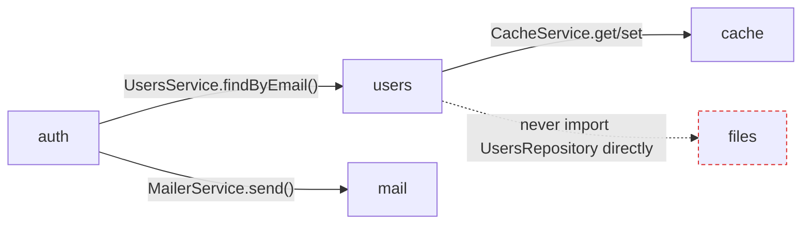
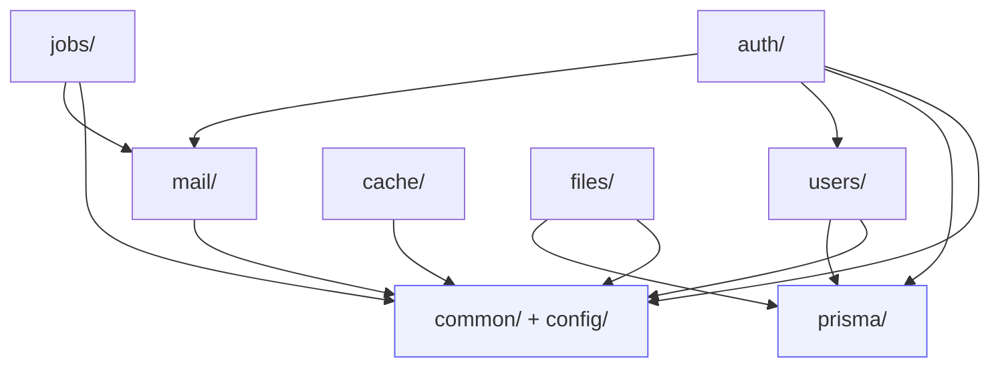

# Folder structure · api

<Status value="in-progress" note="Only auth, users, prisma, health" />

The [repo tour](/en/start/repo-tour) gives a wide-angle view of the whole monorepo. This page zooms into `apps/api/src` — the structure it should reach once the spec's modules are implemented.

## Target tree

```text
apps/api/src/
├── main.ts                  bootstrap: pino, ZodValidationPipe, CORS, Swagger
├── app.module.ts             wires every module + ConfigModule + LoggerModule
├── health.controller.ts      GET /health — outside any module, it has no domain
│
├── common/                   shared across every module, tied to no domain
│   ├── filters/               global exception filter → error envelope
│   ├── interceptors/          trace id, response shaping
│   ├── decorators/             @CurrentUser(), @Public()
│   └── pipe/                   ZodValidationPipe wrapper
│
├── config/                   env schema + ConfigModule setup
│
├── prisma/                   PrismaModule (@Global) + PrismaService
├── auth/                     login, refresh, JwtStrategy, JwtAuthGuard, ability
├── users/                    create, find, update, list
├── mail/                     MailerService + template renderer — see /en/backend/email
├── cache/                     RedisModule + cache-aside helper — see /en/backend/caching
├── jobs/                      BullMQ queue/worker registration — see /en/backend/jobs
└── files/                     upload, presigned URL — see /en/backend/file-storage
```

What actually exists today is only `main.ts`, `app.module.ts`, `health.controller.ts`, `prisma/`, `auth/`, and `users/` — everything else is the target.

## Module boundary rules

**One folder = one module = one bounded context.** Modules talk to each other only through exported services. Never import another module's repository or Prisma model directly.



::: tip Why only through a service
If `auth` imports `PrismaService` and queries the `user` table directly, changing `users`'s schema (say, renaming a field) breaks every module that snuck around it. Forcing everything through `UsersService` means there's exactly one place to fix.
:::

## Anatomy of a module

```text
apps/api/src/users/
├── users.module.ts
├── users.controller.ts
├── users.service.ts
├── dto/
│   ├── create-user.dto.ts     createZodDto(CreateUserSchema)
│   └── update-user.dto.ts     createZodDto(UpdateUserSchema)
└── users.service.spec.ts      unit test paired with the service
```

DTOs carry no validation logic of their own — it all comes from `packages/contracts` via `createZodDto`. See [Validation](/en/backend/validation).

::: warning Never redeclare a zod schema inside `apps/api`
If a schema lives in `packages/contracts` and is also duplicated in an `apps/api` DTO, the two drift the moment someone edits only one. `createZodDto` exists so you import the schema from contracts directly, not rewrite it.
:::

## Shared folders

| Folder | Purpose | Related |
| --- | --- | --- |
| `common/filters/` | Exception filter that turns every error type into the same envelope | [Error envelope](/en/conventions/errors) |
| `common/interceptors/` | Attaches a trace id to every request/response | [Trace ID](/en/platform/trace-id) |
| `common/decorators/` | `@CurrentUser()` pulls the user off the request, `@Public()` skips the guard | [Auth overview](/en/auth/overview) |
| `config/` | Validates env at boot with zod instead of failing at runtime | [Config & environment](/en/platform/config) |

## File naming

| Kind | Pattern | Example |
| --- | --- | --- |
| Module | `<name>.module.ts` | `users.module.ts` |
| Controller | `<name>.controller.ts` | `users.controller.ts` |
| Service | `<name>.service.ts` | `users.service.ts` |
| DTO | `<action>-<entity>.dto.ts` | `create-user.dto.ts` |
| Guard | `<name>.guard.ts` | `jwt-auth.guard.ts` |
| Test | Paired with its source, `.spec.ts` | `users.service.spec.ts` |

## Dependency direction



`common/` and `prisma/` never import a domain module back — the flow is one direction only, which rules out the circular dependencies NestJS can't resolve.

::: warning Current code status
| Target spec | Code today |
| --- | --- |
| `common/`, `config/` modules | Neither folder exists — the logic is scattered across `main.ts` and `app.module.ts` |
| `mail/`, `cache/`, `jobs/`, `files/` modules | None exist — see [Roadmap](/en/start/roadmap) debt #7 |
| `users.service.spec.ts` | No test files exist anywhere in the project — [Roadmap](/en/start/roadmap) debt #8 |
| `auth/`, `users/`, `prisma/`, `health.controller.ts` | Exist and match the target tree |
:::
