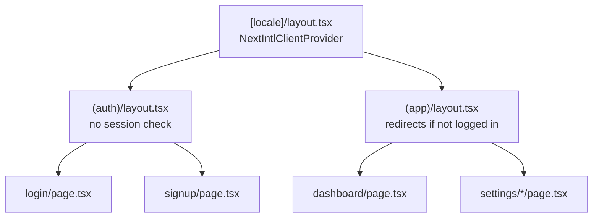
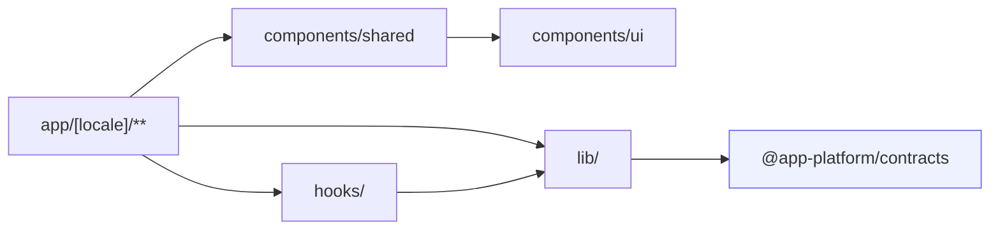

# Folder structure · web

<Status value="in-progress" note="Only one route exists" />

The [repo tour](/en/start/repo-tour) gives a wide-angle view of `apps/web`. This page spells out the full target folder tree.

## Target tree

```text
apps/web/src/
├── app/
│   ├── layout.tsx              root layout (pass-through)
│   ├── providers.tsx           QueryClientProvider (client component)
│   ├── globals.css             Tailwind v4 entry + design tokens
│   └── [locale]/                every page lives under the locale segment
│       ├── layout.tsx           NextIntlClientProvider + shell (nav/sidebar)
│       ├── page.tsx             home page
│       ├── (auth)/               route group — no login required
│       │   ├── login/page.tsx
│       │   └── signup/page.tsx
│       └── (app)/                route group — login required
│           ├── dashboard/page.tsx
│           ├── settings/
│           │   ├── users/page.tsx
│           │   ├── roles/page.tsx
│           │   └── theme/page.tsx
│           └── profile/page.tsx
│
├── i18n/
│   ├── routing.ts               defineRouting: locales ["th","en"]
│   ├── request.ts               loads messages per request
│   └── navigation.ts            Link/redirect/useRouter that know the locale
│
├── components/
│   ├── ui/                      shadcn/ui — never hand-edit generated files
│   └── shared/                  our own components, composed from ui/
│
├── lib/
│   ├── utils.ts                 cn() helper
│   ├── api-client.ts             fetch wrapper that attaches a trace id
│   └── ability.ts                buildAbility() from CASL rules
│
├── hooks/                       custom hooks shared across pages
└── proxy.ts                     Next 16's new name for middleware.ts
```

What actually exists today is only `app/layout.tsx`, `app/[locale]/{layout,page}.tsx`, `i18n/`, `proxy.ts`, and a single `components/ui/button.tsx` — everything else is the target.

## Feature-based grouping

Pages are grouped with Next.js [route groups](https://nextjs.org/docs/app/building-your-application/routing/route-groups) — the parentheses in `(auth)` and `(app)` never appear in the URL, but let each group have its own layout (e.g. `(app)/layout.tsx` checks for a session before rendering).



## Anatomy of a page

```text
app/[locale]/(app)/settings/users/
├── page.tsx           server component — fetches initial data
├── loading.tsx         skeleton shown while loading
├── error.tsx            error boundary scoped to this page
└── _components/         components used only on this page, never exported elsewhere
```

Folders prefixed with `_` are not treated as routes by Next.js — use them for components tied to one page. Once a component is used by more than one page, promote it to `components/shared/`.

## Shared folders

| Folder | Purpose | Related |
| --- | --- | --- |
| `components/ui/` | `shadcn/ui` components generated by the CLI — the design system's base | [UI system](/en/frontend/ui-system) |
| `components/shared/` | Our own components composed from `ui/`, reused across pages | — |
| `lib/api-client.ts` | Fetch wrapper that attaches a trace id and parses the error envelope | [Trace ID](/en/platform/trace-id) |
| `lib/ability.ts` | Builds the CASL ability from the rules the API sends | [CASL](/en/auth/casl) |
| `hooks/` | Custom hooks such as `useDebounce`, `useAbility` | — |

::: tip `proxy.ts`, not `middleware.ts`
Next.js 16 renamed the middleware file to `proxy.ts`. Right now it only holds the next-intl middleware. Route protection (redirecting to `/login` when there's no session) gets added here — see [Client session](/en/frontend/auth-client).
:::

## File naming

| Kind | Pattern | Example |
| --- | --- | --- |
| Route (Next.js requires it) | `page.tsx`, `layout.tsx`, `loading.tsx`, `error.tsx` | `dashboard/page.tsx` |
| Our own components | PascalCase | `UserTable.tsx` |
| Hooks | `use<Name>.ts` | `useAbility.ts` |
| lib / utils | camelCase logic, kebab-case filename | `apiClient` exported from `api-client.ts` |

::: warning Never hand-edit `components/ui/` (except to resolve a merge conflict)
These components are generated by the `shadcn` CLI. Edit them directly and a later `shadcn add` can silently overwrite or conflict with your changes. Adjust styling through `components/shared/` wrappers instead, or edit the tokens in `packages/config/tailwind/theme.css`.
:::

## Dependency direction



`components/ui/` imports nothing beyond external libraries (Radix, `class-variance-authority`) — it's the base everything else builds on, not a place that depends on domain logic.

::: warning Current code status
| Target spec | Code today |
| --- | --- |
| `(auth)` / `(app)` route groups with real pages | Only a single `app/[locale]/page.tsx` exists |
| `components/ui/` from the shadcn CLI | `button.tsx` is hand-rolled, no Radix, references an undefined `bg-brand-600` token — [Roadmap](/en/start/roadmap) debt #10 |
| `lib/api-client.ts`, `lib/ability.ts` | Don't exist |
| `hooks/` | Folder doesn't exist |
| `i18n/`, `proxy.ts` | Exist and match the target tree |
:::
