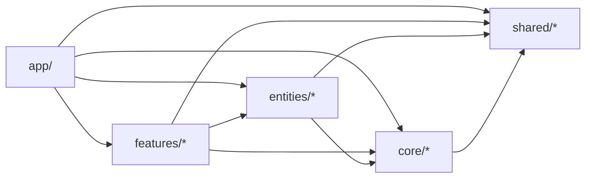

# Folder structure · web

<Status value="implemented" />

The [repo tour](/en/start/repo-tour) gives the big picture of `apps/web`; this page details the `core/entities/features/shared` layout `apps/web/src` actually uses — designed so this repo can be forked to start new projects, by separating what stays fixed across every project from what gets edited or deleted per feature.

## Actual layout

```text
apps/web/src/
├── app/                     Next.js App Router — routing only, imports from the barrels below
│   └── [locale]/            (auth)/login, (app)/{dashboard,profile,settings/*}
├── core/                    infra that stays fixed across every forked project
│   ├── auth/                login/logout/getMe, session storage, useSession
│   ├── permissions/         CASL: buildAbility, AbilityProvider, useAbility
│   ├── api-client/          fetch wrapper + trace id, env, error mapping
│   ├── i18n/                routing, navigation, request config, messages/
│   └── ui/                  design system (19 shadcn-style primitives)
├── entities/                domain hooks bound to @app-platform/contracts schemas
│   ├── user/                useMe, useUsers, useChangePassword
│   └── role/                useRoles
├── features/                project-specific features — replaced/deleted on fork
│   ├── dashboard/, users/, roles/, settings/, shell/
├── shared/                  generic utilities with no domain meaning
│   └── lib/                 cn()
└── proxy.ts                 next-intl middleware (Next 16's rename of middleware.ts)
```

Every subfolder under `core/`, `entities/`, `features/`, `shared/` has one `index.ts` as its only legal entry point — files must not import directly into another module's internals; only through its barrel. This is enforced by ESLint (`eslint-plugin-boundaries`, see below).

## Cross-layer dependency rule



- `shared/` imports nothing here — it's a leaf
- `core/` may only import `shared/`
- `entities/` may import `core/`, `shared/`
- `features/` may import `entities/`, `core/`, `shared/` — **may not import another feature** (e.g. `features/users` may not import `features/roles`). If two features genuinely need to share something, promote it to `entities/`
- `app/` may import every layer

Breaking these rules is an ESLint error at build time, not just a review comment — intentionally strict, since this repo is meant to be forked and edited without the original team reviewing every PR.

## Why this split

| Layer | Criterion | Examples |
| --- | --- | --- |
| `core/` | Infra code that barely changes across projects | auth, CASL, fetch wrapper, i18n, design system |
| `entities/` | Hooks bound to domain objects present in most admin projects | `useUsers`, `useRoles` |
| `features/` | Business logic specific to this project — first thing deleted/rewritten on fork | dashboard, settings, dialogs |
| `shared/` | Utilities with no domain awareness at all | `cn()` |

One judgment call worth flagging: `features/shell/` (sidebar, user menu) looks "stable" but hardcodes the actual menu items per feature, so it's classified as `features/`, not `core/` — a forked project with a different menu edits here.

## Query keys are split by owner

`query-keys.ts` is no longer one central file — each key factory lives with the module that owns that data. `sessionKeys` lives in `core/auth/`, `userKeys` in `entities/user/`, `roleKeys` in `entities/role/`, `dashboardKeys` in `features/dashboard/`. Reason: if a fork deletes `features/dashboard/`, there's no dangling export left behind in a shared file nobody references anymore.

## File naming

| Type | Pattern | Example |
| --- | --- | --- |
| Route (Next.js-mandated) | `page.tsx`, `layout.tsx`, `loading.tsx`, `error.tsx` | `dashboard/page.tsx` |
| Component | PascalCase export, kebab-case filename | `edit-user-dialog.tsx` → `EditUserDialog` |
| Hook | `use<Name>.ts` | `use-roles.ts` → `useRoles` |
| Barrel | `index.ts` in every folder under `core/`, `entities/`, `features/`, `shared/` | `entities/user/index.ts` |

::: tip `proxy.ts`, not `middleware.ts`
Next.js 16 renamed the middleware file to `proxy.ts` — right now it only holds the next-intl middleware. See [Client-side session](/en/frontend/auth-client).
:::

::: warning Don't hand-edit files in `core/ui/` (except to resolve a merge conflict)
These components are the design-system base every forked project shares. Adjust styling through the tokens in `packages/config/tailwind/theme.css` instead.
:::
