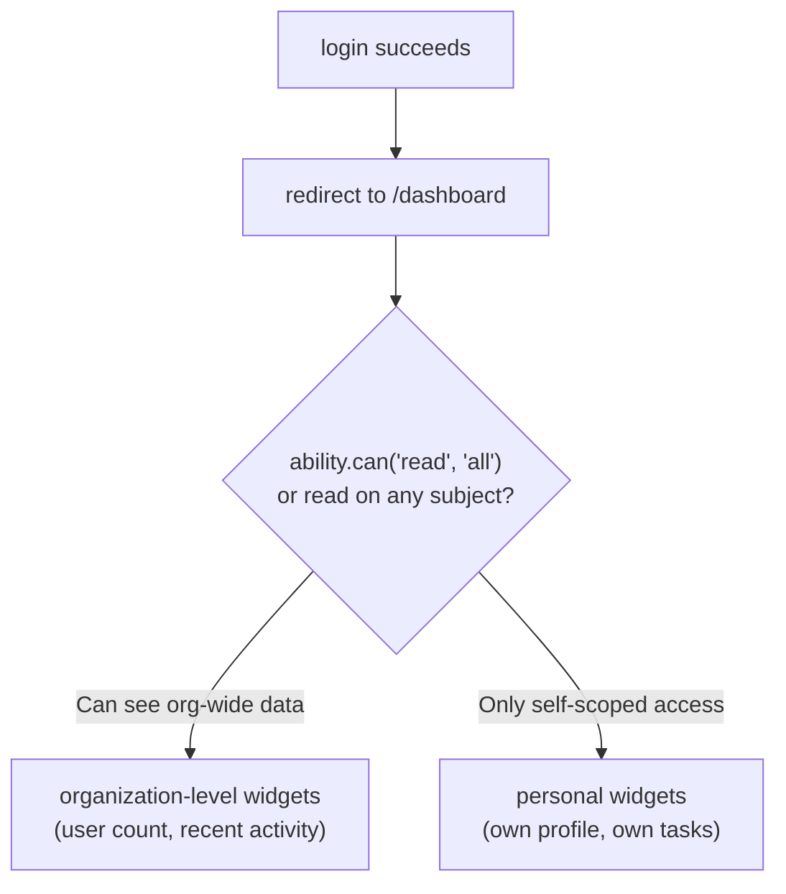
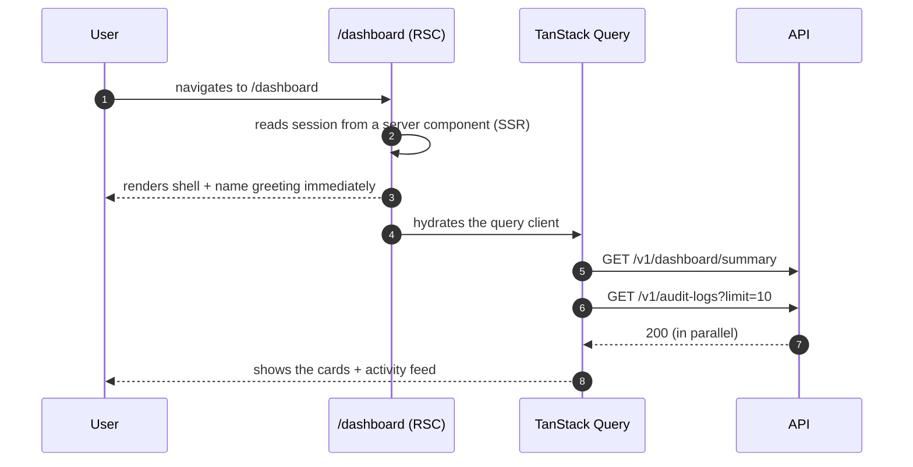

# Dashboard

<Status value="implemented" />

> **The first page a user sees after login must answer one question in 3 seconds: "what do I need to know today?"**

`apps/web` today has only a single home page — there is no authenticated route at all yet. This page specs the post-login landing page.

## Where it lives in routing

`apps/web/src/app/[locale]/(app)/dashboard/page.tsx`



## Layout

```text
┌──────────────────────────────────────────────────┐
│  Hi, Somchai 👋                       [🔔] [👤 ▾]  │
├──────────────────────────────────────────────────┤
│  ┌────────────┐ ┌────────────┐ ┌────────────┐    │
│  │ Total users │ │ Active today│ │  Pending    │    │
│  │    128      │ │     34      │ │      3      │    │
│  └────────────┘ └────────────┘ └────────────┘    │
│  ─────────────────────────────────────────────    │
│  Recent activity                                   │
│  ┌────────────────────────────────────────────┐   │
│  │ • Somchai added the "editor" role  2m ago   │   │
│  │ • Vipa updated her profile         1h ago   │   │
│  │ • System closed an expired session 3h ago   │   │
│  └────────────────────────────────────────────┘   │
└──────────────────────────────────────────────────┘
```

## Widgets that make up the page

| Widget | Data source | Permission required |
| --- | --- | --- |
| Summary number cards (total users, active today) | `GET /v1/dashboard/summary` | `ability.can("read", "User")` unrestricted by conditions |
| Activity feed table | `GET /v1/audit-logs?limit=10` | `ability.can("read", "AuditLog")` — normally `admin` only |
| Personal widget (for `member`s without org-wide access) | `GET /v1/auth/me` | Every role sees this |

::: tip The dashboard must gate with the same ability the server enforces
A widget that fetches from an endpoint the user has no permission for should never render at all — not render and hit `403`. Check before rendering with `<Can>`, described at [CASL § Sending rules to the UI](/en/auth/casl) — the same rule set the backend enforces, not a separate hardcoded copy in the page.
:::

## Fields / components

| Component | Data source | Refresh behavior |
| --- | --- | --- |
| Number cards | REST + TanStack Query, `staleTime: 60_000` | Polls every 60 seconds, not real-time |
| Activity feed | REST, `staleTime: 30_000` | Same, plus a manual "refresh" button |
| Greeting with the user's name | From already-loaded session (no extra API call) | Never refreshed |

## Page states

| State | UI |
| --- | --- |
| Initial load | Skeleton: three cards + 5 skeleton table rows |
| Loaded, has data | As shown in the layout above |
| Loaded, no activity at all | Empty state: icon + "No activity yet" |
| Load failed (network/500) | An error card with "Retry" per widget — one broken widget must not take down the whole page |
| User has no permission for any widget (edge case: an empty-permission role) | Show only the greeting plus a link to the profile |

::: warning Each widget needs its own error boundary
If the activity feed breaks because `GET /v1/audit-logs` fails, the number cards fetched from a different endpoint must keep working. Use widget-level error boundaries, not a single page-level one — see the web-side error-handling approach at [Observability & logging](/en/platform/observability).
:::

## Page-load sequence



::: tip Render the name greeting server-side; don't wait on a client fetch
The user's name already exists in the SSR session — there's no reason to wait for a client round-trip to show "Hi, Somchai." This eliminates a layout shift that would otherwise be visible on every load.
:::

## Endpoints required

| Endpoint | Method | Permission | Notes |
| --- | --- | --- | --- |
| `/v1/dashboard/summary` | `GET` | `read User` unrestricted by conditions (checked explicitly in the service) | Returns aggregate counts, not real user rows |
| `/v1/audit-logs` | `GET` | `read AuditLog` | Only a `limit` query param today — no `cursor` for pagination yet |
| `/v1/auth/me` | `GET` | Anyone logged in | Reuses existing session data if the provider already loaded it |

## Checklist

- [x] Each widget has its own error/loading state (separate `useQuery` per widget)
- [x] A widget the user has no permission for is never rendered (ability checked before mounting each widget)
- [ ] The name greeting renders server-side, not waiting on a client fetch — still waits on a client query like every other widget
- [x] Skeleton loading states exist for every widget
- [x] Empty states have a meaningful icon and message, not just a blank table

::: warning Current code status
| Target spec | Code today |
| --- | --- |
| `/dashboard` route | Real, at `app/[locale]/(app)/dashboard/page.tsx` |
| `GET /v1/dashboard/summary` | Real — returns `totalUsers`/`activeUsers`/`inactiveUsers` |
| `GET /v1/audit-logs` | Real, with real data populated automatically from user/role updates |
| Widget gating by permission | Done via a direct ability check before mounting each widget (not literally the `<Can>` component, but the same effect) |
| React-level error boundary per widget | Still missing — relies on a separate `useQuery` per widget instead, which contains data-fetching errors equivalently |
| Server Component prefetch for the greeting | Still missing — the whole page is a client component that queries `auth/me` on mount |
:::
