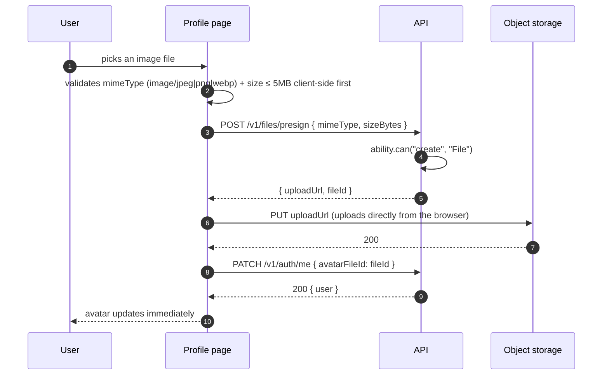

# Profile

<Status value="planned" />

> **The profile page is the one place every user can always edit their own data, regardless of role — the editable fields match the `${user.id}` condition in the [permission table](/en/auth/rbac-model) exactly.**

## Where it lives in routing

`apps/web/src/app/[locale]/(app)/profile/page.tsx`

Every role can always access it — unlike [user management](/en/features/settings-users), this page edits **only the current user**. There's no query param to view someone else's profile.

## Layout

```text
┌──────────────────────────────────────────┐
│  My profile                                │
├──────────────────────────────────────────┤
│      ┌────────┐                           │
│      │  👤    │  [Change photo] [Remove]   │
│      │ avatar │                           │
│      └────────┘                           │
│                                            │
│  Display name                              │
│  [ Somchai Jaidee                     ]   │
│  Email                                     │
│  [ somchai@ex.com          ] 🔒 Verified   │
│  Language                                  │
│  [ Thai                      ▾ ]           │
│                                            │
│  ─────────── Connected accounts ───────    │
│  🔵 Google         Connected     [Unlink]  │
│                                            │
│  ─────────── Security ───────────          │
│  [ Change password ]                       │
│                                            │
│  [ Save changes ]                          │
└──────────────────────────────────────────┘
```

## Editable fields, and why they match RBAC exactly

| Field | Editable? | Why |
| --- | --- | --- |
| `displayName` | ✅ | In the `member` field list defined by the [permission table](/en/auth/rbac-model): `update User where id = ${user.id}` on fields `displayName, avatarFileId, locale, theme` |
| `avatarFileId` | ✅ (via the upload flow) | Same |
| `locale` | ✅ | Same |
| `theme` | ✅ (moved to a separate [theme settings](/en/features/settings-theme) page) | Same |
| `email` | ❌ Display only | Not in `member`'s field list — changing email needs a separate verification flow (not specced on this page) to prevent silent account takeover via email change |
| `roles` | ❌ Never shown | Neither `manager` nor `member` can edit `roles`, even their own — prevents self-escalation, see [CASL § Preventing self-escalation](/en/auth/casl) |
| `status` | ❌ Never shown | No one deactivates their own account from this page (that would need a separate "delete account" flow if one exists) |

::: danger Fields outside the allowlist must never appear in the form at all
Same principle as [user management](/en/features/settings-users) — fields a user can't edit on themselves must not render, not sit there as readonly. A readonly input still misleads people into thinking they're almost allowed, and it's one forgotten `disabled` attribute away from becoming a real bug.
:::

## Avatar upload



Presigned URL details, mime-type/size limits, and old-file cleanup live at [File storage](/en/backend/file-storage) — this page only references the UI-side flow.

::: tip Upload goes straight from the browser to object storage, never through the API
The image itself should never pass through `apps/api` at all — the API just issues a presigned URL, and the browser `PUT`s directly to storage. This keeps the heaviest part of the data path (the file transfer) off the API server, leaving it to do only authorization.
:::

## Fields / states

| Component | State | UI |
| --- | --- | --- |
| Avatar | Uploading | An overlay spinner on top of the old image; the old image stays visible while waiting |
| Avatar | Upload failed (too large) | Red toast "File exceeds 5MB" — shown before the presign call even fires |
| Avatar | Upload failed (network mid-PUT) | Red toast "Upload failed" + a retry button; the old image doesn't change |
| Google account | Connected | Green badge + "Unlink" button |
| Google account | Not connected | "Connect Google" button — starts the same OAuth flow as signup, but ends by linking instead of creating an account |
| Unlinking Google when there's no `passwordHash` | Blocked | A dialog: "Set a password before unlinking Google, or you won't be able to sign in again" |

::: danger Never let a user unlink their only sign-in method without a fallback
A user who signed up via Google only (`passwordHash = null` per the [data model](/en/architecture/data-model)) who unlinks Google without any other way in **permanently locks themselves out**. Always force a password to be set first in this case.
:::

## Change password (for users who already have one)

```text
┌──────────────────────────┐
│  Change password         ✕ │
├──────────────────────────┤
│  Current password          │
│  [                    ] 👁 │
│  New password               │
│  [                    ] 👁 │
│  Confirm new password        │
│  [                    ]    │
│  [ Cancel ]    [ Change ]  │
└──────────────────────────┘
```

Uses the same `PasswordSchema` as [Signup](/en/auth/signup), and always requires confirming the current password first — this prevents a case where a leaked session gets used to hijack the account permanently via a silent password change.

## Checklist

- [ ] Fields outside `member`'s allowlist are never rendered in the form
- [ ] Avatar uploads go straight to object storage via a presigned URL, not through the API server
- [ ] Unlinking Google is blocked when there's no `passwordHash`
- [ ] Changing the password always requires confirming the current one first
- [ ] Email changes are not part of this form (require a separate verification flow)

::: warning Current code status
| Target spec | Code today |
| --- | --- |
| `/profile` route | None — no UI exists at all |
| `PATCH /v1/auth/me` | This endpoint doesn't exist — no auth module is implemented yet |
| `POST /v1/files/presign` | No `File` table and no file-handling module exist (see [File storage](/en/backend/file-storage)) |
| Connecting Google from the profile page | No Google OAuth exists at all (see [Signup](/en/auth/signup)) |
| Change password | No endpoint exists, and there's no current-password verification |
:::
