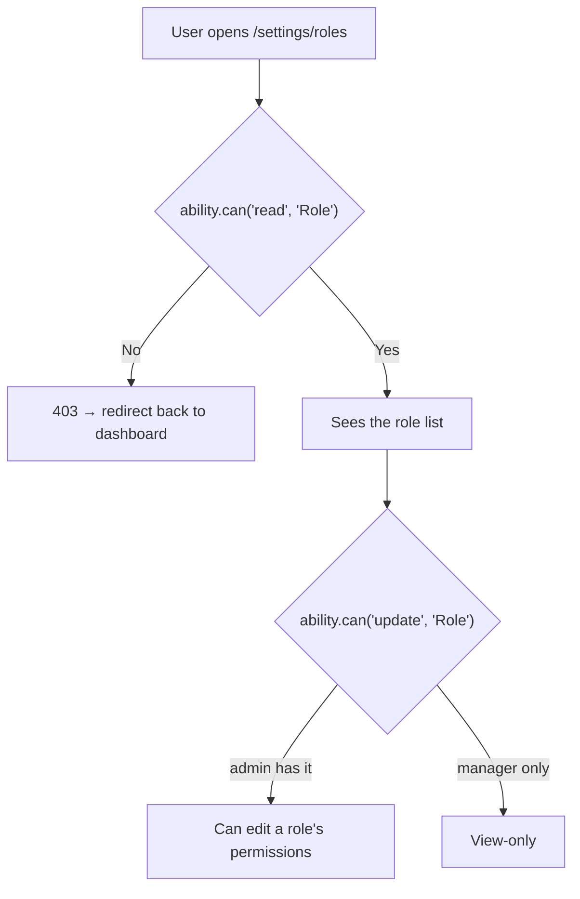
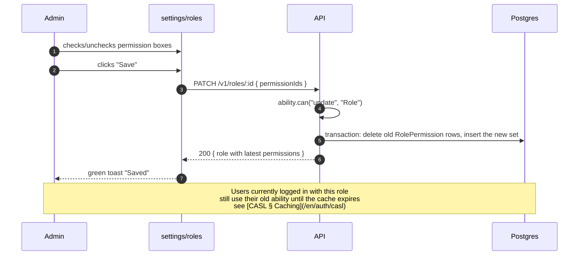

# Settings · Roles & permissions

<Status value="planned" />

> **This page edits "which role holds which permission" — it does not create new permissions. Those are two different levels of action.**

The full data model lives at [Role & permission model](/en/auth/rbac-model); the enforcement mechanism lives at [CASL](/en/auth/casl). This page specs the UI wrapping both.

## Who can access it



Per the [permission table](/en/auth/rbac-model), `manager` has `read Role` but not `create/update/delete Role` — they can see this page, but every edit control must be disabled or not rendered at all. Only `admin` can actually make changes.

## Layout

```text
┌───────────────────────────────────────────────────┐
│  Roles & Permissions                  [+ Add role] │
├───────────────────────────────────────────────────┤
│  ┌─────────────┐ ┌─────────────┐ ┌─────────────┐  │
│  │ admin    🔒  │ │ manager  🔒  │ │ member   🔒  │  │
│  │ Administrator│ │ Manager     │ │ Member      │  │
│  │ Can do anything│ │ 8 permissions│ │ 3 permissions│  │
│  └─────────────┘ └─────────────┘ └─────────────┘  │
│  ┌─────────────┐                                   │
│  │ editor       │  ← custom role, editable/deletable│
│  │ Editorial     │                                   │
│  │ 4 permissions│                                   │
│  └─────────────┘                                   │
└───────────────────────────────────────────────────┘
```

Cards with 🔒 have `isSystem = true` — they cannot be deleted and their `key` cannot change (per the [permission table](/en/auth/rbac-model)), but their display **`name` can still be edited**, since that doesn't affect the `key` the code references.

## Edit-role-permissions screen

```text
┌─────────────────────────────────────────────────┐
│  Edit role: editor                            ✕  │
├─────────────────────────────────────────────────┤
│  Name                                             │
│  [ Editorial                                  ]  │
├─────────────────────────────────────────────────┤
│  Permissions                                      │
│  Subject: User                                    │
│    ☑ create   ☑ read   ☑ update   ☐ delete       │
│  Subject: Role                                     │
│    ☐ create   ☑ read   ☐ update   ☐ delete       │
│  Subject: File                                     │
│    ☑ create   ☑ read   ☐ update   ☐ delete       │
├─────────────────────────────────────────────────┤
│  [ Cancel ]                            [ Save ]  │
└─────────────────────────────────────────────────┘
```

::: danger Checkboxes only pick from action×subject pairs that are already seeded
This UI **does not** create new `Permission` rows — it only chooses which existing permissions a role holds. Every checkbox must render from the actual `Permission` rows in the DB (from the seeder's `PERMISSIONS` list, per [RBAC § Seed](/en/auth/rbac-model)), never a free-text input where someone can type an arbitrary action/subject. Allowing free text would let anyone write arbitrary CASL rules through the UI.
:::

### Contract

```ts
// packages/contracts/src/role.schema.ts
export const UpdateRoleSchema = z.object({
  name: z.string().trim().min(1).max(120).optional(),
  permissionIds: z.array(z.uuid()).optional(), // must be ids that actually exist in Permission
});

export const CreateRoleSchema = z.object({
  key: z.string().trim().min(1).max(64).regex(/^[a-z][a-z0-9_]*$/, "Lowercase letters, digits, and _ only"),
  name: z.string().trim().min(1).max(120),
  permissionIds: z.array(z.uuid()),
});
```

## What's editable on system roles

| Field | `isSystem = true` | Custom role |
| --- | --- | --- |
| `key` | Locked | Locked after creation (changing it would break code that hardcodes `key`) |
| `name` | Editable | Editable |
| Held permissions | Editable (must always leave at least one `admin` with `manage all`) | Freely editable |
| Delete the role | Not possible (button not rendered) | Possible if no user currently holds it |

::: warning Deleting an in-use role must fail with an actionable message
`DELETE /v1/roles/:id` must return `409 ROLE_IN_USE` along with the count of affected users. The UI translates that into "Can't delete — 4 users currently hold this role," not the raw API error.
:::

## Fields / states

| Component | State | UI |
| --- | --- | --- |
| Role card | Loaded | As shown in the layout |
| Role card | Loading | 3-4 skeleton cards |
| Permission checkboxes | Saving | Whole group disabled + a small spinner on Save |
| Delete an `isSystem` role | — | Delete button is never rendered, not just disabled |
| Creating a role with a duplicate key | Error | Inline error under the key field: "This key is already taken" (from `409 RESOURCE_CONFLICT`) |

## Permission-edit sequence



::: tip Permission edits are delayed for already-logged-in users
If the ability is cached (see [CASL § Caching](/en/auth/casl)), someone holding that role who's currently logged in keeps their old permissions until the cache expires or is invalidated. Surface this in the UI with a small line under Save: "Logged-in users will see this change within a few minutes."
:::

## Checklist

- [ ] Permission checkboxes render only from real `Permission` rows, no free text
- [ ] `isSystem = true` roles have no delete button and no editable `key` field
- [ ] Deleting an in-use role returns an error naming the affected user count
- [ ] There's a guard preventing zero `admin`s with `manage all`
- [ ] Users are told new permissions apply with a delay if ability caching exists

::: warning Current code status
| Target spec | Code today |
| --- | --- |
| `/settings/roles` route | None — no UI exists at all |
| `Role`, `Permission`, `RolePermission` tables | None exist at all (see [Data model](/en/architecture/data-model)) |
| `PATCH /v1/roles/:id` | This endpoint doesn't exist |
| `409 ROLE_IN_USE` | Not in the [error code catalog](/en/reference/error-codes) today |
| CASL ability caching | Not implemented yet — see [CASL](/en/auth/casl) |
:::
