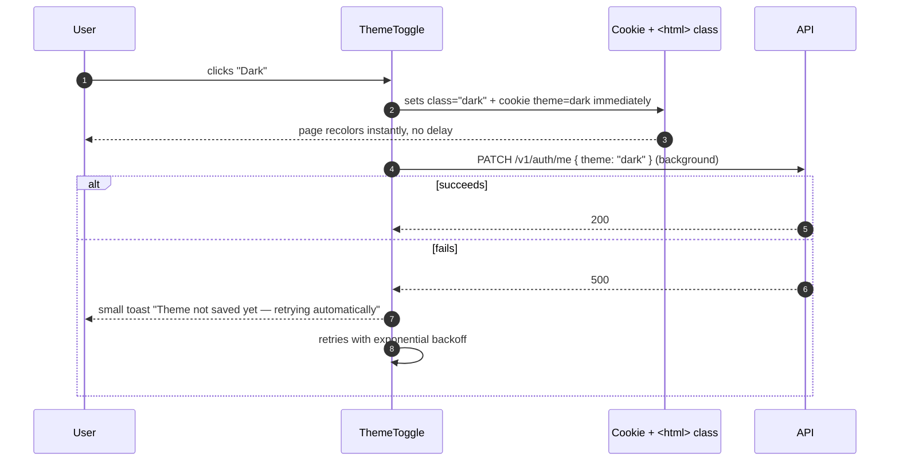
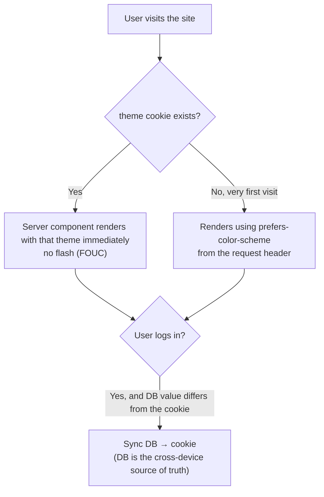

# Settings · Theme

<Status value="implemented" />

> **Theme lives in two places: a cookie for a flash-free first render, and `User.theme` to remember the choice across devices. These two must stay in sync, not compete.**

The underlying mechanism (CSS variables, `prefers-color-scheme`, toggling a class on `<html>`) already lives at [Theming & dark mode](/en/frontend/theming). This page covers only the settings UI and how it ties into the `User.theme` field.

## Where it lives in routing

`apps/web/src/app/[locale]/(app)/settings/theme/page.tsx`

Accessible to every role — theme is purely a personal setting. Per the [permission table](/en/auth/rbac-model), a `member` can already update their own `theme`.

## Layout

```text
┌─────────────────────────────────────────────┐
│  Theme                                        │
├─────────────────────────────────────────────┤
│  Color mode                                   │
│  ┌────────┐  ┌────────┐  ┌────────┐          │
│  │  ☀️     │  │  🌙    │  │  💻    │          │
│  │ Light   │  │  Dark   │  │ System │          │
│  │  ●      │  │        │  │        │          │
│  └────────┘  └────────┘  └────────┘          │
│                                                │
│  Preview                                      │
│  ┌───────────────────────────────────────┐   │
│  │ [Sample button]  Sample text           │   │
│  └───────────────────────────────────────┘   │
└─────────────────────────────────────────────┘
```

The three options map to `User.theme` in the [data model](/en/architecture/data-model): `"light" | "dark" | "system"`. Choosing "System" means following the device's `prefers-color-scheme`, not a fixed value.

## Fields / states

| Component | State | UI |
| --- | --- | --- |
| Color mode selector | Initial load | Uses the cookie value immediately (doesn't wait on the API), preventing a flash |
| Selecting a new mode | Saving | Theme changes immediately, optimistically (no waiting for a response); the selected dot moves instantly |
| Save fails (network) | Error | The UI keeps showing the new theme (the user is already seeing it applied), but a red toast reads: "Save failed — this will revert on your next page load" |
| Preview panel | Always | Shows real sample components (button, card, text) so the user sees the actual result before leaving the page |

::: tip Theme changes must always be optimistic
Waiting for an API round-trip before switching dark/light feels laggy the instant the user notices it. Toggle the class on `<html>` and set the cookie immediately on click, then fire `PATCH /v1/auth/me` in the background, fire-and-forget. If it fails, notify unobtrusively — a small toast, never a blocking modal.
:::

## Theme-change sequence



## Why both a cookie and the DB



| Store | Purpose | Who reads it |
| --- | --- | --- |
| Cookie (`theme`) | Lets the server component render the correct color from the very first HTML, no flash | Next.js server component during SSR |
| `User.theme` in the DB | Remembers the value across devices/browsers | Synced into the cookie right after a successful login |

::: warning Cookie and DB can temporarily disagree — the DB must always win on login
If a user sets dark mode on their phone, then opens the site on a computer with no cookie yet, a successful login must sync `User.theme` into the cookie immediately — not silently fall back to that machine's `prefers-color-scheme` because no cookie exists.
:::

## Checklist

- [x] Theme changes are always optimistic, never waiting on the API (`setTheme` fires immediately, `PATCH` follows)
- [ ] The cookie is set alongside the `<html>` class in the same tick, avoiding FOUC — not implemented; the page relies purely on `next-themes`' `localStorage` mechanism, no cookie at all
- [ ] A successful login syncs `User.theme` → cookie automatically — not implemented, since there's no cookie yet to sync into (see [Theming & dark mode](/en/frontend/theming#persisting-the-user-s-choice))
- [x] Failed saves retry without blocking the UI (a single 3-second delayed retry today, not full exponential backoff)
- [x] The preview panel shows real components from the [UI system](/en/frontend/ui-system), not a separate mockup

::: warning Current code status
| Target spec | Code today |
| --- | --- |
| `/settings/theme` route | Real, at `app/[locale]/(app)/settings/theme/page.tsx` |
| `User.theme` column | Real in the database, defaults to `"system"` |
| `PATCH /v1/auth/me { theme }` | Real, using the same field-level ability check as `PATCH /v1/users/:id` |
| Frontend dark-mode mechanism | Fully implemented — see [Theming & dark mode](/en/frontend/theming) |
| Cookie for a flash-free SSR first render | Still missing — the initial theme on page load still comes only from `next-themes`' `localStorage`/`prefers-color-scheme`, not `User.theme` |
:::
