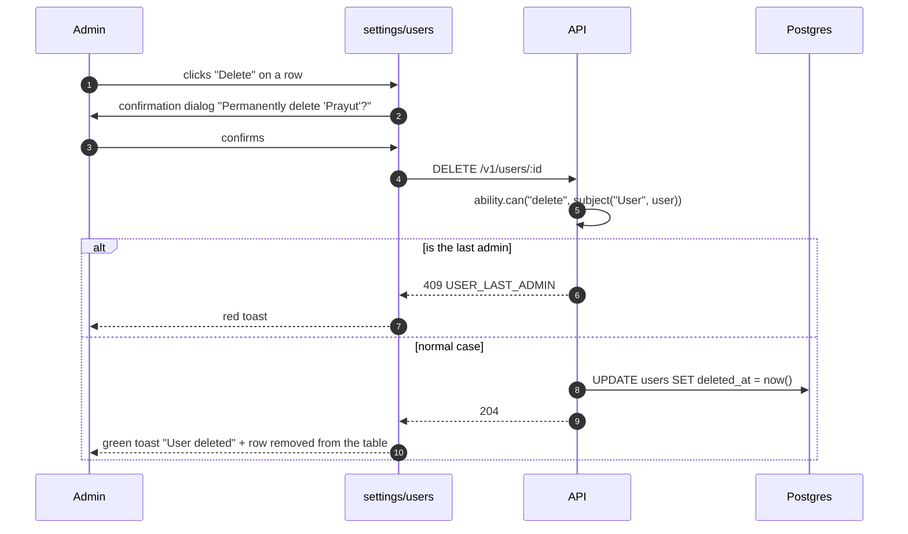

# Settings · User management

<Status value="implemented" />

> **This page is `User` CRUD fully filtered by [CASL](/en/auth/casl) — what `admin` sees and what `manager` sees must differ because of the same rules, not because of two separate components in two separate files.**

## Where it lives in routing

`apps/web/src/app/[locale]/(app)/settings/users/page.tsx`

Accessible only to users with `ability.can("read", "User")` that isn't restricted to themselves — `admin` and `manager` per the [permission table](/en/auth/rbac-model). A `member`, who only has `read User` (self), never sees this menu item at all.

## List layout

```text
┌────────────────────────────────────────────────────┐
│  User management                     [+ Add user]  │
│  [ Search name/email...        ]  [ Status ▾ ]      │
├────────────────────────────────────────────────────┤
│  Name           Email               Role     Status │
│  ─────────────────────────────────────────────────  │
│  Somchai Jaidee somchai@ex.com     manager  ●active  │
│  Vipa Rakrian   vipa@ex.com        member   ●active  │
│  Prayut Mankong prayut@ex.com      member   ○inactive│
│  ─────────────────────────────────────────────────  │
│  Showing 1-20 of 128       [< Previous]  [Next >]    │
└────────────────────────────────────────────────────┘
```

## Table fields

| Column | Comes from field | Behavior |
| --- | --- | --- |
| Name | `displayName` | Click to open the edit drawer |
| Email | `email` | Plain text (not clickable) |
| Role | `roles[].role.name` | Badge; multiple roles show multiple badges |
| Status | `status` | Dot indicator: green = `ACTIVE`, gray = `INACTIVE` |
| Action | — | `⋮` button opens a menu: Edit / Deactivate / Delete |

::: tip The table must be filtered by `accessibleBy` on the server, not by hiding rows on the client
A `manager` sees only the users their ability allows — that filtering must happen at `GET /v1/users` via `accessibleBy(ability, "read").User` (see [CASL § Filtering data](/en/auth/casl)), not fetched in full and hidden with JS, because the payload that reaches the browser leaks regardless.
:::

## Add/edit user form (drawer)

```text
┌──────────────────────────┐
│  Edit user              ✕ │
├──────────────────────────┤
│  Display name              │
│  [ Somchai Jaidee         ] │
│  Email                     │
│  [ somchai@ex.com         ] │
│  Role                      │
│  [ manager             ▾ ] │
│  Status                    │
│  ( ) Active  ( ) Inactive  │
│                            │
│  [ Cancel ]    [ Save ]   │
└──────────────────────────┘
```

### Contract

```ts
// packages/contracts/src/user.schema.ts
export const UpdateUserSchema = z.object({
  displayName: z.string().trim().min(1).max(120).optional(),
  email: z.email().max(255).optional(),
  status: z.enum(["ACTIVE", "INACTIVE"]).optional(),
  roleIds: z.array(z.uuid()).optional(),
});
export type UpdateUser = z.infer<typeof UpdateUserSchema>;
```

The same form is used for both adding and editing. Which fields are shown depends on the *viewing* user's ability, not the role of the user being edited — when a `manager` opens the edit form for someone else, the Role field is **not shown at all**, because the [permission table](/en/auth/rbac-model) says `manager` cannot update `roles`.

::: danger Fields the current user can't edit must not render, not render-and-disable
A `<input disabled>` still ships its value to the DOM, inspectable via dev tools, and signals a false "you're almost allowed to do this." Wrap the whole field in `<Can I="update" a={subject} field="roles">` — no permission means the field never renders at all. This follows the principle laid out at [CASL § UI gating is not security](/en/auth/casl) (hiding a field the backend already rejects is a UX nicety, not an extra security layer).
:::

## Empty states and errors

| Situation | UI |
| --- | --- |
| Search returns no matches | "No users match 'xyz'" + a clear-filters button |
| No users exist at all (theoretical — never happens because a seed admin always exists) | "No users yet" |
| Load failed | A red banner over the table + "Retry" button; existing data stays visible (never wiped until a successful reload) |
| Deleting the last remaining `admin` | The delete button still renders (a `manager` can't know in advance who the last admin is), but clicking it shows a red toast: "At least one admin must remain" (from `USER_LAST_ADMIN`) |

## User deletion sequence



::: tip Delete is always a soft delete
`DELETE /v1/users/:id` never removes the actual row. It sets `deletedAt` per the [schema conventions](/en/architecture/data-model) — the UI doesn't need to know this at all; it just responds to `204` as a successful delete.
:::

## Checklist

- [x] `GET /v1/users` is filtered by `accessibleBy` on the server, not the client
- [x] Fields the current user cannot edit are never rendered in the form (checked per-field with `ability.can("update", target, field)`)
- [x] The delete button always shows a confirmation dialog
- [x] `USER_LAST_ADMIN` shows as a readable toast, not a raw error code
- [ ] Pagination (cursor or offset) matches whatever the backend implements — currently offset only (`page`/`limit`), single page at a time, no cursor/infinite scroll

::: warning Current code status
| Target spec | Code today |
| --- | --- |
| `/settings/users` route | Real, at `app/[locale]/(app)/settings/users/page.tsx` |
| `GET /v1/users` filtered by ability | Real — filtered via `accessibleBy(ability, "read").User`, supports a `search` param too |
| `UpdateUserSchema` | Complete: `displayName`, `email`, `status`, `roleIds` (every field checked against field-level ability before applying) |
| `DELETE /v1/users/:id` as a soft delete | Real — sets `deletedAt` and checks `USER_LAST_ADMIN` before deleting |
| `USER_LAST_ADMIN` check | Real — blocks deleting the last admin |
:::
