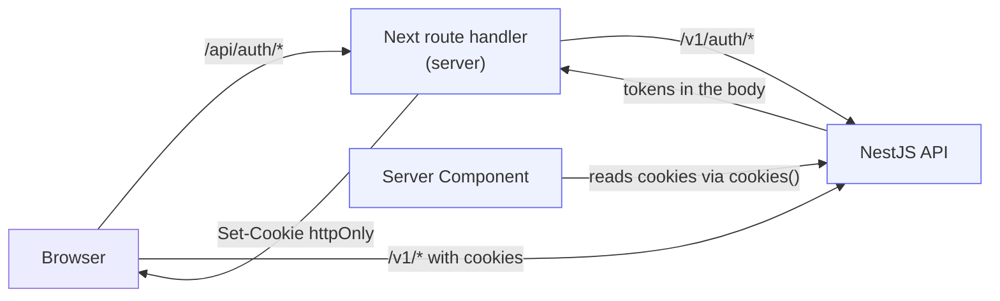
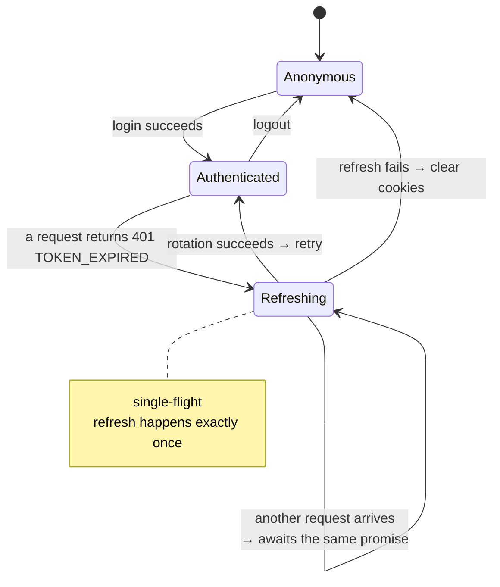

# Client session

<Status value="planned" />

How the browser holds a session, renews it, and guards routes.

## Where tokens live

| | httpOnly cookie | localStorage | In-memory variable |
| --- | --- | --- | --- |
| Stealable by XSS | ❌ No | ✅ **Yes** | ✅ Yes (harder) |
| Needs CSRF defence | ✅ Yes | ❌ No | ❌ No |
| Readable in Server Components | ✅ | ❌ | ❌ |
| Survives a page reload | ✅ | ✅ | ❌ |
| Attached automatically | ✅ | ❌ | ❌ |

**httpOnly cookies** for both the access and refresh tokens.

One XSS against `localStorage` means permanent token theft until expiry. CSRF, by contrast, has well-understood defences that actually work (`SameSite=Lax` + double-submit). Just as important: Server Components can read cookies, which enables authenticated server-side prefetching without waiting for JavaScript. Full reasoning at [ADR-0006](/en/adr/0006-token-storage-httponly-cookie).

## Overall shape



Tokens never pass through page JavaScript — the route handler receives them and converts them to cookies immediately.

## Setting cookies

```ts
// apps/web/src/app/api/auth/login/route.ts
import { cookies } from "next/headers";
import { LoginSchema, AuthTokensSchema } from "@app-platform/contracts";

export async function POST(request: Request) {
  const body = LoginSchema.parse(await request.json());

  const res = await fetch(`${process.env.API_URL}/v1/auth/login`, {
    method: "POST",
    headers: { "content-type": "application/json", "x-request-id": crypto.randomUUID() },
    body: JSON.stringify(body),
  });

  if (!res.ok) {
    return Response.json(await res.json(), { status: res.status });
  }

  const tokens = AuthTokensSchema.parse(await res.json());
  const jar = await cookies();

  jar.set("access_token", tokens.accessToken, {
    httpOnly: true,
    secure: process.env.NODE_ENV === "production",
    sameSite: "lax",
    path: "/",
    maxAge: 60 * 15,
  });

  jar.set("refresh_token", tokens.refreshToken, {
    httpOnly: true,
    secure: process.env.NODE_ENV === "production",
    sameSite: "lax",
    // narrow the path — this cookie is only ever sent to the refresh endpoint
    path: "/api/auth/refresh",
    maxAge: 60 * 60 * 24 * 7,
  });

  // never return tokens in the body — keeping them away from JS is the whole point
  return Response.json({ ok: true });
}
```

::: tip Keep the refresh cookie's `path` narrow
`path: "/api/auth/refresh"` means the browser sends the refresh token only when calling that endpoint. Every other request can't carry it, which shrinks its exposure to a single route.
:::

::: tip Use `API_URL`, not `NEXT_PUBLIC_API_URL`
Route handlers run server-side, so they can use plain env vars — and **should**, because it points at the internal Docker hostname the browser can't reach anyway.
:::

## CSRF defence

`SameSite=Lax` blocks nearly all cross-site submission — browsers won't send the cookie with a cross-origin `POST`. Add a double-submit token for all mutations:

```ts
// proxy.ts — set a CSRF token that JS is meant to read
if (!request.cookies.get("csrf_token")) {
  response.cookies.set("csrf_token", crypto.randomUUID(), {
    httpOnly: false,     // must be readable, or it can't be echoed back as a header
    sameSite: "lax",
    path: "/",
  });
}
```

```ts
// in every mutating route handler
const cookieToken = (await cookies()).get("csrf_token")?.value;
const headerToken = request.headers.get("x-csrf-token");
if (!cookieToken || cookieToken !== headerToken) {
  return Response.json({ code: "AUTHZ_FORBIDDEN" }, { status: 403 });
}
```

::: tip Why double-submit works
An attacker's site can make the browser *send* our cookie (where SameSite allows it), but it cannot **read** the value — same-origin policy forbids that. So it can't put the correct value in the header. Cookie and header matching proves the request came from our own pages.
:::

## Automatic refresh



```ts
// apps/web/src/lib/api-client.ts
let refreshPromise: Promise<boolean> | null = null;

/** everyone who hits 401 at once shares a single refresh */
function refreshOnce(): Promise<boolean> {
  refreshPromise ??= fetch("/api/auth/refresh", { method: "POST" })
    .then((res) => res.ok)
    .finally(() => { refreshPromise = null; });
  return refreshPromise;
}

export async function apiFetch<T extends z.ZodTypeAny>(
  path: string,
  schema: T,
  init: RequestInit = {},
): Promise<z.infer<T>> {
  const send = () =>
    fetch(`/api/proxy${path}`, {
      ...init,
      headers: {
        "content-type": "application/json",
        "x-request-id": uuidv7(),
        ...(isMutation(init.method) ? { "x-csrf-token": readCsrfCookie() } : {}),
        ...init.headers,
      },
      credentials: "include",
    });

  let res = await send();

  if (res.status === 401) {
    const body = await res.clone().json().catch(() => null);
    // only EXPIRED warrants a refresh — INVALID means the session is genuinely dead
    if (body?.code === "AUTH_TOKEN_EXPIRED" && (await refreshOnce())) {
      res = await send();
    } else {
      window.location.href = `/login?next=${encodeURIComponent(location.pathname)}`;
      throw toApiError(body, 401);
    }
  }

  const body = await res.json().catch(() => null);
  if (!res.ok) throw toApiError(body, res.status);
  return schema.parse(body);
}
```

::: danger Single-flight isn't optional
A dashboard with five parallel queries whose access token has just expired gets five `401`s and fires five refreshes. The first succeeds and rotates; the other four present an already-rotated token → [the system reads it as reuse](/en/auth/tokens) → **the whole family is revoked and the user is thrown out.**

Without single-flight, rotation logs users out every time a token expires while a multi-query page is loading.
:::

::: tip `AUTH_TOKEN_EXPIRED` must be distinct from `AUTH_TOKEN_INVALID`
`EXPIRED` → refresh and retry. `INVALID` → clear and go to login. Merge them and a genuinely broken token produces an endless refresh–401 loop. This is why [JwtAuthGuard must separate the two](/en/auth/tokens).
:::

## Route protection

```ts
// apps/web/src/proxy.ts
import createIntlMiddleware from "next-intl/middleware";
import { routing } from "./i18n/routing";

const intl = createIntlMiddleware(routing);

const PUBLIC = ["/login", "/signup", "/forgot-password", "/reset-password", "/verify-email", "/check-email"];

export default function proxy(request: NextRequest) {
  const response = intl(request);

  // strip the locale first: /th/settings → /settings
  const path = request.nextUrl.pathname.replace(/^\/(th|en)/, "") || "/";
  const hasSession = Boolean(request.cookies.get("access_token") ?? request.cookies.get("refresh_token"));

  if (!PUBLIC.some((p) => path.startsWith(p)) && !hasSession) {
    const url = request.nextUrl.clone();
    url.pathname = `/${getLocale(request)}/login`;
    url.searchParams.set("next", request.nextUrl.pathname);
    return NextResponse.redirect(url);
  }

  // an authenticated user shouldn't see the login page
  if (PUBLIC.some((p) => path.startsWith(p)) && hasSession && path !== "/reset-password") {
    return NextResponse.redirect(new URL(`/${getLocale(request)}/dashboard`, request.url));
  }

  return response;
}

export const config = { matcher: ["/((?!api|_next|_vercel|.*\\..*).*)"] };
```

::: danger The middleware only checks that a cookie exists
It doesn't verify the signature — doing so would mean an API call on every navigation, which is too slow. So someone with a garbage cookie passes the middleware and **immediately gets a 401 from the API when the page fetches data.**

The middleware is UX (don't show an empty page), not security. Security lives in the API guards, always.
:::

## The current session

```ts
// apps/web/src/hooks/use-session.ts
export const sessionKeys = { me: ["auth", "me"] as const };

export function useSession() {
  const { data, isPending } = useQuery({
    queryKey: sessionKeys.me,
    queryFn: () => apiFetch("/auth/me", MeResponseSchema),
    staleTime: 5 * 60_000,
    retry: false,          // never retry a 401
  });

  return {
    user: data?.user ?? null,
    ability: useMemo(() => (data ? buildAbility(data.rules) : null), [data]),
    isPending,
  };
}
```

Prefetch on the server so the first paint isn't empty:

```tsx
// app/[locale]/(app)/layout.tsx — Server Component
const queryClient = new QueryClient();
await queryClient.prefetchQuery({
  queryKey: sessionKeys.me,
  queryFn: () => serverFetch("/v1/auth/me", MeResponseSchema),  // reads cookies via cookies()
});

return (
  <HydrationBoundary state={dehydrate(queryClient)}>
    <AbilityProvider>{children}</AbilityProvider>
  </HydrationBoundary>
);
```

## Logging out

```ts
// apps/web/src/app/api/auth/logout/route.ts
export async function POST() {
  const jar = await cookies();
  const refreshToken = jar.get("refresh_token")?.value;

  // tell the API to revoke it — clearing only the cookie leaves it valid for 7 more days
  if (refreshToken) {
    await fetch(`${process.env.API_URL}/v1/auth/logout`, {
      method: "POST",
      headers: { cookie: `refresh_token=${refreshToken}` },
    }).catch(() => {});   // still clear cookies even if the API is down
  }

  jar.delete("access_token");
  jar.delete("refresh_token");
  return Response.json({ ok: true });
}
```

The client must also call `queryClient.clear()`, not just `invalidateQueries` — otherwise the previous user's data lingers in the cache and shows up for whoever logs in next on that machine.

::: warning Current code status
| Target spec | Code today |
| --- | --- |
| `/api/auth/*` route handlers | There's no `app/api/` directory at all |
| `api-client` with single-flight refresh | The file doesn't exist |
| Route protection in `proxy.ts` | Only next-intl middleware |
| `useSession` + ability | Don't exist |
| CSRF token | Doesn't exist |
| `QueryClient` with defaults | `providers.tsx` creates a bare `new QueryClient()` — no `staleTime`, no `retry` |
| Server prefetch + hydration | Doesn't exist |
| API returns tokens as cookies | The API returns them in the body; nothing converts them |
:::
