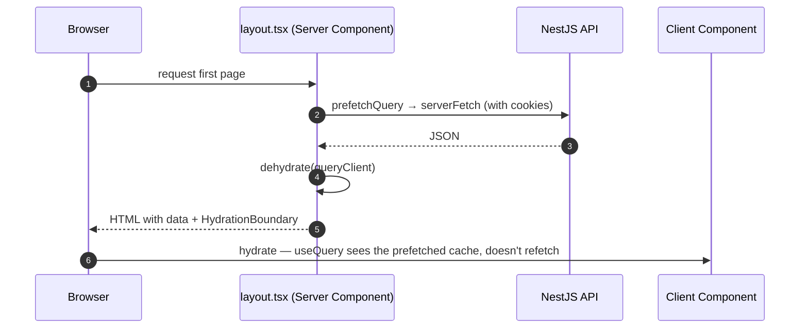

# Data fetching (TanStack Query)

<Status value="in-progress" note="provider is ready; no hooks use it yet" />

Any request that needs caching, revalidation, or dedupe goes through TanStack Query. No `useEffect` + raw `fetch` in pages.

## Why not `useEffect` + `fetch`

```tsx
// ❌ Don't do this — no cache, refetches on every mount, races when id changes fast
useEffect(() => {
  fetch(`/api/users/${id}`).then((r) => r.json()).then(setUser);
}, [id]);
```

The problem isn't the line count — it's the behavior that's missing. No dedupe between two components requesting the same data at once, no retry, no stale-while-revalidate, and no cancellation of a stale request when `id` changes before the first response lands. TanStack Query fixes all of this with one idea: **the query key is the cache key.**

## The `QueryClientProvider` today <Status value="implemented" inline />

```tsx
// apps/web/src/app/providers.tsx
"use client";

import { useState } from "react";
import { QueryClient, QueryClientProvider } from "@tanstack/react-query";
import { ReactQueryDevtools } from "@tanstack/react-query-devtools";

export function Providers({ children }: { children: React.ReactNode }) {
  const [queryClient] = useState(() => new QueryClient());

  return (
    <QueryClientProvider client={queryClient}>
      {children}
      <ReactQueryDevtools initialIsOpen={false} />
    </QueryClientProvider>
  );
}
```

This works today, but `new QueryClient()` sets no defaults. The target is to set `staleTime`/`retry` centrally here instead of repeating them in every hook.

```ts
// target — not implemented yet
const [queryClient] = useState(
  () =>
    new QueryClient({
      defaultOptions: {
        queries: {
          staleTime: 30_000,     // most data doesn't need a refetch every time the tab regains focus
          retry: (failureCount, error) =>
            isApiError(error) && error.status >= 500 && failureCount < 2,
        },
      },
    }),
);
```

::: tip `retry` needs to understand our own error shape
TanStack Query's default retry (3 attempts, exponential backoff) doesn't distinguish `4xx` from `5xx` — retrying a `404` or `422` three times just makes the user wait longer for the same result. Always gate on the actual condition.
:::

## Query key convention

```ts
// apps/web/src/hooks/query-keys.ts — target
export const userKeys = {
  all: ["users"] as const,
  list: (filters: UsersFilter) => [...userKeys.all, "list", filters] as const,
  detail: (id: string) => [...userKeys.all, "detail", id] as const,
};
```

| Rule | Why |
| --- | --- |
| Keys are always arrays, never a single string | `invalidateQueries({ queryKey: userKeys.all })` clears list and detail together from one prefix |
| Filters/params go inside the key | Different filters are different cache entries — otherwise a search page shows the previous filter's results |
| Export one object, not scattered constants | "Who uses this key" is answerable from one place, which makes refactors safer |

## Writing a query hook

```ts
// apps/web/src/hooks/use-users.ts — target
import { useQuery } from "@tanstack/react-query";
import { UsersListResponseSchema } from "@app-platform/contracts";
import { apiFetch } from "@/lib/api-client";
import { userKeys } from "./query-keys";

export function useUsers(filters: UsersFilter) {
  return useQuery({
    queryKey: userKeys.list(filters),
    queryFn: () =>
      apiFetch(`/users?${toSearchParams(filters)}`, UsersListResponseSchema),
    placeholderData: (prev) => prev, // avoids a flash of empty state while paginating
  });
}
```

`apiFetch` comes from [Client session](/en/frontend/auth-client#automatic-refresh) — it parses the response through the same schema the API uses to generate Swagger, so the type of `data` can never drift from what the server actually sends.

## Server prefetch + Hydration



```tsx
// app/[locale]/(app)/users/page.tsx — Server Component, target
export default async function UsersPage() {
  const queryClient = new QueryClient();
  await queryClient.prefetchQuery({
    queryKey: userKeys.list(DEFAULT_FILTERS),
    queryFn: () => serverFetch("/v1/users", UsersListResponseSchema),
  });

  return (
    <HydrationBoundary state={dehydrate(queryClient)}>
      <UsersTable />
    </HydrationBoundary>
  );
}
```

`useUsers` inside `<UsersTable />` (client component) must use **the exact same query key** as the prefetch. Otherwise hydration doesn't match up and the query refetches from the client immediately.

::: danger A mismatched key means the prefetch was wasted
`dehydrate`/`HydrationBoundary` match queries by serializing the whole `queryKey` object. If the server prefetches with `userKeys.list({ page: 1 })` but the client calls `useUsers({ page: 1, sort: undefined })`, the two keys may not match depending on property order. Always build keys both sides through one shared helper — never hand-assemble the array twice.
:::

## Mutations + invalidation

```ts
// apps/web/src/hooks/use-update-user.ts — target
export function useUpdateUser(id: string) {
  const queryClient = useQueryClient();

  return useMutation({
    mutationFn: (dto: UpdateUser) =>
      apiFetch(`/users/${id}`, UserSchema, { method: "PATCH", body: JSON.stringify(dto) }),
    onSuccess: (updated) => {
      queryClient.setQueryData(userKeys.detail(id), updated);          // update immediately, no refetch needed
      queryClient.invalidateQueries({ queryKey: userKeys.all });        // but the list must refetch — filter/sort may have moved this row
    },
  });
}
```

::: tip `setQueryData` and `invalidateQueries` do different jobs
`setQueryData` patches the cache immediately with no network call — use it when you know the exact resulting value (like the detail of a record you just updated). `invalidateQueries` just marks data stale and waits for the next refetch — use it for queries whose outcome is uncertain (a list with filters/sort/pagination).
:::

## Handling errors

`apiFetch` always throws the same error object defined by the [error envelope](/en/conventions/errors), so components write one handler, once.

```tsx
const { data, error, isPending } = useUsers(filters);

if (error) {
  return <ErrorBanner code={error.code} message={t(`errors.${error.code}`)} />;
}
```

Bind `error.code` to a translated message in the locale files instead of showing the raw `error.message` — `message` in the error envelope is English, for debugging only. See the full [error code catalog](/en/reference/error-codes).

::: warning Current code status
| Target spec | Code today |
| --- | --- |
| `QueryClient` with central `staleTime`/`retry` defaults | `providers.tsx` creates a bare `new QueryClient()` — no default options |
| query/mutation hooks in a `hooks/` folder | No data-fetching hook files exist anywhere in the project |
| `apiFetch` client with single-flight refresh | `lib/api-client.ts` doesn't exist yet — see [Client session](/en/frontend/auth-client) |
| Server prefetch + `HydrationBoundary` | No route does any data fetching besides `page.tsx`, which fetches nothing |
| query key convention (`query-keys.ts`) | File doesn't exist |
:::
