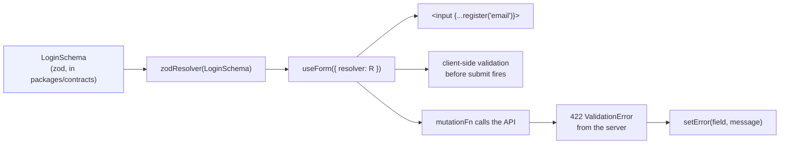

# Forms (react-hook-form + zod)

<Status value="implemented" />

Every form uses the same schema the API uses to validate — validation logic is never duplicated between client and server.

## The standard shape



One schema does three jobs: defines the type of the form values, generates client-side validation via `zodResolver`, and is the exact same thing the API validates against server-side. So an error message from a 422 maps onto a form field name exactly. See [Contract-first workflow](/en/conventions/contract-first).

## A full form example

```tsx
// apps/web/src/features/auth/login-form.tsx — target
"use client";

import { useForm } from "react-hook-form";
import { zodResolver } from "@hookform/resolvers/zod";
import { LoginSchema, type Login } from "@app-platform/contracts";
import { useLogin } from "@/features/auth";
import { Button } from "@/core/ui/button";
import { Input } from "@/core/ui/input";
import { Field, FieldError } from "@/core/ui/field";

export function LoginForm() {
  const form = useForm<Login>({
    resolver: zodResolver(LoginSchema),
    defaultValues: { email: "", password: "" },
  });
  const login = useLogin();

  const onSubmit = form.handleSubmit(async (values) => {
    try {
      await login.mutateAsync(values);
    } catch (err) {
      applyServerErrors(form, err); // see "mapping server errors" below
    }
  });

  return (
    <form onSubmit={onSubmit} noValidate>
      <Field label="Email" error={form.formState.errors.email?.message}>
        <Input type="email" {...form.register("email")} />
      </Field>
      <Field label="Password" error={form.formState.errors.password?.message}>
        <Input type="password" {...form.register("password")} />
      </Field>
      <Button type="submit" disabled={form.formState.isSubmitting}>
        Log in
      </Button>
    </form>
  );
}
```

::: tip Always `noValidate`
Turn off the browser's own validation (`required`, the `type="email"` popup) — its messages can't be translated and its styling won't match the design system. Let `zodResolver` be the single source of truth.
:::

## Wiring into [the UI system](/en/frontend/ui-system)

`Field` is a thin wrapper that lays out label + input + error text according to the design tokens — it isn't part of react-hook-form itself. It lives in the UI system so every form looks the same.

```tsx
// apps/web/src/core/ui/field.tsx
export function Field({ label, htmlFor, error, hint, children, className }: FieldProps) {
  return (
    <div className={cn("flex flex-col gap-1.5", className)}>
      <Label htmlFor={htmlFor}>{label}</Label>
      {children}
      {hint && !error && <p className="text-xs text-muted-foreground">{hint}</p>}
      {error && <FieldError>{error}</FieldError>}
    </div>
  );
}
```

## Mapping server errors back onto the form

The server can reject a submission for reasons client-side zod can't check ahead of time (like "this email is already taken"). Those arrive as an [error envelope](/en/conventions/errors) and need converting back into react-hook-form field errors.

```ts
// apps/web/src/core/api-client/apply-server-errors.ts
import type { UseFormReturn, FieldValues, Path } from "react-hook-form";
import { ApiError } from "@/core/api-client";

export function applyServerErrors<T extends FieldValues>(form: UseFormReturn<T>, err: unknown) {
  if (!(err instanceof ApiError) || err.status !== 422) throw err; // not a validation error — let an error boundary handle it

  if (!err.details?.length) {
    form.setError("root", { message: err.code, type: "server" });
    return;
  }

  for (const detail of err.details) {
    if (detail.field) {
      form.setError(detail.field as Path<T>, { message: detail.code, type: "server" });
    } else {
      form.setError("root", { message: detail.code, type: "server" });
    }
  }
}
```

::: warning Use `detail.code`, not `detail.message`, as the translation key
`message` in the error envelope is English, for debugging only. Per the [error envelope contract](/en/conventions/errors), `code` is the stable key meant for i18n — bind `code` into the next-intl message files instead of showing the raw `message` to a user.
:::

## Submitting is a mutation

`onSubmit` never calls `fetch` directly — it always calls a mutation hook from [Data fetching](/en/frontend/data-fetching#mutations-invalidation). The reason: `isSubmitting` needs to reflect real network state (a mutation's `isPending`), not a hand-rolled flag, and a successful submit needs to invalidate the right queries immediately.

```ts
// apps/web/src/entities/user/use-users.ts
export function useCreateUser() {
  const queryClient = useQueryClient();
  return useMutation({
    mutationFn: (input: CreateUser) => request("/v1/users", UserSchema, { method: "POST", body: input }),
    onSuccess: () => queryClient.invalidateQueries({ queryKey: userKeys.all }),
  });
}
```

The same shape repeats in `use-roles.ts` (create/update/delete role), `use-me.ts` (update profile/theme), and `use-change-password.ts`. The login page itself still calls `login()` directly instead of going through a mutation hook (not an exact match to spec, but the error handling is equivalent).

## Testing forms

Forms are easiest to test once validation logic (in the schema) is separated from interaction logic (in the component) — test the schema directly with plain unit tests, and only test the component's main flows (fill in correctly → submit → see the result; fill in wrong → see an error).

```ts
describe("LoginSchema", () => {
  it("rejects a password shorter than 8 characters", () => {
    expect(LoginSchema.safeParse({ email: "a@b.com", password: "short" }).success).toBe(false);
  });
});
```

::: warning Current code status
| Target spec | Code today |
| --- | --- |
| forms using `zodResolver` | Real in every form: login, add/edit user, create/edit role, change password, profile |
| `Field` / `FieldError` in the UI system | Real at `core/ui/field.tsx`, used everywhere |
| `applyServerErrors` mapping 422s back onto the form | Real at `core/api-client/apply-server-errors.ts` |
| mutation hook per form | Real in `use-users.ts`, `use-roles.ts`, `use-me.ts`, `use-change-password.ts` |
| `react-hook-form` + `@hookform/resolvers` dependencies | Installed and used throughout the app |
:::
