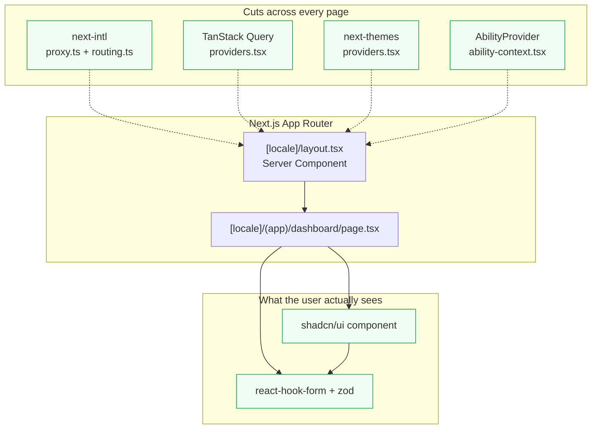

# Frontend overview

<Status value="implemented" note="every pillar has real code running — server prefetch/hydration is the main remaining gap" />

This section explains how `apps/web` fits together — data fetching, forms, the UI system, language, and theming. This page is the map; details for each topic live in the sub-pages.

## The chosen stack

| Concern | Tool | Status |
| --- | --- | --- |
| Routing & rendering | Next.js 16 App Router | <Status value="implemented" inline /> |
| Data fetching / cache | TanStack Query | <Status value="in-progress" inline note="hooks exist for every resource; server prefetch is still missing" /> |
| Forms + validation | react-hook-form + `zodResolver` | <Status value="implemented" inline /> |
| Component system | shadcn/ui (on Radix + Tailwind) | <Status value="implemented" inline /> |
| Language | next-intl | <Status value="implemented" inline /> |
| Theme / dark mode | next-themes | <Status value="implemented" inline /> |
| Data contracts | zod schemas from `packages/contracts` | <Status value="implemented" inline note="every hook in web imports from contracts" /> |

Every row was chosen for the same reason: let TypeScript catch mistakes at build time instead of in a user's browser at runtime.

## High-level shape

Dashed lines = providers wrapping the whole tree from the layout. Solid lines = normal rendering. Every green node has real code running today.

## Page map

| Page | Topic | Status |
| --- | --- | --- |
| [Data fetching](/en/frontend/data-fetching) | TanStack Query, query keys, prefetch/hydrate | <Status value="in-progress" inline /> |
| [Forms](/en/frontend/forms) | react-hook-form + `zodResolver` on the same schema as the API | <Status value="implemented" inline /> |
| [UI system](/en/frontend/ui-system) | shadcn/ui, `components.json`, token setup | <Status value="implemented" inline /> |
| [i18n](/en/frontend/i18n) | next-intl, routing, message files | <Status value="implemented" inline /> |
| [Theming & dark mode](/en/frontend/theming) | next-themes, CSS variables, toggle | <Status value="implemented" inline /> |
| [Client session](/en/frontend/auth-client) | token storage, automatic refresh, route protection | <Status value="in-progress" inline /> |
| [Permissions in the UI](/en/frontend/permissions-client) | `<Can>`, `AbilityProvider` | <Status value="implemented" inline /> |

The actual product pages (which assemble everything above) live under [Product features](/en/features/dashboard) — e.g. [Dashboard](/en/features/dashboard), [Settings · User management](/en/features/settings-users), and [Settings · Theme](/en/features/settings-theme).

## Shared design principles

These three repeat across almost every sub-page, because they're the backbone of the whole frontend.

1. **Server Components first.** Data that requires a session gets prefetched on the server and handed off through `HydrationBoundary` — never re-fetched from the client after mount. Full example in [Data fetching](/en/frontend/data-fetching#server-prefetch-hydration).
2. **One contract, reused everywhere.** Schemas in `packages/contracts` are simultaneously a type, a `zodResolver`, and the thing that validates the real response. No hand-typed duplicate. See [Contract-first workflow](/en/conventions/contract-first).
3. **UI hides buttons; it doesn't enforce anything.** `<Can>` and any client-side permission check exist for UX only — the server always rejects on its own. See [CASL authorization](/en/auth/casl).

::: tip Where to start implementing
If you're about to build a new page, a sane order is i18n (already there) → data fetching → UI system → forms → theming. Following this order means the dependencies won't loop back and bite you.
:::

## What's missing today

- No server prefetch + `HydrationBoundary` yet — every query still fires from the client after mount.
- Client tokens still live in `sessionStorage`, not an httpOnly cookie per ADR-0006 (see [Client session](/en/frontend/auth-client)).
- The profile page has no avatar upload and no Google account linking (needs object storage / Google credentials).

::: warning Current code status
| Target spec | Code today |
| --- | --- |
| dashboard / settings / profile pages | All exist: `dashboard`, `settings/users`, `settings/roles`, `settings/theme`, `profile` |
| query/mutation hooks powering every page | Hooks exist per resource (`use-users`, `use-roles`, `use-dashboard`, `use-me`, etc.) — server prefetch is still missing |
| forms via react-hook-form + zod | `Field`/`FieldError`/`applyServerErrors` are real and used in every form |
| shadcn/ui as a full system | `components.json` plus Radix-backed components (`Button`, `Dialog`, `Select`, `Checkbox`, `Table`, etc.) |
| `apps/web` consuming `packages/contracts` | Every hook in `entities/*` and `features/*` imports schemas from contracts |
| dark mode | `next-themes` + per-mode CSS variables + `ThemeToggle` all work |
:::
