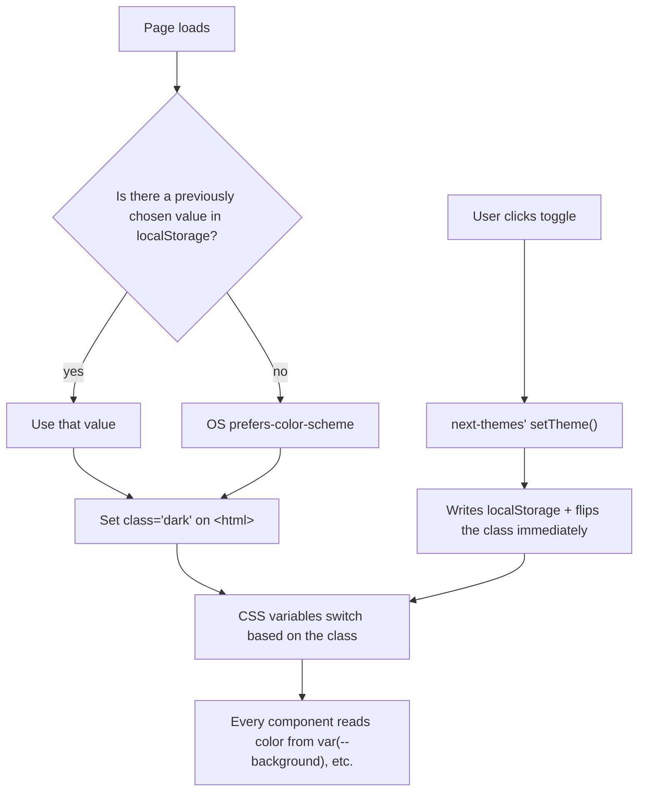

# Theming & dark mode

<Status value="planned" />

Light/dark switches via a class on `<html>` plus CSS variables — not a prop threaded through the component tree. This means every component (including shadcn/ui's) picks up the right colors without re-rendering the whole tree when the theme flips.

## Approach



There's no theme state living in a React context that components need to subscribe to — `next-themes` works entirely through the DOM class, so switching themes doesn't trigger re-renders of unrelated components.

## Setting up `ThemeProvider`

```bash
pnpm --filter @app-platform/web add next-themes
```

```tsx
// apps/web/src/app/providers.tsx — target
"use client";

import { useState } from "react";
import { ThemeProvider } from "next-themes";
import { QueryClient, QueryClientProvider } from "@tanstack/react-query";
import { ReactQueryDevtools } from "@tanstack/react-query-devtools";

export function Providers({ children }: { children: React.ReactNode }) {
  const [queryClient] = useState(() => new QueryClient());

  return (
    <ThemeProvider attribute="class" defaultTheme="system" enableSystem disableTransitionOnChange>
      <QueryClientProvider client={queryClient}>
        {children}
        <ReactQueryDevtools initialIsOpen={false} />
      </QueryClientProvider>
    </ThemeProvider>
  );
}
```

`attribute="class"` is what ties `next-themes` to Tailwind — Tailwind reads dark mode from a `dark` class on an ancestor by default. `disableTransitionOnChange` stops CSS transitions from misbehaving during a switch (colors visibly sliding across the whole page unintentionally).

::: tip `attribute="class"` must match Tailwind's `darkMode` setting
Tailwind v4 uses `@custom-variant dark (&:where(.dark, .dark *))` (or `darkMode: "class"` in v3) — if `next-themes` is set to a different attribute (e.g. `data-theme`) while Tailwind still waits for the `.dark` class, dark mode silently never activates, with no error to see.
:::

## CSS variables per mode

```css
/* apps/web/src/app/globals.css — target */
:root {
  --background: 0 0% 100%;
  --foreground: 222 47% 11%;
  --primary: 221 83% 53%;
  --primary-foreground: 0 0% 100%;
  --border: 220 13% 91%;
}

.dark {
  --background: 222 47% 11%;
  --foreground: 210 40% 98%;
  --primary: 217 91% 60%;
  --primary-foreground: 222 47% 11%;
  --border: 217 33% 24%;
}
```

```css
@theme inline {
  --color-background: hsl(var(--background));
  --color-foreground: hsl(var(--foreground));
  --color-primary: hsl(var(--primary));
  --color-border: hsl(var(--border));
}
```

Every component uses `bg-background`, `text-foreground`, `bg-primary` — nowhere does a component file write `dark:bg-slate-900` directly. The difference between modes lives entirely in one layer: the CSS variable definitions.

::: warning Today's Button doesn't participate in this system at all
`components/ui/button.tsx` currently references `bg-brand-600` directly, which isn't just an undefined token (see [UI system](/en/frontend/ui-system#a-component-the-way-the-cli-would-generate-it)) — even if that token were defined, it would stay one fixed color and never switch with dark mode. It needs to move to `bg-primary` before it can support theming at all.
:::

## Toggle component

```tsx
// apps/web/src/components/theme-toggle.tsx — target
"use client";

import { useTheme } from "next-themes";
import { Sun, Moon } from "lucide-react";
import { Button } from "@/components/ui/button";

export function ThemeToggle() {
  const { resolvedTheme, setTheme } = useTheme();

  return (
    <Button
      variant="ghost"
      size="sm"
      aria-label="Toggle theme"
      onClick={() => setTheme(resolvedTheme === "dark" ? "light" : "dark")}
    >
      {resolvedTheme === "dark" ? <Sun className="size-4" /> : <Moon className="size-4" />}
    </Button>
  );
}
```

Use `resolvedTheme`, not `theme` — `theme` might be `"system"`, which doesn't tell you what the icon should show. `resolvedTheme` is always the actual value after resolving `"system"`.

## Persisting the user's choice

`next-themes` saves the value to `localStorage` automatically, which is enough for an MVP, but it doesn't sync across devices. The next step is to persist it to the user's profile through the API, so they see the same theme after logging in on another machine. See [Settings · Theme](/en/features/settings-theme) for the page that will combine this toggle with a full settings form.

```ts
// target — sync the theme to the profile after a toggle
const updateTheme = useMutation({
  mutationFn: (theme: "light" | "dark" | "system") =>
    apiFetch("/users/me/preferences", UserPreferencesSchema, {
      method: "PATCH",
      body: JSON.stringify({ theme }),
    }),
});
```

## Avoiding a flash of the wrong theme

`next-themes` injects an inline script into `<head>` that reads `localStorage` and sets the class **before** React hydrates — but `<html>` needs `suppressHydrationWarning`, or React will warn about mismatched attributes between the server render and the first client render.

```tsx
// apps/web/src/app/[locale]/layout.tsx — target
<html lang={locale} suppressHydrationWarning>
```

::: danger Never read `theme` in a Server Component
`useTheme()` only works client-side, because the real value comes from `localStorage`, which the server doesn't know about. Trying to read the theme in a Server Component to render the right colors in the very first HTML always causes a hydration mismatch. Let the first HTML render with default colors, and let `next-themes`' script fix the class before paint — the user never sees a flash, because the script really does run before the browser paints.
:::

::: warning Current code status
| Target spec | Code today |
| --- | --- |
| `next-themes` dependency | Not in `package.json` at all |
| `ThemeProvider` in `providers.tsx` | `providers.tsx` only has `QueryClientProvider` |
| Per-mode CSS variables (`:root` / `.dark`) in `globals.css` | No dark mode definitions exist |
| `ThemeToggle` component | File doesn't exist |
| `suppressHydrationWarning` on `<html>` | Not needed yet — no theme provider means no mismatch |
| Syncing theme to profile via the API | No endpoint or hook exists |
:::
