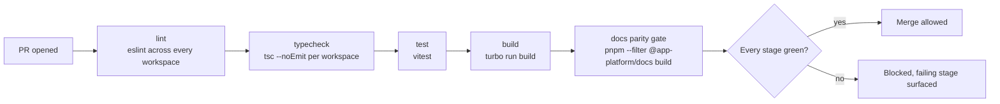

# CI/CD

<Status value="planned" />

::: warning There is no CI today
`.github/workflows/` does not exist in the codebase — nothing stops a broken build, a failing lint, or a type error from being merged. See [Roadmap item 9](/en/start/roadmap). Everything on this page is the target spec.
:::

## Why it matters

This repo is a pnpm workspace where `apps/web`, `apps/api`, and `apps/docs` share `packages/contracts`. A schema change in contracts can break both web and api at once, and nobody finds out until deploy time. CI is the only gate that catches it before merge.

This documentation set is also the bilingual SSOT under [ADR-0015](/en/adr/0015-docs-as-bilingual-ssot) — the rule that "every Thai page needs an `/en/` mirror" is unenforceable without a pipeline that actually runs `pnpm --filter @app-platform/docs build` and checks for dead links.

## Target pipeline



Each stage runs through `turbo` so caching skips work across jobs and untouched workspaces.

| Stage | Command | Blocks |
| --- | --- | --- |
| lint | `pnpm lint` | Code style, unused imports, eslint rules |
| typecheck | `pnpm turbo run typecheck` | Cross-workspace type errors (contracts → web/api) |
| test | `pnpm test` | No test files exist yet — see [Roadmap item 8](/en/start/roadmap); this stage passes vacuously until they do |
| build | `pnpm build` | Every app must actually build, not just run its dev server |
| docs parity gate | `pnpm --filter @app-platform/docs build` | Thai pages with no `/en/` mirror, dead links, mermaid/Vue compile errors |

::: tip The docs parity gate is more than "docs build succeeds"
VitePress runs with `ignoreDeadLinks` narrowed to `http(s)://localhost` only, and `.vitepress/structure.ts` pre-registers every page. That means a page that exists only in Thai (or only in English) turns the whole repo's build red. It's the one mechanism that actually enforces ADR-0015, rather than relying on people remembering to follow it.
:::

## Target workflow example

```yaml
# .github/workflows/ci.yml — this file doesn't exist yet
name: ci

on:
  pull_request:
  push:
    branches: [main]

jobs:
  ci:
    runs-on: ubuntu-latest
    steps:
      - uses: actions/checkout@v4

      - uses: pnpm/action-setup@v4
        with:
          version: 11.18.0

      - uses: actions/setup-node@v4
        with:
          node-version: 22
          cache: pnpm

      - run: pnpm install --frozen-lockfile

      - run: pnpm lint
      - run: pnpm turbo run typecheck
      - run: pnpm test
      - run: pnpm build
      - run: pnpm --filter @app-platform/docs build
```

`--frozen-lockfile` stops CI from silently rewriting `pnpm-lock.yaml` — if the lockfile doesn't match `package.json`, it should fail rather than auto-update.

## Required checks and branch protection

The target is to require, on `main`:

| Rule | Why |
| --- | --- |
| No direct pushes to `main` | Everything goes through a PR |
| The `ci` job must pass before merging | Blocks broken builds from landing on `main` |
| Branch must be up to date before merging | Avoids "passed when opened, broken after someone else merged first" |

## Getting to a production pipeline

The stages above are **CI** only — checks before merge. **CD** (build image → push → deploy) is a separate layer that's blocked on choosing a target platform — see [Deployment](/en/ops/deployment) and [Docker & Traefik § The production target](/en/ops/docker-traefik).

::: warning Current code status
| Target spec | Code today |
| --- | --- |
| `.github/workflows/ci.yml` running lint/typecheck/test/build/docs | No `.github/` directory at all |
| Branch protection on `main` | None — no remote repo configured for it yet |
| Docs parity gate enforced automatically | Only the script `pnpm --filter @app-platform/docs build`, which has to be run manually |
| CD (build → push → deploy) | None — no target platform to deploy to |
:::
