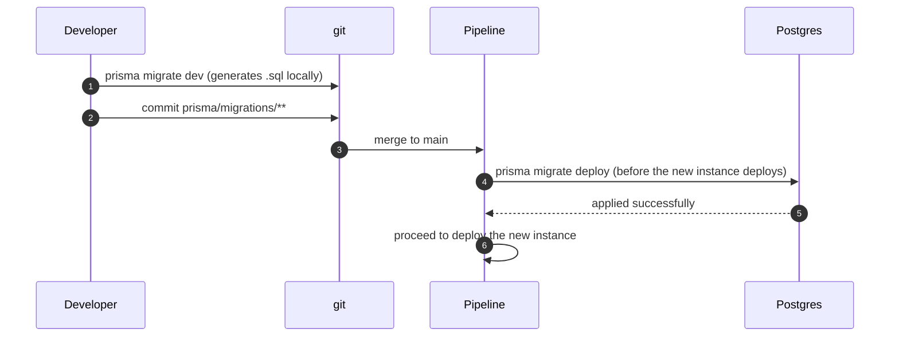
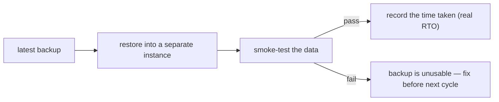

# Database operations

<Status value="planned" />

This page covers looking after Postgres past the local-development stage — migrations on deploy, backups, and restore drills. Day-to-day `prisma migrate dev` and `prisma:seed` work is already covered in [Local development § Database](/en/ops/local-development); this page doesn't repeat it.

## Migrations on deploy

Today the only command that exists is `prisma migrate dev`, which is **not** what runs on deploy — it prompts interactively and does dev-only things (shadow database, etc). The target draws a clear line:

| Command | Runs where | Does |
| --- | --- | --- |
| `prisma migrate dev` | Dev machines only | Generates a new migration from the `schema.prisma` diff, applies it immediately, prompts for a name |
| `prisma migrate deploy` | CI/CD, before traffic moves to a new instance | Applies only existing migrations, no prompts, creates nothing new |



::: danger `migrate deploy` must run before traffic switches, not after
If the new instance (with new code) starts receiving traffic before the migration is applied, and that code queries a column that doesn't exist yet, it fails immediately. Migrations always come first — see [Deployment § Migrations on deploy](/en/ops/deployment).
:::

Seeding has the same problem from a different angle — see [Roadmap item 4](/en/start/roadmap): `prisma db seed` doesn't work because `tsx` isn't a dependency. That needs fixing before seeding can be part of an automated pipeline.

## Backups

No backup script or cron job exists in the code yet. The target:

| Aspect | Target |
| --- | --- |
| Frequency | At least daily full `pg_dump`, plus continuous WAL archiving if PITR is needed |
| Storage | Object storage in a different region from the primary database |
| Retention | At least 30 days back, grandfather-father-son rotation for longer retention |
| Encryption | Off-site backups must be encrypted at rest |
| Testing | A backup that's never been restored is unproven, full stop |

```bash
# Illustrative command (target, not an existing script)
pg_dump --format=custom \
  --dbname="$DATABASE_URL" \
  --file="backup-$(date +%Y%m%d-%H%M%S).dump"
```

## Restore drills

A backup that has never been restored is a backup nobody has proven works. The target:

1. Run restore drills on a schedule (e.g. quarterly), not only during a real incident.
2. Restore into a separate instance, never over the real one.
3. Run a basic smoke test (e.g. `SELECT count(*) FROM "User"`) against the expected numbers.
4. Record how long the whole process took — that number is the real RTO (recovery time objective), not whatever's written down.



## Point-in-time recovery (PITR)

Restoring to an arbitrary timestamp (not just the last backup point) requires continuous WAL archiving alongside periodic full backups. Common choices are relying on a managed Postgres provider's built-in capability, or running `pgbackrest`/`wal-g` yourself. This hasn't been decided — it depends on choosing managed vs. self-hosted Postgres first — see [Deployment § Decisions to make first](/en/ops/deployment).

::: warning Current code status
| Target spec | Code today |
| --- | --- |
| `prisma migrate deploy` as a pre-deploy CI/CD step | No CI/CD at all — see [CI/CD](/en/ops/ci-cd) |
| Daily backups + retention policy | No script or cron job of any kind |
| Scheduled restore drills | Never done |
| PITR via WAL archiving | Doesn't exist |
| A seed that works unattended | `prisma db seed` fails because `tsx` isn't a dependency — see [Roadmap item 4](/en/start/roadmap) |
:::
