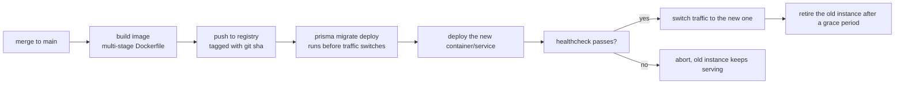
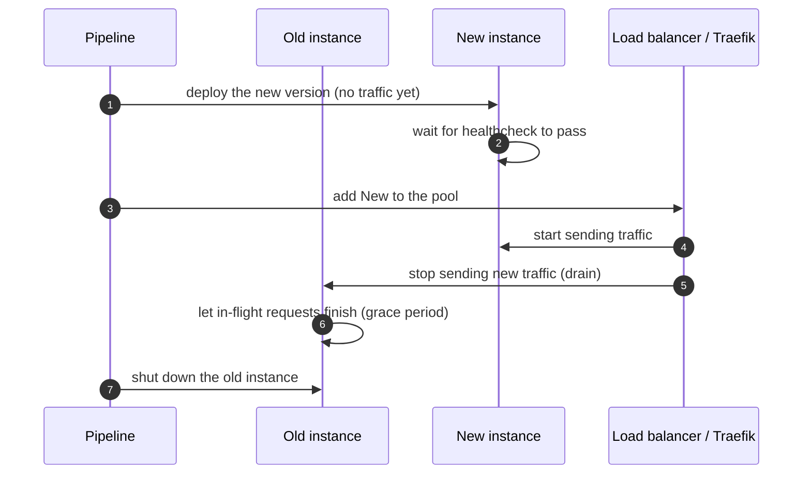

# Deployment

<Status value="planned" />

::: warning No target platform yet
This page deliberately doesn't commit to a cloud provider — the team hasn't decided. What follows is the *shape* deployment needs to take, regardless of where it eventually runs.
:::

## Decisions to make before writing real code

| Question | Why it matters |
| --- | --- |
| Self-hosted (VM + Docker) or a managed platform (PaaS/container service)? | Determines how much orchestrator manifest work is on us |
| Managed Postgres, or run it as a container ourselves? | Drives everything about backup/PITR — see [Database operations](/en/ops/database-ops) |
| How many environments (staging + production, or more)? | Sets how many secret sets and pipelines need to exist |
| Who owns the domain/DNS and the TLS certs? | Traefik needs the right ACME provider configured |

Until these are answered, this page won't name a specific cloud provider.

## Shape of the target deployment

### Build artifacts

| App | What the image needs | Reference |
| --- | --- | --- |
| web | `.next/standalone` + `.next/static` (`output: "standalone"` is already set) | [Docker & Traefik](/en/ops/docker-traefik) |
| api | Compiled `dist/` + a Prisma engine matching the target platform | — |
| docs | Pure static output (`pnpm --filter @app-platform/docs build` produces `dist/`) — deployable as static hosting, no container needed | — |

::: tip Docs don't need the same deployment shape as web/api
VitePress builds to plain static files, unlike web/api which are long-running servers. Docs can go through static hosting/a CDN with no container running at all.
:::

### Env injection

Env values must not be baked into the image (with the intentional exception of `NEXT_PUBLIC_*`, which is baked at build time by design — see [Environment variables](/en/reference/env-vars)). Everything else is injected at runtime through the target platform's secret manager, never committed to the repo or baked into the image.

### Migrations on deploy

`prisma migrate deploy` must run **before** the new instance receives traffic, not after — an unapplied migration paired with new code querying a not-yet-existing field fails immediately. Full detail in [Database operations](/en/ops/database-ops).

### Zero-downtime rollout

Rule: a new instance only receives traffic **after** its healthcheck passes, and the old instance gets a grace period before being killed — otherwise in-flight requests get dropped.

### Rollback

Every deploy is tagged with an identifiable git sha, so rollback means redeploying the previous image tag — no need to revert a commit first. The exception is when the newer migration is breaking (dropping a column the old code still reads); that case needs an expand/contract migration planned in advance — see [Contract-first § Breaking contract changes](/en/conventions/contract-first).

::: danger Never roll back code without checking the migration
If a new migration dropped or renamed a column, rolling back just the image to an older version leaves old code querying a column that no longer exists — it fails immediately. Migrations always need to stay backward-compatible for at least one version.
:::

::: warning Current code status
| Target spec | Code today |
| --- | --- |
| Production Dockerfile + registry + deploy pipeline | None of it exists — see [Docker & Traefik](/en/ops/docker-traefik) and [CI/CD](/en/ops/ci-cd) |
| `prisma migrate deploy` as an automated pre-deploy step | Only `prisma migrate dev` exists, for local development — see [Database operations](/en/ops/database-ops) |
| A chosen target platform | Not decided yet |
| Zero-downtime rollout | None — there's nothing to roll out yet |
:::
