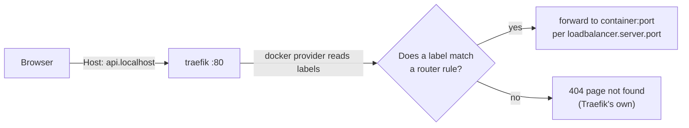
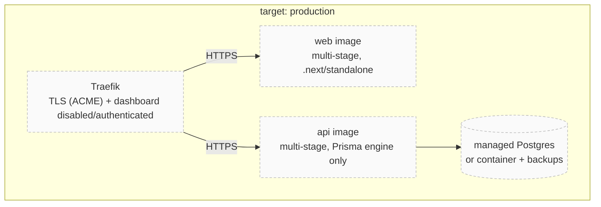

# Docker & Traefik

<Status value="in-progress" note="dev stack is real, production is still a spec" />

This page is the ops runbook for Docker/Traefik — for the architecture and a diagram of the stack, read [Containers & routing](/en/architecture/containers) first. This page covers the commands you actually run, how to debug routing, and what's still missing before production.

## Common commands

```bash
pnpm dev:docker              # bring up the whole stack (base + local overlay)
pnpm dev:docker:build        # force an image rebuild after changing a Dockerfile.dev
pnpm dev:docker:down         # stop and remove containers (volumes survive)

docker compose logs -f traefik            # tail Traefik's log
docker compose restart api                # restart a single service
docker compose exec postgres psql -U app  # jump straight into psql
docker compose ps                         # status + healthcheck of every service
```

These are shorthand for

```bash
docker compose -f docker-compose.yml -f docker-compose.local.yml <subcommand>
```

`docker-compose.yml` is the base (services, network, env, Traefik labels); `docker-compose.local.yml` is the dev-only overlay (`build:` pointing at `Dockerfile.dev`, bind mounts, published ports, polling watchers) — full detail in [Containers & routing § Why two files](/en/architecture/containers).

## Debugging routing through Traefik



Checklist when a `*.localhost` domain doesn't reach a service:

1. Open the dashboard at `http://localhost:8080` — is the router/service for that app listed?
2. Not listed at all: the container is missing the `traefik.enable=true` label or isn't on the `app-platform` network.
3. Listed but red/unhealthy: `loadbalancer.server.port` is wrong, or the process inside hasn't bound to the declared port yet.
4. Router looks fine but the browser can't resolve `*.localhost`: some OS/browser combinations need an explicit `/etc/hosts` entry — see [Local development § Troubleshooting](/en/ops/local-development).

::: tip Adding a new service to Traefik
1. Add all four label lines in `docker-compose.yml` (`enable`, `routers.<name>.rule`, `routers.<name>.entrypoints`, `services.<name>.loadbalancer.server.port`).
2. Add a `build:` and bind mount for that service in `docker-compose.local.yml`.
3. Attach it to `networks: [app-platform]` — miss this and Traefik silently can't see the container at all.
:::

## Each app's Dockerfile

All three are dev-only — no multi-stage build, no production output.

| App | File | Base image | CMD |
| --- | --- | --- | --- |
| api | `infra/docker/api/Dockerfile.dev` | `node:22-bookworm-slim` + `openssl`, `ca-certificates` | `prisma generate && pnpm dev` |
| web | `infra/docker/web/Dockerfile.dev` | `node:22-bookworm-slim` | `pnpm dev` |
| docs | `infra/docker/docs/Dockerfile.dev` | `node:22-bookworm-slim` | `pnpm dev` |

Every file copies every workspace's `package.json` before running `pnpm install`, so the layer cache only invalidates when a dependency actually changes, not on every source edit.

::: warning The `docs` image has no `git`
`node:22-bookworm-slim` doesn't ship `git`, and `Dockerfile.dev` for docs never installs it. If a VitePress plugin ever tries to read a file's `git log` (e.g. a "last updated" timestamp derived from commits), it fails silently in Docker mode. Nothing enabled today does that — but if one is added later, this Dockerfile needs `apt-get install git` too.
:::

## The production target

None of this exists in code yet — it's entirely spec.



`apps/web/next.config.ts` already sets `output: "standalone"`, which is the piece a production Dockerfile needs — copying just `.next/standalone` and `.next/static` is enough, no need to drag the full `node_modules` into the final image.

The target platform (self-hosted vs. a specific cloud provider) hasn't been decided — see [Deployment](/en/ops/deployment).

::: warning Current code status
| Target spec | Code today |
| --- | --- |
| Multi-stage production Dockerfile for every app | Only `Dockerfile.dev` exists — see [Containers & routing](/en/architecture/containers) |
| `docker-compose.prod.yml` or an orchestrator manifest | Doesn't exist |
| Traefik terminating TLS via ACME + dashboard disabled | `traefik.yml` sets `insecure: true`, HTTP only |
| Healthchecks for web/api in compose | Only postgres and redis have one |
| Image registry + tagging scheme | None — no image has ever been built to push |
:::
