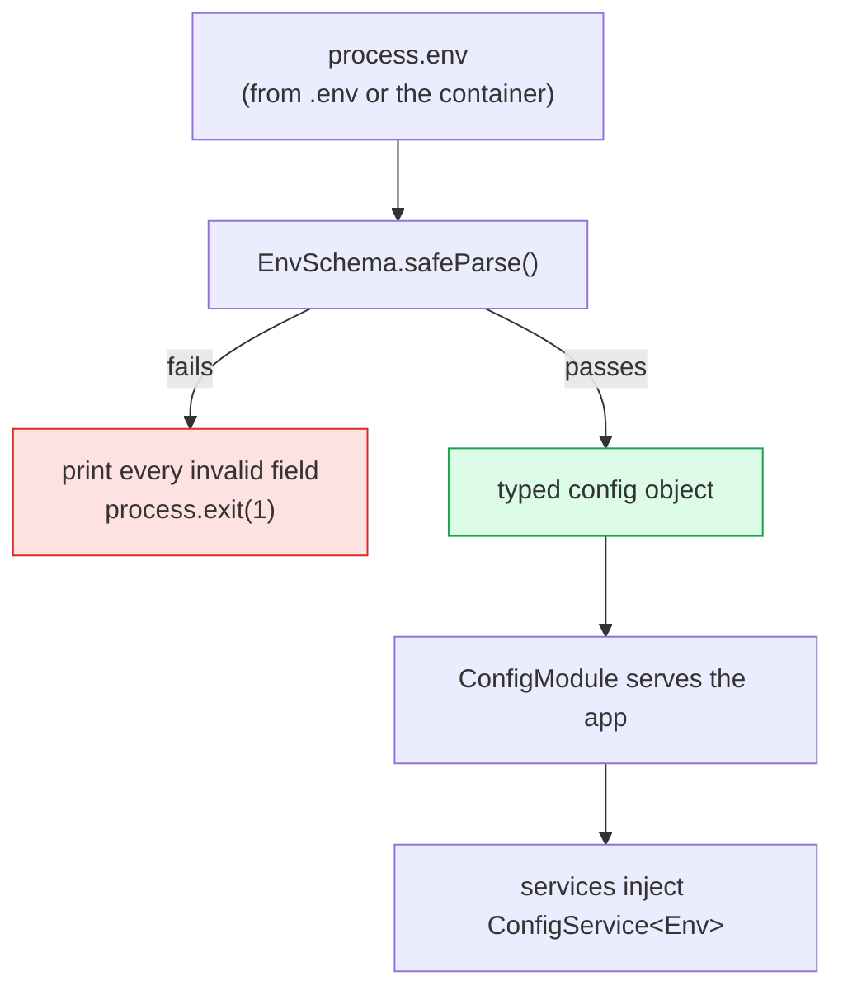

# Config & environment

<Status value="planned" />

> **Misconfiguration must kill the process at boot, not surface when a user hits it.**

## Principles

| Principle | Meaning |
| --- | --- |
| Fail fast | Validate the whole environment at boot; one missing value means no start |
| Declare once | Every variable exists in one zod schema; everything else reads from there |
| No defaults for secrets | Ports can have defaults; secrets cannot |
| Build-time vs runtime | `NEXT_PUBLIC_*` is baked in at build; never put secrets there |
| Config isn't feature flags | Values that change often belong in the database, not the environment |

## Boot sequence



::: danger Don't report one failure at a time
`safeParse`, then print **every** invalid field at once. Using `getOrThrow` per variable means restarting repeatedly to discover what else is missing.
:::

## The env schema

```ts
// apps/api/src/config/env.schema.ts
import { z } from "zod";

export const EnvSchema = z.object({
  NODE_ENV: z.enum(["development", "test", "production"]).default("development"),
  API_PORT: z.coerce.number().int().min(1).max(65535).default(4000),
  LOG_LEVEL: z.enum(["fatal", "error", "warn", "info", "debug", "trace"]).default("info"),

  DATABASE_URL: z.url().startsWith("postgresql://"),
  REDIS_URL: z.url().startsWith("redis://").optional(),

  // 32+ chars, and never the placeholder — stops anyone shipping .env.example verbatim
  JWT_ACCESS_SECRET: z.string().min(32).refine((s) => !s.startsWith("change-me"), {
    message: "JWT_ACCESS_SECRET is still the placeholder. Generate one: openssl rand -base64 48",
  }),
  JWT_REFRESH_SECRET: z.string().min(32).refine((s) => !s.startsWith("change-me"), {
    message: "JWT_REFRESH_SECRET is still the placeholder. Generate one: openssl rand -base64 48",
  }),
  JWT_ACCESS_EXPIRES_IN: z.string().regex(/^\d+[smhd]$/).default("15m"),
  JWT_REFRESH_EXPIRES_IN: z.string().regex(/^\d+[smhd]$/).default("7d"),

  CORS_ORIGINS: z.string().transform((s) => s.split(",").map((o) => o.trim()).filter(Boolean)),

  GOOGLE_CLIENT_ID: z.string().optional(),
  GOOGLE_CLIENT_SECRET: z.string().optional(),
  GOOGLE_CALLBACK_URL: z.url().optional(),

  MAIL_TRANSPORT: z.enum(["smtp", "console"]).default("console"),
  MAIL_FROM: z.string().default("no-reply@app-platform.local"),
  SMTP_URL: z.url().optional(),

  APP_WEB_URL: z.url().default("http://app.localhost"),
})
  // the two secrets must differ, or an access token could stand in for a refresh token
  .refine((env) => env.JWT_ACCESS_SECRET !== env.JWT_REFRESH_SECRET, {
    message: "JWT_ACCESS_SECRET and JWT_REFRESH_SECRET must be different",
    path: ["JWT_REFRESH_SECRET"],
  })
  // Google config is all-or-nothing
  .refine(
    (env) => !env.GOOGLE_CLIENT_ID || (env.GOOGLE_CLIENT_SECRET && env.GOOGLE_CALLBACK_URL),
    { message: "Setting GOOGLE_CLIENT_ID requires GOOGLE_CLIENT_SECRET and GOOGLE_CALLBACK_URL" },
  )
  .refine((env) => env.MAIL_TRANSPORT !== "smtp" || !!env.SMTP_URL, {
    message: "MAIL_TRANSPORT=smtp requires SMTP_URL",
    path: ["SMTP_URL"],
  });

export type Env = z.infer<typeof EnvSchema>;
```

::: tip refine is where cross-variable rules belong
Rules like "these two secrets must differ" or "if A then also B" get scattered and forgotten when they live in services. In the schema they're enforced at every boot.
:::

## Wiring into Nest

```ts
// apps/api/src/config/env.validate.ts
import { EnvSchema } from "./env.schema";

export function validateEnv(raw: Record<string, unknown>) {
  const result = EnvSchema.safeParse(raw);
  if (result.success) return result.data;

  // print everything that's wrong, in one pass
  console.error("❌ Invalid environment configuration:\n");
  for (const issue of result.error.issues) {
    console.error(`  • ${issue.path.join(".") || "(root)"}: ${issue.message}`);
  }
  console.error("\nFull reference: docs.localhost/en/reference/env-vars\n");
  process.exit(1);
}
```

```ts
// app.module.ts
ConfigModule.forRoot({
  isGlobal: true,
  validate: validateEnv,
  cache: true,
}),
```

Reading values with types:

```ts
constructor(private readonly config: ConfigService<Env, true>) {}

// inferred as string — no generic needed
const secret = this.config.get("JWT_ACCESS_SECRET", { infer: true });
```

::: tip `ConfigService<Env, true>`
The second type argument is `WasValidated`. Passing `true` makes `get()` return non-optional types, because validation already guaranteed the value exists — no more `!` or `?? default` sprinkled everywhere.
:::

## The web app is different

Next.js splits env into two worlds, and mixing them is the most common leak.

| Kind | Visible to | Read at | Secrets allowed |
| --- | --- | --- | --- |
| `NEXT_PUBLIC_*` | Server **and browser** | **Build** time | **Absolutely not** |
| Everything else | Server only | Runtime | Yes |

::: danger `NEXT_PUBLIC_*` is baked into JavaScript anyone can download
These values are replaced with literals at build time. Anyone who opens the site downloads them. **Never put an API key, secret, or connection string in a `NEXT_PUBLIC_*` variable.** And "we'll change it in production later" doesn't work — the value was frozen when the image was built.
:::

There's one today. Validate it at boot too:

```ts
// apps/web/src/lib/env.ts
import { z } from "zod";

const PublicEnvSchema = z.object({
  NEXT_PUBLIC_API_URL: z.url(),
});

// each one must be referenced in full — Next substitutes by literal text match,
// so a dynamic process.env[name] resolves to undefined
export const env = PublicEnvSchema.parse({
  NEXT_PUBLIC_API_URL: process.env.NEXT_PUBLIC_API_URL,
});
```

## Env file layering

| File | Committed | Purpose |
| --- | --- | --- |
| `.env.example` | **Yes** | The template. Every key present; secrets are placeholders |
| `.env` | No | Real local values; in `.gitignore` |
| `.env.test` | Yes | Deterministic test values, no real secrets |
| Container environment | No | Production injects from a secret manager |

`docker-compose.yml` reads `.env` automatically and forwards values to services with `${VAR:-fallback}` defaults.

::: warning `.env.example` is currently byte-identical to `.env`
Which means someone copied the whole file and kept using it — so the live secret is `change-me-access-secret`. That's exactly why the schema above blocks anything starting with `change-me`.
:::

## Adding a variable

1. Add it to `EnvSchema` with a type and rules — secrets get **no default**
2. Add it to `.env.example` with a short comment
3. Add it to the `environment:` block of every service that needs it in `docker-compose.yml`
4. Add a row to the [env table](/en/reference/env-vars)
5. If it's a secret → add it to the production secret manager before deploying
6. Read it through `ConfigService` only. **Never touch `process.env` in application code.**

::: danger Never read `process.env` directly in application code
`process.env.FOO` bypasses all validation and is always typed `string | undefined`. Read through `ConfigService`. The only unavoidable exceptions are `main.ts` before boot and `prisma.config.ts`, which runs outside Nest.
:::

## Secrets policy

| Rule | Why |
| --- | --- |
| Never commit real values, under any circumstance | Git doesn't forget, even after you delete the commit |
| Different secrets per environment | A dev leak must not touch production |
| Rotate JWT secrets without logging everyone out | Accept multiple secrets during verification for a window |
| `LOG_LEVEL=debug` only outside production | Debug logs contain queries |
| Redact secret-bearing headers in logs | See [Trace ID](/en/platform/trace-id) |

::: warning Current code status
| Target spec | Code today |
| --- | --- |
| `ConfigModule.forRoot({ validate })` | Just `ConfigModule.forRoot({ isGlobal: true })` — nothing is validated |
| Nothing reads `process.env` directly | `main.ts` reads `API_PORT`, `app.module.ts` reads `LOG_LEVEL`/`NODE_ENV` |
| `EnvSchema` in `src/config/` | There is no `src/config/` directory |
| `CORS_ORIGINS` allowlist | `main.ts` calls bare `enableCors()` — every origin allowed |
| Web validates its env | It doesn't; `NEXT_PUBLIC_API_URL` isn't referenced anywhere |
| Placeholder secrets blocked | No such check |
:::
