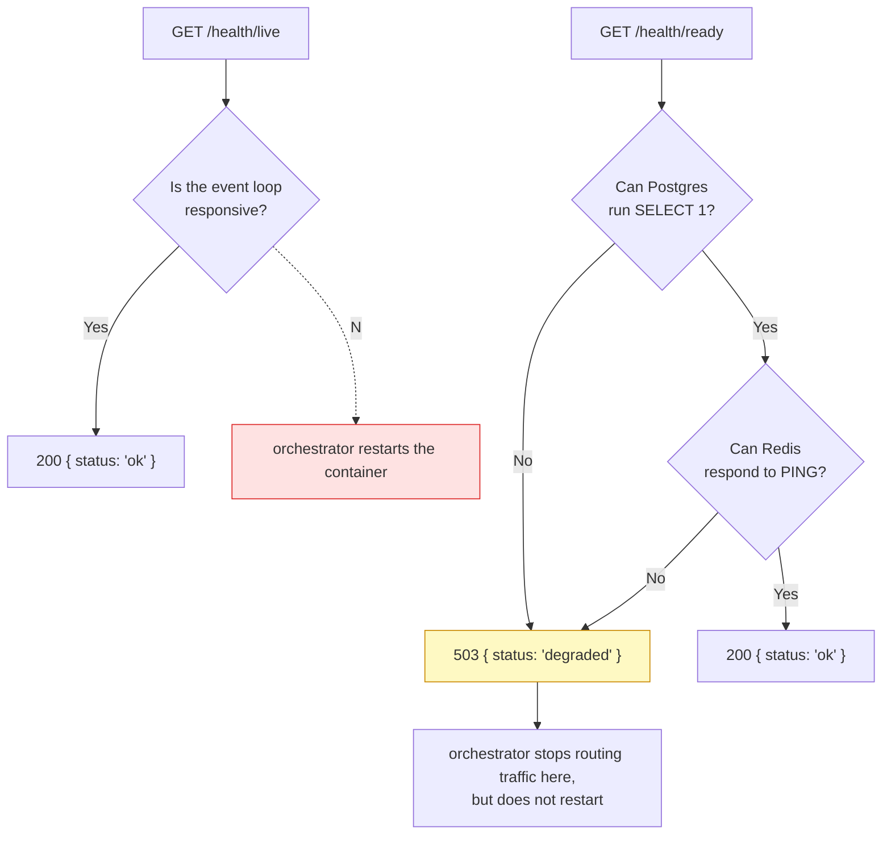

# Health checks

<Status value="in-progress" note="Liveness exists; readiness does not" />

> **Liveness answers "is the process still alive?" Readiness answers "can it actually serve traffic?" Those are different questions.**

## Why split them

The `GET /health` endpoint that exists today answers only whether the Node process is running and the event loop is responsive. It says nothing about whether Postgres is reachable or Redis is up. If an orchestrator (a Docker Compose healthcheck today, Kubernetes tomorrow) uses one endpoint to decide both things, you get two opposite failure modes.

- **A container whose DB is unreachable keeps receiving traffic** because the health check "passes" (the process just hasn't died), while every request that touches the DB returns 500.
- **A container that's mid-restart or mid-migration gets killed** because an overly strict liveness check folds in readiness-level checks.

Kubernetes (and Docker Compose healthchecks modeled on it) deliberately separate these two signals. This page's spec follows that pattern.

## Two endpoints



| Endpoint | Answers | If it says "no", the orchestrator should | Checks |
| --- | --- | --- | --- |
| `GET /health/live` | Is the process running? | Restart the container | Nothing — the handler just needs to respond |
| `GET /health/ready` | Can it serve real traffic? | Pull it out of the load balancer temporarily, never restart | Postgres, Redis (if used), any critical external dependency |

::: danger A readiness failure must never trigger a restart
If readiness fails because the DB is temporarily down, restarting the container doesn't help and can make things worse (a thundering herd once the DB recovers). Only `/health/live` should be wired to "restart." `/health/ready` should be wired to a Kubernetes `readinessProbe` or a Traefik healthcheck that just removes the instance from routing.
:::

## Response contract

```ts
// packages/contracts/src/health.schema.ts
import { z } from "zod";

export const HealthCheckSchema = z.object({
  status: z.enum(["ok"]),
  checkedAt: z.iso.datetime(),
});

export const ReadinessCheckSchema = z.object({
  status: z.enum(["ok", "degraded"]),
  checkedAt: z.iso.datetime(),
  checks: z.object({
    postgres: z.object({ ok: z.boolean(), latencyMs: z.number().optional() }),
    redis: z.object({ ok: z.boolean(), latencyMs: z.number().optional() }).optional(),
  }),
});
export type ReadinessCheck = z.infer<typeof ReadinessCheckSchema>;
```

## Target implementation

```ts
// apps/api/src/health/health.controller.ts
import { Controller, Get, HttpCode, HttpStatus } from "@nestjs/common";
import { ApiExcludeController } from "@nestjs/swagger";
import { Public } from "../auth/decorators/public.decorator";
import { PrismaService } from "../prisma/prisma.service";
import { RedisService } from "../redis/redis.service";

@ApiExcludeController()
@Controller("health")
export class HealthController {
  constructor(
    private readonly prisma: PrismaService,
    private readonly redis: RedisService,
  ) {}

  @Public()
  @Get("live")
  live() {
    return { status: "ok", checkedAt: new Date().toISOString() };
  }

  @Public()
  @Get("ready")
  async ready() {
    const [postgres, redis] = await Promise.all([this.checkPostgres(), this.checkRedis()]);
    const ok = postgres.ok && redis.ok;

    return {
      status: ok ? "ok" : "degraded",
      checkedAt: new Date().toISOString(),
      checks: { postgres, redis },
    };
  }

  private async checkPostgres() {
    const start = Date.now();
    try {
      await this.prisma.$queryRaw`SELECT 1`;
      return { ok: true, latencyMs: Date.now() - start };
    } catch {
      return { ok: false };
    }
  }

  private async checkRedis() {
    const start = Date.now();
    try {
      await this.redis.ping();
      return { ok: true, latencyMs: Date.now() - start };
    } catch {
      return { ok: false };
    }
  }
}
```

::: tip Readiness must return 503 when degraded, not 200
Docker Compose / Kubernetes healthchecks decide from the HTTP status, not by parsing the body. Returning `200 { status: "degraded" }` means the orchestrator still thinks everything is fine and keeps routing traffic. Return `503` via `@HttpCode(HttpStatus.SERVICE_UNAVAILABLE)` whenever `ok === false`.
:::

Both endpoints must be `@Public()` — health checks run before any session exists. If a guard blocks them, the orchestrator sees 401 on every check and concludes every container is dead.

## Wiring it into Docker Compose

```yaml
# docker-compose.yml
services:
  api:
    healthcheck:
      test: ["CMD", "wget", "--spider", "-q", "http://localhost:4000/health/ready"]
      interval: 10s
      timeout: 3s
      retries: 3
      start_period: 20s
```

`start_period` gives the container time to boot before a failing readiness check counts as a real failure — necessary because Prisma hasn't finished connecting yet during startup.

## What exists today (real code)

`GET /health` in `apps/api/src/health.controller.ts` already works.

```ts
@ApiExcludeController()
@Controller("health")
export class HealthController {
  @Get()
  check() {
    return { status: "ok", checkedAt: new Date().toISOString() };
  }
}
```

It's pure liveness — it responds immediately without touching the DB or Redis. `@ApiExcludeController()` correctly keeps it out of Swagger (health endpoints aren't business API), but there's no public/private guard split yet because the whole controller has no guards at all right now.

## Migration plan

1. Add `GET /health/ready` alongside the existing `GET /health` (don't remove the old one yet)
2. Turn `GET /health` into an alias for `/health/live` so it doesn't break the Docker Compose healthcheck that already references it
3. Update `docker-compose.yml` to point at `/health/ready`
4. Remove the old `GET /health` once every other config has moved to the new paths

## Checklist

- [ ] `GET /health/live` — touches no dependency
- [ ] `GET /health/ready` — checks Postgres and Redis
- [ ] Readiness returns `503` when degraded, not `200`
- [ ] Both endpoints are `@Public()` and excluded from Swagger
- [ ] `docker-compose.yml` healthcheck points at `/health/ready`
- [ ] `start_period` allows enough time for a freshly booted container

::: warning Current code status
| Target spec | Code today |
| --- | --- |
| `GET /health/live` separate from `/ready` | Only `GET /health`, acting as liveness |
| `GET /health/ready` checks Postgres/Redis | Missing — no connectivity check at all |
| Returns `503` when degraded | No concept of "degraded" in the code today |
| `docker-compose.yml` healthcheck tied to readiness | No `healthcheck:` block on the `api` service yet |
:::
