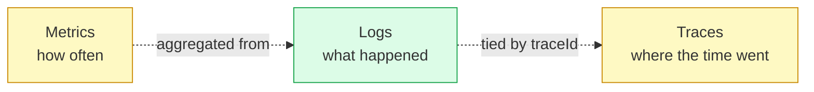
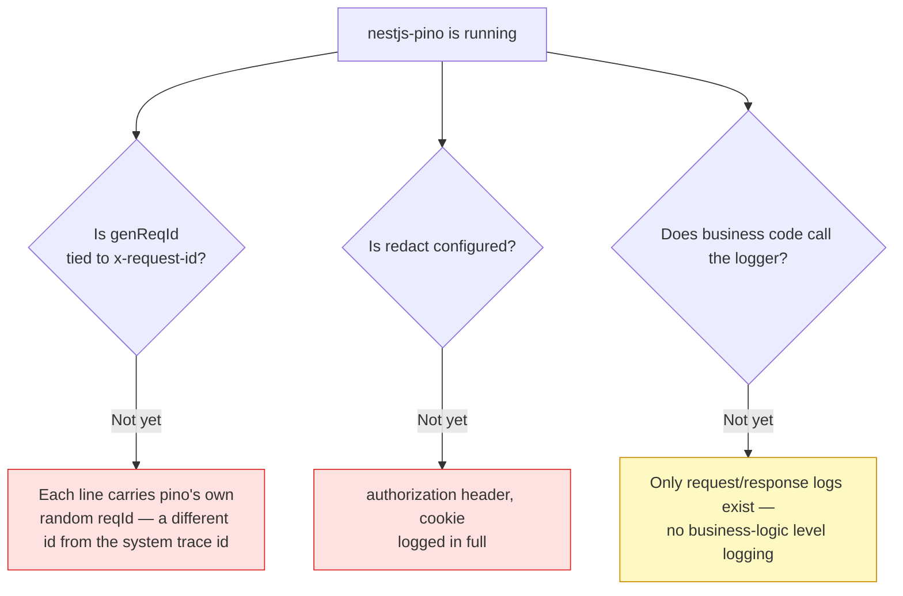
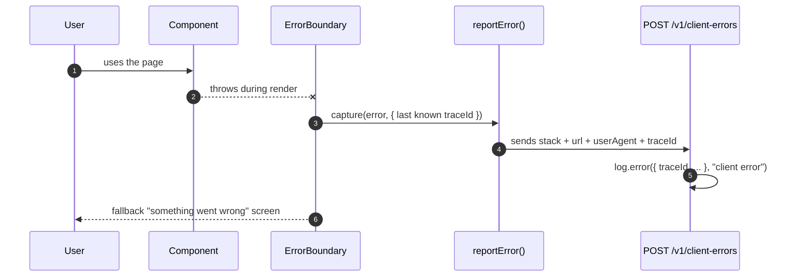

# Observability & logging

<Status value="in-progress" note="API-side structured logging exists; it isn't tied to the trace id yet" />

> **A log line you can't read at 3am is a log line that isn't there. Structured logging isn't a nicety — it's a minimum bar.**

This page covers "what you can see when something breaks." The mechanism that ties an id to every log line lives at [Trace ID](/en/platform/trace-id) already — this page doesn't repeat it.

## Three pillars of observability



| Pillar | Today | Target |
| --- | --- | --- |
| Logs | `nestjs-pino` wired up, JSON format | Every line tied to `traceId`/`userId` (see [Trace ID](/en/platform/trace-id)) |
| Metrics | None | A Prometheus `/metrics` endpoint — request count, latency histogram, error rate |
| Traces | None | OpenTelemetry once logs alone stop being enough (see [Trace ID's upgrade path](/en/platform/trace-id)) |

This page focuses on logs because it's the only pillar with real code behind it already.

## API-side logging

### What actually exists today

```ts
// apps/api/src/app.module.ts
LoggerModule.forRoot({
  pinoHttp: {
    level: process.env.LOG_LEVEL ?? "info",
    transport:
      process.env.NODE_ENV === "production"
        ? undefined
        : { target: "pino-pretty", options: { singleLine: true } },
  },
}),
```

`nestjs-pino` replaces Nest's default logger with `pino-http`. Every request/response is auto-logged as JSON in production (pino-pretty is dev-only, for terminal readability). This is the right foundation — the problem isn't the library, it's what hasn't been wired into it yet.

### Three gaps



1. **`genReqId` isn't set** — pino mints its own random request id, not the same one as the `x-request-id` defined in [Trace ID](/en/platform/trace-id). Result: logs and error responses carry different ids and can't be joined.
2. **`redact` isn't configured** — the `Authorization` header (carrying a JWT) and `Cookie` (carrying a refresh token) are logged in full today. Anyone who can read the logs can forge a session.
3. **No service-level logging** — all that exists is `pino-http`'s automatic request/response log. Business events (`user registered`, `role assigned`, `permission denied`) are never logged.

Fixing all three is the implementation described in [Trace ID § Wire it into pino](/en/platform/trace-id).

### Log levels — when to use each

| Level | Use when | Example |
| --- | --- | --- |
| `trace` | Line-by-line debugging (always off in production) | A variable's value mid-computation |
| `debug` | Detail that's useful during development | SQL query, cache hit/miss |
| `info` | Normal business events | `user registered`, `role assigned` |
| `warn` | Abnormal but the system handled it | Validation failed, `403 Forbidden` |
| `error` | Someone needs to look | Unexpected exception, lost DB connection |
| `fatal` | The system is no longer usable | Boot failed, env validation failed |

```ts
// example business-level logs to add
this.logger.info({ userId: user.id, roleKey: "manager" }, "role assigned");
this.logger.warn({ userId: user.id, field: "roles" }, "permission denied: field-level update");
```

::: danger Never log sensitive data
Never log: passwords or their hashes, full JWT/refresh token values, card numbers, raw `Authorization`/`Cookie` header values. When you need to reference a user, log `userId`, not their email or full name — `userId` is just as traceable but isn't directly readable PII.
:::

## Web-side logging

Right now there is **none at all** — no logging error boundary, no client-side error reporting anywhere. If a user hits a blank white screen, the team won't know until someone reports it.

### Target



```tsx
// apps/web/src/app/error.tsx
"use client";

export default function GlobalError({ error, reset }: { error: Error & { digest?: string }; reset: () => void }) {
  useEffect(() => {
    reportClientError(error);
  }, [error]);

  return (
    <div role="alert">
      <p>Something went wrong</p>
      <button onClick={reset}>Try again</button>
    </div>
  );
}
```

`reportClientError` should send the latest `traceId` the `api-client` used (if any), so client-side errors link to the server logs for the same request. See how `x-request-id` gets sent at [Trace ID](/en/platform/trace-id).

::: tip Don't log every React warning right away
On the web, third-party noise (browser extensions, ad blockers) shows up alongside real errors. Filter with an `ignoreErrors` list before sending anything, or the noise buries the signal until nobody opens the logs anymore.
:::

## Metrics (not started)

Once logs alone stop being enough — for example, alerting on error rate or p99 latency — add `@willsoto/nestjs-prometheus` and a `GET /metrics` endpoint (never exposed to the public internet — internal network only, or behind auth). Measure at least three things: request count by route + status, a latency histogram, and active DB connection count.

## Checklist

- [ ] `genReqId` uses the same `x-request-id` as [Trace ID](/en/platform/trace-id), not its own id
- [ ] `redact` covers `authorization`, `cookie`, `set-cookie`
- [ ] Key business events have at least an `info`-level log
- [ ] No sensitive data is logged anywhere
- [ ] The web app has an `error.tsx` that reports errors with a traceId
- [ ] (When needed) `GET /metrics` is never public

::: warning Current code status
| Target spec | Code today |
| --- | --- |
| `nestjs-pino` wired up | ✅ actually in use in `app.module.ts` |
| `genReqId` tied to `x-request-id` | Not configured — uses pino's own random reqId |
| `redact` for secret headers | Not configured — `authorization` is logged in full |
| Business-event level logging | None — only the automatic request/response log |
| Web-side error reporting | None at all — no `error.tsx`, no api-client |
| Metrics endpoint | None — no related dependency in `package.json` |
:::
