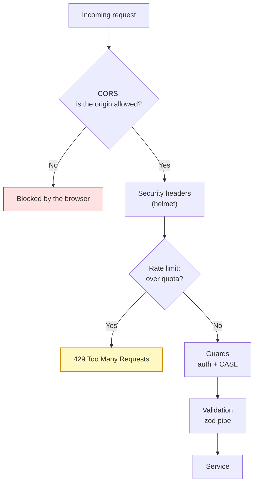

# Security checklist

<Status value="planned" note="Three basic gaps are still open today" />

> **This isn't security theory. It's the list of things that must close before this boilerplate is ready for real traffic.**

## Layers of defense



This page covers the first three layers (CORS, headers, rate limiting) — auth and CASL live at [Auth overview](/en/auth/overview) and [CASL](/en/auth/casl); backend validation has its own page.

## 1. CORS

### The problem today

```ts
// apps/api/src/main.ts
app.enableCors();
```

`enableCors()` with no options means **`Access-Control-Allow-Origin: *`** — any website on the internet can call this API from a browser. If any endpoint reads cookies or uses credentials, this gets dangerous fast: the browser can attach a logged-in user's credentials to a request from an entirely different site, without the user knowing.

::: danger Open CORS plus an httpOnly cookie is a CSRF hole
The [refresh token lives in an httpOnly cookie](/en/auth/tokens). Without a restricted CORS origin, another site can embed a `<script>` that runs `fetch(apiUrl, { credentials: "include" })`, and the browser attaches the user's cookie automatically. This must be fixed before production — it is not a "later" item.
:::

### Target

```ts
// apps/api/src/main.ts
app.enableCors({
  origin: env.CORS_ORIGINS, // from EnvSchema — an exact array of allowed origins
  credentials: true,
  methods: ["GET", "POST", "PATCH", "DELETE"],
  allowedHeaders: ["content-type", "authorization", "x-request-id"],
});
```

`CORS_ORIGINS` ties into [Config & environment](/en/platform/config) — the app fails to boot if it's unset in production. It must never default to `*` or `localhost`.

## 2. Security headers (helmet)

### The problem today

There is no `helmet` in `apps/api`'s `package.json` at all — no `Content-Security-Policy`, no `X-Content-Type-Options`, no `Strict-Transport-Security`. Every response header ships with Express's plain defaults.

### Target

```ts
// apps/api/src/main.ts
import helmet from "helmet";

app.use(
  helmet({
    contentSecurityPolicy: {
      directives: {
        defaultSrc: ["'self'"],
        imgSrc: ["'self'", "data:", env.APP_WEB_URL],
        connectSrc: ["'self'"],
        frameAncestors: ["'none'"],
      },
    },
    crossOriginResourcePolicy: { policy: "same-site" },
  }),
);
```

| Header | Protects against |
| --- | --- |
| `Content-Security-Policy` | XSS from unauthorized script/style sources |
| `X-Content-Type-Options: nosniff` | Browsers guessing the wrong MIME type and running foreign content as script |
| `Strict-Transport-Security` | Forces HTTPS after the first visit |
| `X-Frame-Options` / `frame-ancestors` | Clickjacking via iframe embedding |

::: tip An API with no HTML rendering still needs helmet
A common misconception is "APIs can't have XSS because they don't render HTML." But Swagger UI, Express's own error pages, or any endpoint that reflects user input back can still be exploitable. helmet's defaults are sensible and cost almost nothing to enable.
:::

## 3. Rate limiting

### The problem today

There's no `@nestjs/throttler` or any rate-limiting mechanism in the system — `POST /users` (see [Signup](/en/auth/signup)) and the login endpoint accept unlimited requests from a single IP, leaving password brute force and account-creation spam wide open.

### Target

```ts
// apps/api/src/app.module.ts
ThrottlerModule.forRoot([
  { name: "default", ttl: 60_000, limit: 100 }, // general: 100 req/min/IP
  { name: "auth", ttl: 60_000, limit: 5 },       // stricter for auth endpoints
]),
```

```ts
// apps/api/src/auth/auth.controller.ts
@Throttle({ auth: { limit: 5, ttl: 60_000 } })
@Public()
@Post("login")
login(@Body() dto: Login) { … }
```

| Endpoint | Recommended quota | Why |
| --- | --- | --- |
| `POST /v1/auth/login` | 5/min/IP | Stops password brute force |
| `POST /v1/auth/register` | 5/min/IP | Stops account-creation spam |
| `POST /v1/auth/forgot-password` | 3/min/IP + 3/hour/email | Stops flooding someone else's inbox with resets |
| Ordinary authenticated endpoints | 100/min/IP | Basic scraping/DoS protection |

::: warning Rate limiting needs the right key per endpoint
`forgot-password` needs limits both by IP (stops bots) **and** by target email (stops someone repeatedly triggering resets against another person's address as harassment). A single key isn't enough.
:::

## 4. Related topics that live on their own pages

This list doesn't repeat that content — it points at the page responsible for each.

| Topic | Lives at |
| --- | --- |
| bcrypt cost, password policy | [Signup](/en/auth/signup) |
| httpOnly cookies, token rotation | [JWT & refresh rotation](/en/auth/tokens) |
| Field-level authorization, self-escalation | [CASL](/en/auth/casl) |
| Never leaking stack traces to the client | [Error envelope](/en/conventions/errors) |
| No default secrets, build/runtime env split | [Config & environment](/en/platform/config) |
| Never logging sensitive data | [Observability & logging](/en/platform/observability) |

## CI that doesn't exist yet

There's no dependency scanning (`npm audit` / Snyk / Dependabot) wired to CI, because there's no CI at all yet — see [CI/CD](/en/ops/ci-cd). Once a pipeline exists, dependency scanning should run as its own job on every PR, not as an occasional manual check.

## Checklist

- [ ] `enableCors()` restricts `origin` from `CORS_ORIGINS`
- [ ] `helmet()` is enabled with a CSP that sets `defaultSrc`, `frameAncestors`
- [ ] `ThrottlerModule` covers the whole app, with stricter limits on auth endpoints
- [ ] `forgot-password` is limited by both IP and target email
- [ ] Dependency scanning is in CI (once CI exists)
- [ ] No secret in [`EnvSchema`](/en/platform/config) has a default

::: warning Current code status
| Target spec | Code today |
| --- | --- |
| CORS restricted to allowed origins | `app.enableCors()` has no options — wide open to every origin |
| `helmet()` sets security headers | No `helmet` in `package.json` at all |
| `ThrottlerModule` app-wide | No `@nestjs/throttler` — no rate limiting anywhere |
| Stricter throttle on auth endpoints | None, because there's no throttler at all |
| Dependency scanning in CI | No CI — see [CI/CD](/en/ops/ci-cd) |
:::
