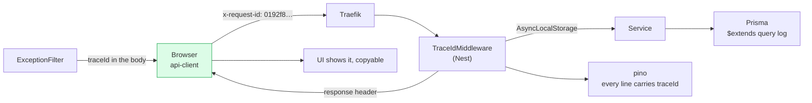
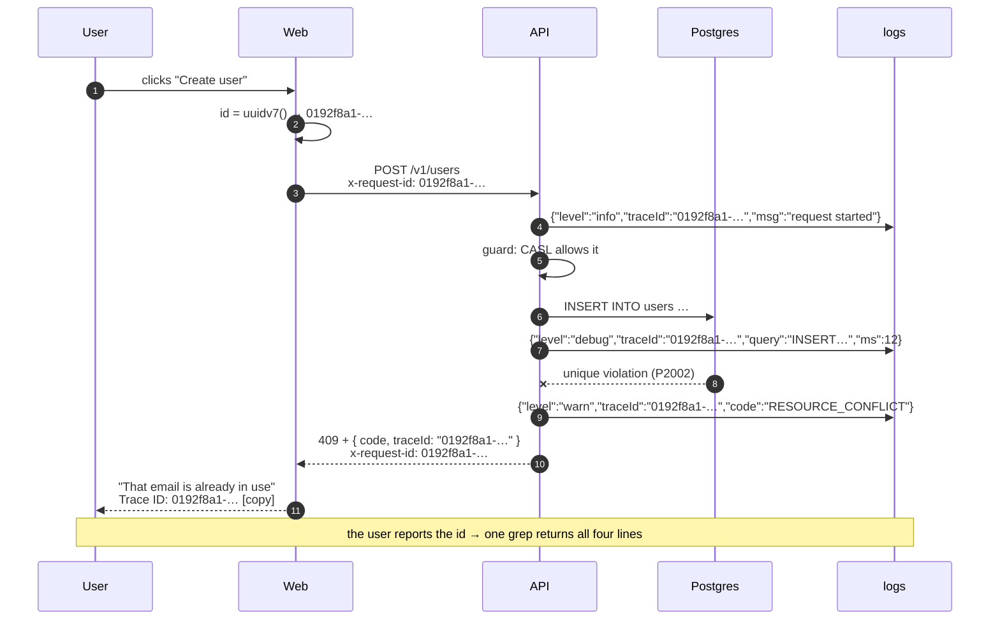

# Trace ID

<Status value="planned" />

> **One request, one id — and that id appears on every log line it touches, from the browser down to the SQL.**

When a user says "it showed an error", the only question you need is *"what was the trace id?"* One search returns the whole story.

## Format

| Aspect | Decision |
| --- | --- |
| Format | **UUIDv7** — time-ordered, so database indexes stay healthy and logs sort by id |
| Header | `x-request-id`, both inbound and outbound |
| Who creates it | The first hop that touches the request and doesn't find the header |
| Propagation | If the incoming request already has `x-request-id`, **use it**. Never mint a new one. |
| Response | Every response carries `x-request-id`, on success and on failure |
| In the body | Appears as `traceId` in the [error envelope](/en/conventions/errors) |

::: tip Why UUIDv7 and not v4
UUIDv7 puts a millisecond timestamp at the front, so it sorts by time naturally — audit rows stay index-friendly and interleaved logs can be ordered by id alone. Node 22's `crypto.randomUUID()` is v4, so use a `uuid` version that supports v7.
:::

## Where it flows



| Hop | Gets the id from | Uses it for |
| --- | --- | --- |
| Browser (`api-client`) | Creates one per request | Sends `x-request-id` |
| Traefik | Passes the header through | — (no extra config) |
| `TraceIdMiddleware` | Reads the header, creates one if absent | Stores it in `AsyncLocalStorage`, sets the response header |
| `pino-http` (`genReqId`) | Reads the same value | Every request log line gets a `traceId` field |
| Services / repositories | Reads `AsyncLocalStorage` | Their own logs carry it too |
| Prisma extension | Same | SQL logs tie back to the causing request |
| `AllExceptionsFilter` | Same | Fills `traceId` in the envelope |
| UI | Reads it from the envelope | Displays it with a copy button |

## A real trace



## Implementation

### 1. The context store

`AsyncLocalStorage` makes the trace id readable anywhere without threading it through every function signature.

```ts
// apps/api/src/common/trace/trace-context.ts
import { AsyncLocalStorage } from "node:async_hooks";

interface TraceStore {
  traceId: string;
  userId?: string;
}

export const traceStorage = new AsyncLocalStorage<TraceStore>();

export const getTraceId = () => traceStorage.getStore()?.traceId ?? "no-trace";
export const getUserId = () => traceStorage.getStore()?.userId;

/** the guard calls this after authentication so later logs know who acted */
export const setUserId = (userId: string) => {
  const store = traceStorage.getStore();
  if (store) store.userId = userId;
};
```

### 2. The middleware

```ts
// apps/api/src/common/trace/trace-id.middleware.ts
import { Injectable, NestMiddleware } from "@nestjs/common";
import type { NextFunction, Request, Response } from "express";
import { v7 as uuidv7 } from "uuid";
import { traceStorage } from "./trace-context";

export const TRACE_HEADER = "x-request-id";

@Injectable()
export class TraceIdMiddleware implements NestMiddleware {
  use(req: Request, res: Response, next: NextFunction) {
    const incoming = req.header(TRACE_HEADER);
    // adopt an incoming id only if it looks sane — stops anyone injecting junk into logs
    const traceId = incoming && /^[0-9a-f-]{36}$/i.test(incoming) ? incoming : uuidv7();

    res.setHeader(TRACE_HEADER, traceId);
    traceStorage.run({ traceId }, () => next());
  }
}
```

Apply it to everything:

```ts
// app.module.ts
export class AppModule implements NestModule {
  configure(consumer: MiddlewareConsumer) {
    consumer.apply(TraceIdMiddleware).forRoutes("*");
  }
}
```

::: warning Order is critical
`TraceIdMiddleware` must run before pino's `LoggerModule`. Reversed, `genReqId` executes before the store exists and every line reads `no-trace`.
:::

### 3. Wire it into pino

```ts
// app.module.ts
LoggerModule.forRoot({
  pinoHttp: {
    level: process.env.LOG_LEVEL ?? "info",
    // reuse the middleware's id — never let pino invent its own
    genReqId: (req, res) => {
      const id = (req.headers["x-request-id"] as string) ?? uuidv7();
      res.setHeader("x-request-id", id);
      return id;
    },
    customProps: () => ({ traceId: getTraceId(), userId: getUserId() }),
    // keep secret-bearing headers out of the logs
    redact: {
      paths: ["req.headers.authorization", "req.headers.cookie", "res.headers['set-cookie']"],
      remove: true,
    },
    transport:
      process.env.NODE_ENV === "production"
        ? undefined
        : { target: "pino-pretty", options: { singleLine: true } },
  },
}),
```

### 4. Prisma query logs

```ts
// apps/api/src/prisma/prisma.service.ts
this.$on("query", (e) => {
  this.logger.debug({ traceId: getTraceId(), query: e.query, durationMs: e.duration }, "prisma query");
});
```

::: danger `e.params` contains real user data
Prisma puts bound values in `e.params`, which can include emails and password hashes. **Don't log the whole object.** Log `query` and `duration` only; if you need params while debugging, enable that locally.
:::

### 5. The client mints and sends it

```ts
// apps/web/src/lib/api-client.ts
import { v7 as uuidv7 } from "uuid";

export async function apiFetch<T extends z.ZodTypeAny>(path: string, schema: T, init?: RequestInit) {
  const traceId = uuidv7();
  const res = await fetch(`${process.env.NEXT_PUBLIC_API_URL}${path}`, {
    ...init,
    headers: { "content-type": "application/json", "x-request-id": traceId, ...init?.headers },
    credentials: "include",
  });
  // …
}
```

Letting the client create it first means browser-side logs use the same id, so error reports link straight to server logs.

## Using it

```bash
# every line for one request
docker compose logs api | grep '0192f8a1-4c2e-7b3d-9f01-2a4c6e8b0d13'

# all failed requests with their trace ids
docker compose logs api | jq -r 'select(.level >= 50) | "\(.traceId) \(.msg)"'

# everything one user did
docker compose logs api | jq -r 'select(.userId == "…") | "\(.traceId) \(.req.url)"'
```

Once you add a log aggregator, `traceId` should be the first indexed field you configure.

## Required log fields

| Field | Source | Why |
| --- | --- | --- |
| `traceId` | `customProps` | Ties everything together |
| `userId` | `customProps`, after the guard | Answers "who did it" |
| `level` | pino | Severity filtering |
| `time` | pino | Ordering |
| `req.method`, `req.url` | pino-http | What was called |
| `res.statusCode`, `responseTime` | pino-http | Outcome and speed |

## Upgrade path: OpenTelemetry

`x-request-id` is our own convention. When you need to interoperate with standard tracing, accept W3C `traceparent` as well, without dropping the old header:

```ts
// traceparent: 00-<32 hex trace id>-<span id>-<flags>
const traceparent = req.header("traceparent");
const traceId = traceparent?.split("-")[1] ?? req.header(TRACE_HEADER) ?? uuidv7();
```

`getTraceId()` still returns one id for the whole system, so nothing downstream has to change.

::: warning Current code status
| Target spec | Code today |
| --- | --- |
| `TraceIdMiddleware` + `AsyncLocalStorage` | No `src/common/` at all; no middleware |
| `genReqId` tied to the header | `LoggerModule.forRoot` only sets `level` and `transport` |
| `redact` for secret headers | Not configured — `authorization` is logged in full |
| Prisma logs carry the trace id | `PrismaService` doesn't subscribe to the `query` event |
| Client sends `x-request-id` | There's no API client on the web side |
| UI displays the trace id | There's no error handling in the UI |
:::
