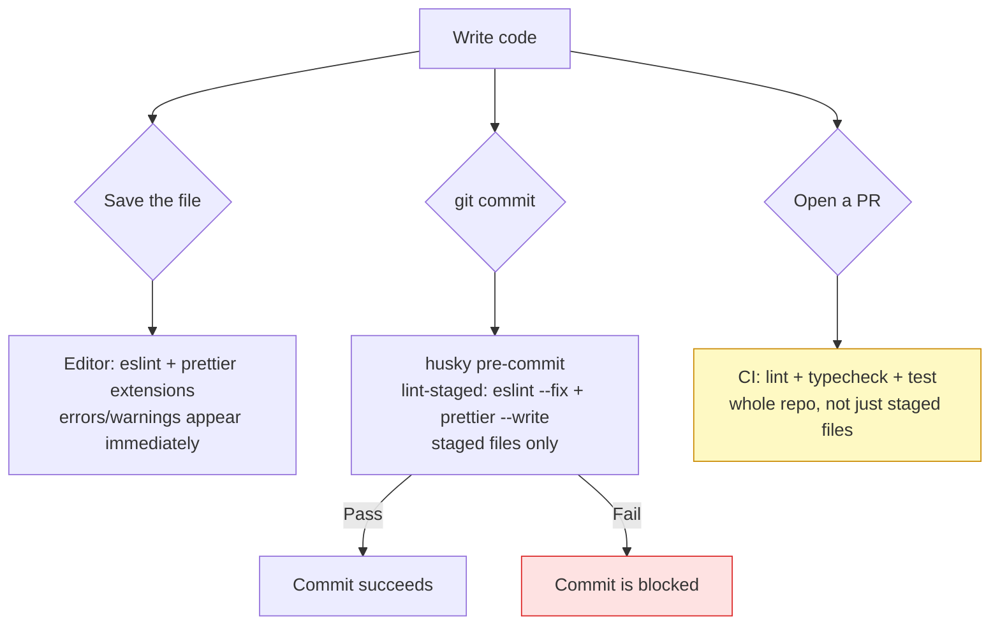

# Lint, format & type-check

<Status value="in-progress" note="lint/format are enforced at pre-commit; typecheck isn't enforced anywhere" />

> **Three tools, three different jobs: lint catches bugs a pattern can name, format removes style arguments entirely, type-check catches type mismatches before they become runtime errors.**

## Three tools, three different points in the flow



| Tool | Catches | Example |
| --- | --- | --- |
| ESLint | Patterns known to cause bugs, framework-specific rules | A `useEffect` with an incomplete dependency array, an unused import, an accidental `any` |
| Prettier | Pure formatting, no logic involved | Line breaks, quote style, trailing commas |
| `tsc --noEmit` (typecheck) | Type mismatches across files/modules | Passing a `string` where a `number` parameter is expected, a property that doesn't actually exist on an object |

These three barely overlap — ESLint doesn't catch cross-file type errors, Prettier has no opinion on logic at all, `tsc` doesn't care how many blank lines you use. Each catches things the other two can't see, so all three are needed.

## What actually exists today

### ESLint per workspace

```js
// apps/web/eslint.config.js
import { reactConfig } from "@app-platform/config/eslint/react";
export default reactConfig;
```

```js
// apps/api/eslint.config.js
import { nodeConfig } from "@app-platform/config/eslint/node";
export default nodeConfig;
```

Each workspace has its own config extending a shared central config (`@app-platform/config`) — `apps/web` uses React rules (hooks, JSX a11y), `apps/api` uses Node/Nest rules (no irrelevant JSX rules).

```bash
pnpm --filter @app-platform/web lint
pnpm --filter @app-platform/api lint
pnpm lint   # every workspace, via Turborepo
```

### Prettier + husky + lint-staged at the root

```json
// package.json (root)
"lint-staged": {
  "*.{ts,tsx}": ["eslint --fix"],
  "*.{ts,tsx,md,json}": ["prettier --write"]
}
```

`husky` wires `lint-staged` into the git `pre-commit` hook — every time you commit, staged `.ts`/`.tsx` files get `eslint --fix` first, then everything (including `.md`, `.json`) runs through `prettier --write`. The fix happens **before** the commit lands, not as a warning after.

::: tip lint-staged runs only on staged files, not the whole repo
That's why pre-commit stays fast — it doesn't lint the entire monorepo every time you commit one file. The trade-off is that old files nobody touches can still carry stale lint errors until someone commits them again, or until CI runs a full-repo lint.
:::

## The gap: no typecheck script anywhere

```json
// apps/api/package.json — no "typecheck"
"scripts": {
  "build": "nest build",
  "lint": "eslint \"src/**/*.ts\"",
  "test": "vitest run"
}
```

No `package.json` in the repo — root, `apps/web`, `apps/api`, `apps/docs`, `packages/contracts` — has a script named `typecheck` that runs `tsc --noEmit` directly. `nest build` and `next build` do touch the TypeScript compiler, but that's a side effect of building, not a deliberate gate. If any path succeeds without a full compile (like a dev server that transpiles and skips type-checking), a type error can slip through unnoticed.

::: danger Most dev servers don't fully type-check
`ts-node-dev` (which `apps/api` uses for `dev`) and the Next.js dev server prioritize speed by transpiling and skipping full type-checking. Code with a type error can run fine under `pnpm dev`, then fail at `build` — or worse, never fail at all because nothing runs `tsc --noEmit` separately. Without an enforced typecheck script, nothing guarantees that merged code actually passes type checking.
:::

### Target

```json
// apps/api/package.json
"scripts": {
  "typecheck": "tsc --noEmit"
}
```

```json
// apps/web/package.json
"scripts": {
  "typecheck": "tsc --noEmit"
}
```

```json
// root package.json
"scripts": {
  "typecheck": "turbo run typecheck"
}
```

```json
// turbo.json
"tasks": {
  "typecheck": {
    "dependsOn": ["^build"]
  }
}
```

`dependsOn: ["^build"]` matters because `apps/web` and `apps/api` need to see `packages/contracts`'s built types (its `.d.ts` files), not raw source. If `packages/contracts` changes a type but hasn't rebuilt, other workspaces' typecheck sees the stale type.

## Target for CI

Once [CI/CD](/en/ops/ci-cd) exists, all four of these must run as required checks before merging any PR.

```yaml
# conceptual example, not confirmed syntax — see the real pipeline at /en/ops/ci-cd
- run: pnpm lint
- run: pnpm typecheck
- run: pnpm test
- run: pnpm build
```

The order is deliberate: lint is fastest, so it runs first to fail fast; typecheck next; tests after that; build last because it's the most expensive.

## Checklist

- [ ] A `typecheck` script exists in `apps/web`, `apps/api`, and `packages/contracts`
- [ ] `turbo.json` has a `typecheck` task with `dependsOn: ["^build"]`
- [ ] `pnpm typecheck` passes cleanly across the whole monorepo
- [ ] CI runs `lint`, `typecheck`, `test`, `build` as required checks (see [CI/CD](/en/ops/ci-cd))
- [ ] The pre-commit hook stays lightweight (staged files only) — don't push a full-repo `tsc` into it

::: warning Current code status
| Target spec | Code today |
| --- | --- |
| ESLint per workspace | ✅ `apps/web/eslint.config.js`, `apps/api/eslint.config.js` are in real use |
| Prettier at the root | ✅ config lives in the root `package.json`, via `pnpm format` |
| husky + lint-staged at pre-commit | ✅ genuinely wired up in the root `package.json` |
| `typecheck` script | ❌ Missing from every `package.json` — `apps/web`, `apps/api`, `apps/docs`, `packages/contracts`, and root |
| CI runs typecheck | No CI at all — see [CI/CD](/en/ops/ci-cd) |
:::
