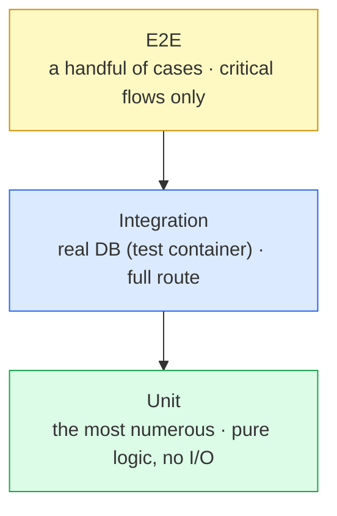

# Testing strategy

<Status value="planned" note="A test runner exists; 3 test files exist, no controller/e2e coverage yet" />

> **The best test catches what *can't* be done, not just what *can* — especially for permissions.**

## Target pyramid



| Layer | Tests what | Example in this system | Speed |
| --- | --- | --- | --- |
| Unit | Pure functions, no I/O | CASL `AppAbility`, `PasswordSchema`, RBAC computations | Very fast (ms) — thousands per minute |
| Integration | Full routes over real HTTP, real Postgres | `POST /v1/users` then check the DB row, whether `accessibleBy` filters correctly | Medium (seconds) — needs a DB |
| E2E | Real user flows through a browser | Signup → verify email → login → see the dashboard | Slow (minutes), most fragile — reserve for flows whose failure hurts most |

::: tip A recommended ratio, not a hard rule
The lower the layer, the more tests it can have — unit tests should outnumber integration tests by a wide margin, and integration should outnumber E2E. If the ratio flips (more E2E than unit), the suite gets slow and flaky enough that the team starts skipping CI.
:::

## Unit tests — start here

The code most worth testing first is authorization logic, because that's where a regression does the most damage the most quietly (the code still "works," it just returns too much access).

```ts
// apps/api/src/auth/ability/ability.factory.spec.ts
describe("manager ability", () => {
  const manager = { id: "u1", roles: ["manager"] };
  const ability = buildAbilityFrom(MANAGER_RULES, manager);

  it("can update other users", () => {
    expect(ability.can("update", subject("User", { id: "u2" }))).toBe(true);
  });

  it("cannot update itself", () => {
    expect(ability.can("update", subject("User", { id: "u1" }))).toBe(false);
  });

  it("cannot update the roles field even on other users", () => {
    expect(ability.can("update", subject("User", { id: "u2" }), "roles")).toBe(false);
  });
});
```

This suite is detailed at [CASL § Testing](/en/auth/casl) already — this page doesn't repeat it. What matters here: **every row in the [permission table](/en/auth/rbac-model) should have a matching test, especially the denial rows.**

### Other pure logic worth unit testing

| Module | What to test |
| --- | --- |
| `PasswordSchema` | Passes/fails on length, leading/trailing whitespace |
| `EnvSchema` | Production values still set to `change-me` must be rejected |
| `conditions` interpolation (`${user.id}`) | Substitutes correctly, doesn't leak unknown placeholders |
| Error classification in `AllExceptionsFilter` | Prisma P2002 → 409, P2025 → 404 |

## Integration tests — against a real DB

Unit tests that mock Prisma entirely risk testing behavior that doesn't match real Postgres (unique constraints, cascade deletes). Integration tests fix that by running against a real database.

```ts
// apps/api/test/users.e2e-spec.ts
describe("POST /v1/users (integration)", () => {
  let app: INestApplication;

  beforeAll(async () => {
    app = await createTestApp(); // a real Postgres test container
  });

  afterEach(async () => {
    await resetDatabase(); // truncate every table, respecting FKs — never the dev database
  });

  it("creates a user and assigns the member role automatically", async () => {
    const res = await request(app.getHttpServer())
      .post("/v1/users")
      .send({ email: "new@example.com", displayName: "New", password: "correct-horse-battery" });

    expect(res.status).toBe(201);
    const user = await prisma.user.findUniqueOrThrow({
      where: { email: "new@example.com" },
      include: { roles: { include: { role: true } } },
    });
    expect(user.roles.map((r) => r.role.key)).toContain("member");
  });

  it("returns a neutral response on email collision", async () => {
    await createUser({ email: "dup@example.com" });
    const res = await request(app.getHttpServer())
      .post("/v1/users")
      .send({ email: "dup@example.com", displayName: "Dup", password: "correct-horse-battery" });

    expect(res.status).toBe(200); // always succeeds — see [Signup](/en/auth/signup)
  });
});
```

::: warning The test DB must never be the dev DB
`resetDatabase()` is destructive (truncates every table). Running it against the dev database wipes it entirely. Always use a separate `DATABASE_URL` for tests — `docker-compose.yml` should have its own `postgres-test` service, or at minimum `NODE_ENV=test` should make the config service pick a different connection string automatically.
:::

### `accessibleBy` needs its own integration test

`accessibleBy` translates an ability into a SQL `WHERE` clause. Tests that mock Prisma can't catch whether that translated `WHERE` is actually correct. This needs an integration test that seeds multiple real rows, then confirms a `member` sees only their own.

```ts
it("member sees only their own user in the list", async () => {
  const me = await createUser({ roles: ["member"] });
  await createUser(); // someone else — should not be visible

  const res = await request(app.getHttpServer())
    .get("/v1/users")
    .set("Cookie", await sessionCookieFor(me));

  expect(res.body.items).toHaveLength(1);
  expect(res.body.items[0].id).toBe(me.id);
});
```

## E2E tests — critical flows only

Use Playwright through a real browser, reserved for flows whose failure directly hurts the business.

| Flow | Why E2E and not integration |
| --- | --- |
| Signup → verify email → login | Spans redirects, cookies, and multiple real pages |
| Google OAuth (mock provider) | Needs to confirm the redirect chain actually works |
| Admin cannot remove the last admin's role | Needs to see the real error on the UI, not just the API response |

::: danger Too much E2E is debt, not safety
E2E is inherently slow and flaky (timing, network). Test every edge case with E2E and the team starts skipping it whenever CI is red. Anything already covered by unit/integration doesn't need E2E coverage too.
:::

## Running tests

```bash
# whole monorepo via Turborepo — cached by input hash
pnpm test

# apps/api only
pnpm --filter @app-platform/api test

# watch mode during development
pnpm --filter @app-platform/api test -- --watch
```

`turbo.json` already has a `test` task with `dependsOn: ["^build"]` — any package whose dependency changed rebuilds before its tests run, automatically.

## Checklist

- [ ] Every row in the [permission table](/en/auth/rbac-model) has a matching test, especially denial rows
- [ ] `PasswordSchema` and `EnvSchema` have unit tests
- [ ] `accessibleBy` has an integration test confirming the real SQL filter
- [ ] The test DB is strictly separate from the dev DB
- [ ] E2E covers only the flows whose failure hurts most
- [ ] `pnpm test` runs in CI on every PR (see [CI/CD](/en/ops/ci-cd))

::: warning Current code status
| Target spec | Code today |
| --- | --- |
| `vitest` installed with a `test` script | ✅ actually present in `apps/api/package.json` and at the root via Turborepo |
| Unit tests for ability/CASL | None — [CASL](/en/auth/casl) itself isn't implemented yet |
| Integration tests against a real DB | None — no `*.spec.ts` or `*.e2e-spec.ts` file anywhere in the repo |
| E2E for signup/login flows | None — no Playwright or any E2E tooling installed |
| `pnpm test` runs in CI | No CI at all — see [CI/CD](/en/ops/ci-cd) |
:::
