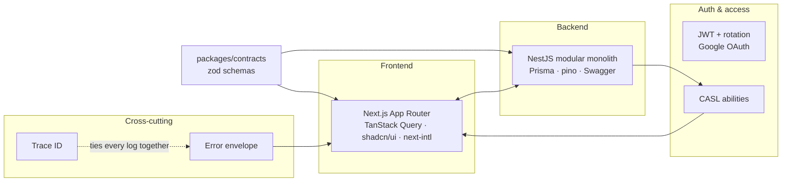

# What is this boilerplate

<Status value="implemented" />

`app-platform` is a boilerplate for building web apps that have users, permissions, and a backend — in a single monorepo where the web app, the API, and the docs live together and share one set of data contracts.

## What these docs are for

These docs are **spec-first**. They describe the *target* boilerplate, not a report of what the code currently does. The order of work is:

> agree on the spec in the docs → implement against it → update that page's status

Because the code hasn't caught up everywhere, every page carries a status badge telling you how much to trust it.

| Badge | Means |
| --- | --- |
| <Status value="implemented" inline /> | Code exists in this repo and matches this page. |
| <Status value="in-progress" inline /> | Partially there; the page states exactly what's missing. |
| <Status value="planned" inline /> | Spec only. No code yet. |

Any page where the spec and the code disagree carries a side-by-side box:

::: warning Current code status
| Target spec | Code today |
| --- | --- |
| Example: refresh token rotation | `auth.service.ts` only verifies and re-signs — the same token stays reusable |
:::

See [Status legend](/en/reference/status-legend) for the rules, and [Roadmap](/en/start/roadmap) for the full picture.

## Six pillars

1. **[Contract-first](/en/conventions/contract-first)** — one set of zod schemas in `packages/contracts` defines every request and response for both apps. Change one, and TypeScript breaks on both sides until they agree.
2. **[Modular monolith](/en/adr/0004-modular-monolith)** — NestJS split into strict modules but deployed as one unit. Split later, when there's a real reason.
3. **[Trace ID](/en/platform/trace-id)** — every request carries one id from the browser through the API into Prisma and every log line, and it shows up in the error the user sees so they can copy it to you.
4. **[Error envelope](/en/conventions/errors)** — every error has the same shape, so the client writes one handler for the whole system.
5. **[Auth + CASL](/en/auth/overview)** — JWT access/refresh with rotation, Google OAuth, and one ability set that both guards the server and hides buttons in the UI.
6. **[Bilingual i18n](/en/adr/0011-thai-default-locale)** — Thai is the primary language for both the product and these docs.

## What you get out of the box

| Area | What's provided |
| --- | --- |
| Monorepo | pnpm workspaces + Turborepo, shared eslint/prettier/tsconfig in `packages/config` |
| Dev environment | Docker Compose + Traefik, the full stack (`app.localhost`, `api.localhost`, `docs.localhost`), hot reload for all three apps |
| Frontend | Next.js 16 App Router, next-intl (th/en), TanStack Query, Tailwind v4, shadcn/ui, react-hook-form + zod |
| Backend | NestJS 11, Prisma 7 + Postgres, JWT, Swagger UI, pino structured logging |
| Contracts | zod schemas shared by Nest DTOs and react-hook-form resolvers |
| Docs | This site |

## What this boilerplate deliberately does *not* do

Knowing the boundaries keeps things from creeping in.

- **Not multi-tenant** — there is no tenant or organisation in the data model. If you need one, add `tenantId` and wire it into CASL conditions on day one; do not bolt it on later.
- **No microservices or message broker** — it's a modular monolith on purpose. See [ADR-0004](/en/adr/0004-modular-monolith).
- **No cloud vendor lock-in** — everything runs under Docker Compose.
- **No billing, analytics, or feature flags** — those belong to your app's domain, not to a boilerplate.
- **No i18n beyond two languages** — the structure supports more; what ships is th/en.

## Suggested reading order

1. [Quickstart](/en/start/quickstart) — get the stack running first
2. [Repo tour](/en/start/repo-tour) — learn where things live
3. [System overview](/en/architecture/overview) → [Request lifecycle](/en/architecture/request-lifecycle) — the mental model
4. [Contract-first](/en/conventions/contract-first) → [Error envelope](/en/conventions/errors) → [Trace ID](/en/platform/trace-id) — these three are referenced by every later page. Read them first and everything else gets easier.
5. [Auth overview](/en/auth/overview) when you start touching users and permissions
