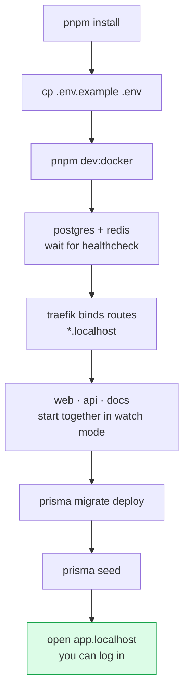

# Quickstart

<Status value="in-progress" note="seed script has a known issue — see migrate & seed" />

Goal: from a fresh clone to `app.localhost` in your browser, with sample data.

## Prerequisites

| Tool | Version | Check with |
| --- | --- | --- |
| Node.js | ≥ 22 | `node -v` |
| pnpm | 11.18.0 (pinned via `packageManager`) | `pnpm -v` |
| Docker + Compose | v2 or newer | `docker compose version` |

The easiest way to get pnpm is corepack: `corepack enable && corepack prepare pnpm@11.18.0 --activate`

## Bring-up sequence



## Steps

### 1. Install dependencies

```bash
pnpm install
```

### 2. Set up environment

```bash
cp .env.example .env
```

The defaults work on your machine, but two things are worth knowing.

::: danger The example secrets must never be used for real
`JWT_ACCESS_SECRET` and `JWT_REFRESH_SECRET` in `.env.example` are `change-me-*` placeholders. Replace them before any environment that isn't your own laptop. Generate with `openssl rand -base64 48`.
:::

::: tip DATABASE_URL points at a Docker hostname
`DATABASE_URL` uses the hostname `postgres`, which only resolves inside the Docker network. To run `pnpm dev` natively you must change it to `localhost:5432` — see [Local development](/en/ops/local-development).
:::

The full list lives at [Environment variables](/en/reference/env-vars).

### 3. Start the stack

```bash
pnpm dev:docker
```

This composes `docker-compose.yml` with `docker-compose.local.yml`, bringing up Postgres, Redis, Traefik, and all three apps in watch mode with your source bind-mounted into each container — edit a file on the host and it hot-reloads inside, no image rebuild.

The first run is slow because images have to be built.

### 4. Migrate & seed

Once Postgres passes its healthcheck:

```bash
pnpm --filter @app-platform/api prisma:migrate
pnpm --filter @app-platform/api prisma:seed
```

::: warning Current code status
| Target spec | Code today |
| --- | --- |
| `pnpm prisma:seed` just works | `apps/api/prisma.config.ts` sets `migrations.seed = "tsx prisma/seed.ts"`, but `tsx` is **not a dependency** (`package.json` uses `ts-node`) — so `prisma db seed` fails |
| Seed creates starter roles and permissions | `seed.ts` only upserts one user; there are no role/permission tables to seed yet ([data model](/en/architecture/data-model)) |

**Workaround today:** the `prisma:seed` script in `package.json` calls `ts-node prisma/seed.ts` directly, so it works. Use `pnpm --filter @app-platform/api prisma:seed` and avoid `prisma db seed`.
:::

### 5. Open it

| Service | URL |
| --- | --- |
| Web | http://app.localhost |
| API | http://api.localhost |
| **Swagger UI** | http://api.localhost/docs |
| These docs | http://docs.localhost |
| Traefik dashboard | http://localhost:8080 |

::: tip Two different "docs"
`api.localhost/docs` is the **Swagger UI** for the REST API. `docs.localhost` is **this VitePress site**. Same word, different things.
:::

### 6. Sample account

From `apps/api/prisma/seed.ts`:

| Email | Password |
| --- | --- |
| `demo@example.com` | `password123` |

Right now you can only exercise this through Swagger (`POST /auth/login`) because the web login page isn't implemented yet — see the [login spec](/en/auth/login).

## Common problems

| Symptom | Cause | Fix |
| --- | --- | --- |
| `app.localhost` doesn't respond | Some browsers don't resolve `*.localhost` | Add `127.0.0.1 app.localhost api.localhost docs.localhost` to `/etc/hosts` |
| API exits immediately on boot | `getOrThrow("JWT_ACCESS_SECRET")` found nothing | You skipped `cp .env.example .env` |
| `Can't reach database server` | Running `pnpm dev` outside Docker while `DATABASE_URL` points at the `postgres` hostname | Change it to `localhost:5432` |
| Port 80 already in use | Another web server owns it | Stop it, or change Traefik's port in compose |
| Edits don't reload | File watcher doesn't see changes across the bind mount | Compose already enables polling; if it still fails, restart that service |
| `pnpm install` complains about build scripts | pnpm 11 blocks postinstall by default | `pnpm-workspace.yaml` declares `allowBuilds`; add new packages that need building there |

## Next

- [Repo tour](/en/start/repo-tour) — where everything lives
- [Local development](/en/ops/local-development) — Docker vs native, and day-to-day tasks
- [Roadmap](/en/start/roadmap) — what's built and what isn't
