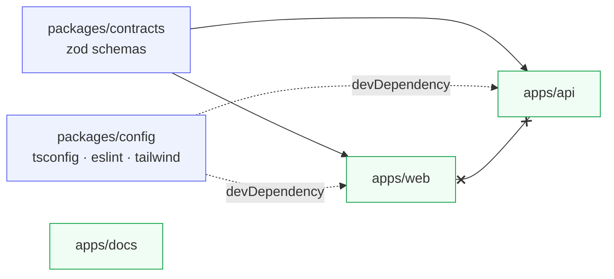

# Repo tour

<Status value="implemented" />

## Layout

```
app-platform/
├── apps/
│   ├── web/            Next.js 16 App Router — the user interface
│   ├── api/            NestJS 11 modular monolith — the REST API
│   └── docs/           VitePress — this site
├── packages/
│   ├── contracts/      zod schemas shared by web and api   ← the keystone
│   └── config/         shared tsconfig / eslint / prettier / tailwind theme
├── infra/
│   └── docker/         per-app Dockerfile.dev + Traefik config
├── docker-compose.yml         service definitions (postgres, redis, traefik, web, api, docs)
├── docker-compose.local.yml   dev overlay: build, bind mounts, published ports
├── turbo.json                 Turborepo task definitions
├── pnpm-workspace.yaml        workspace scope + allowBuilds
└── .env.example               template for .env
```

## Dependency direction



The one rule that must never break: **`apps/web` and `apps/api` never import from each other.** Anything they both need goes into `packages/contracts`. That is exactly what stops the two sides from drifting — see [Contract-first](/en/conventions/contract-first).

`apps/docs` depends on nothing and nothing depends on it. It's documentation, not runtime code.

## What lives where

### `apps/web`

```
src/
├── app/
│   ├── layout.tsx          root layout (pass-through)
│   ├── providers.tsx       QueryClientProvider (client component)
│   ├── globals.css         Tailwind v4 entry + design tokens
│   └── [locale]/           every page lives under a locale segment
├── i18n/
│   ├── routing.ts          defineRouting: locales ["en","th"]
│   ├── request.ts          loads messages per request
│   └── navigation.ts       locale-aware Link/redirect/useRouter
├── components/ui/          shadcn/ui components
├── lib/utils.ts            cn() helper
└── proxy.ts                Next 16 middleware (the new name for middleware.ts)
```

::: tip It's `proxy.ts`, not `middleware.ts`
Next.js 16 renamed the middleware file to `proxy.ts`. Right now it only holds the next-intl middleware; route protection gets added here — see [Client session](/en/frontend/auth-client).
:::

### `apps/api`

```
src/
├── main.ts                 bootstrap: pino logger, ZodValidationPipe, CORS, Swagger
├── app.module.ts           wires modules + ConfigModule + LoggerModule
├── health.controller.ts    GET /health
├── prisma/                 PrismaService (@Global)
├── auth/                   login / refresh / JwtStrategy / JwtAuthGuard
└── users/                  create / find
```

One folder = one module = one bounded context. Modules talk through exported services, never by reaching into another module's repository.

### `packages/contracts`

Pure zod schemas with no build step (`main` points straight at `./src/index.ts`), which is why `apps/web` needs `transpilePackages: ["@app-platform/contracts"]` in `next.config.ts`.

What's there today: `TokenRequestSchema`, `TokenResponseSchema`, `UserSchema`, `CreateUserSchema`, `UpdateUserSchema`, `PaginationQuerySchema`, `paginatedSchema()`.

### `packages/config`

Shared configuration so the apps can't drift apart: `tsconfig.base.json`, `eslint/{base,react,nest}.js`, `prettier.config.js`, `tailwind/theme.css`.

## Where do I add X?

| I want to | Touch |
| --- | --- |
| Add an endpoint | schema in `packages/contracts` → controller/service in `apps/api/src/<module>/` |
| Add a page | `apps/web/src/app/[locale]/<route>/page.tsx` + keys in `apps/web/messages/{th,en}.json` |
| Add a database column | `apps/api/prisma/schema.prisma` → `prisma:migrate` → update the contract schema |
| Add an env var | `.env.example` → the API's env schema → [env table](/en/reference/env-vars) |
| Add a shadcn component | `pnpm --filter @app-platform/web dlx shadcn@latest add <name>` |
| Add a language | `apps/web/src/i18n/routing.ts` + `apps/web/messages/<locale>.json` |
| Add a docs page | `apps/docs/<section>/<page>.md` **and** `apps/docs/en/<section>/<page>.md`, then register it in `.vitepress/structure.ts` |
| Add a service to the stack | `docker-compose.yml` + `docker-compose.local.yml` + Traefik labels |

::: warning Docs pages always come in pairs
`.vitepress/config.ts` fails the build on dead links. Add a Thai page without its `/en/` mirror and `pnpm --filter @app-platform/docs build` breaks — that's intentional.
:::

## Turborepo tasks

`turbo.json` defines five:

| Task | Behaviour |
| --- | --- |
| `dev` | `cache: false`, `persistent: true` — runs every app together |
| `build` | `dependsOn: ["^build"]`, caches `dist/**` and `.next/**` |
| `lint` | `dependsOn: ["^build"]` |
| `test` | `dependsOn: ["^build"]` |
| `clean` | not cached |

Whole repo: `pnpm dev` / `pnpm build` / `pnpm lint` / `pnpm test`
One app: `pnpm --filter @app-platform/api <script>`
