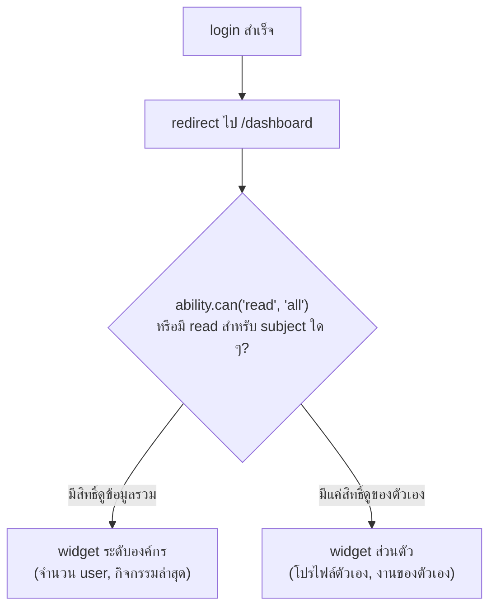
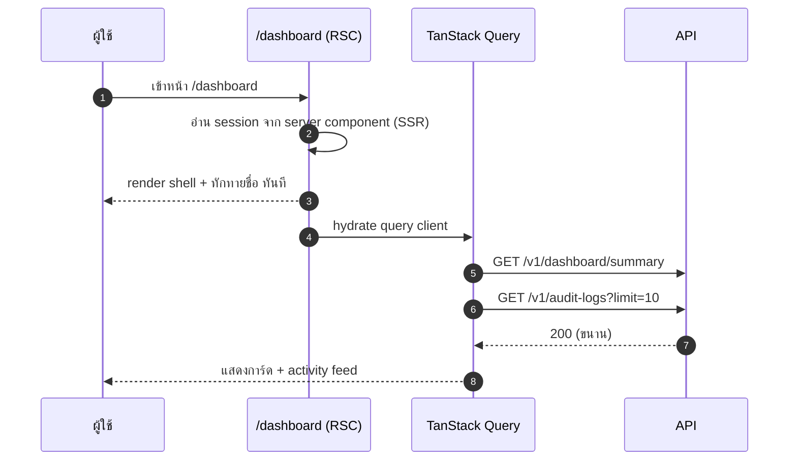

# แดชบอร์ด

<Status value="implemented" />

> **หน้าแรกที่ผู้ใช้เห็นหลัง login ต้องตอบคำถามเดียวใน 3 วินาที: "วันนี้มีอะไรที่ฉันต้องรู้"**

`apps/web` วันนี้มีแค่ home page ตัวเดียว ยังไม่มี route ที่ล็อกอินแล้วเข้าถึงได้เลย หน้านี้เป็นสเปกของหน้าแรกหลัง login

## ตำแหน่งใน route

`apps/web/src/app/[locale]/(app)/dashboard/page.tsx`



## Layout

```text
┌──────────────────────────────────────────────────┐
│  สวัสดี, สมชาย 👋                     [🔔] [👤 ▾]  │
├──────────────────────────────────────────────────┤
│  ┌────────────┐ ┌────────────┐ ┌────────────┐    │
│  │ ผู้ใช้ทั้งหมด │ │ ใช้งานวันนี้ │ │ รอดำเนินการ │    │
│  │    128      │ │     34      │ │      3      │    │
│  └────────────┘ └────────────┘ └────────────┘    │
│  ─────────────────────────────────────────────    │
│  กิจกรรมล่าสุด                                     │
│  ┌────────────────────────────────────────────┐   │
│  │ • สมชาย เพิ่ม role "editor"     2 นาทีที่แล้ว │   │
│  │ • วิภา อัปเดตโปรไฟล์            1 ชม.ที่แล้ว   │   │
│  │ • ระบบ ปิด session ที่หมดอายุ    3 ชม.ที่แล้ว  │   │
│  └────────────────────────────────────────────┘   │
└──────────────────────────────────────────────────┘
```

## Widget ที่ประกอบเป็นหน้า

| Widget | มาจากไหน | สิทธิ์ที่ต้องมี |
| --- | --- | --- |
| การ์ดสรุปตัวเลข (ผู้ใช้ทั้งหมด, active วันนี้) | `GET /v1/dashboard/summary` | `ability.can("read", "User")` แบบไม่จำกัด condition |
| ตาราง Activity feed | `GET /v1/audit-logs?limit=10` | `ability.can("read", "AuditLog")` — ปกติมีแค่ `admin` |
| Widget ส่วนตัว (สำหรับ `member` ที่ไม่มีสิทธิ์ดูภาพรวม) | `GET /v1/auth/me` | ทุก role เห็นได้ |

::: tip แดชบอร์ดต้อง gate ด้วย ability เดียวกับที่ server ใช้จริง
Widget ที่ดึงข้อมูลจาก endpoint ที่ผู้ใช้ไม่มีสิทธิ์เข้าไม่ควรถูก render เลย ไม่ใช่ render แล้วเจอ `403` การเช็คก่อน render ทำได้ด้วย `<Can>` ที่กล่าวถึงใน [CASL § ส่งกฎไปให้ UI](/auth/casl) — rule set เดียวกับที่ backend ใช้ ไม่ใช่ hardcode แยกไว้ในหน้าเว็บ
:::

## Field / ส่วนประกอบ

| ส่วนประกอบ | ที่มาของข้อมูล | รีเฟรชยังไง |
| --- | --- | --- |
| การ์ดตัวเลข | REST + TanStack Query, `staleTime: 60_000` | polling ทุก 60 วินาที ไม่ใช่ real-time |
| Activity feed | REST, `staleTime: 30_000` | เหมือนกัน + ปุ่ม "รีเฟรช" ให้กดเอง |
| ทักทายชื่อผู้ใช้ | จาก session ที่โหลดมาแล้ว (ไม่ยิง API ซ้ำ) | ไม่ต้องรีเฟรช |

## สถานะของหน้า

| สถานะ | UI |
| --- | --- |
| กำลังโหลดครั้งแรก | Skeleton สามการ์ด + skeleton แถวตาราง 5 แถว |
| โหลดสำเร็จ, มีข้อมูล | ตามภาพ layout ด้านบน |
| โหลดสำเร็จ, ไม่มี activity เลย | Empty state: ไอคอน + "ยังไม่มีกิจกรรมในระบบ" |
| โหลดพลาด (network/500) | การ์ด error พร้อมปุ่ม "ลองใหม่" ต่อ widget แยกกัน — widget หนึ่งพังไม่ควรทำให้ทั้งหน้าใช้ไม่ได้ |
| ผู้ใช้ไม่มีสิทธิ์ดู widget ใดเลย (edge case: role ที่ permission ว่างเปล่า) | แสดงแค่คำทักทาย + ลิงก์ไปโปรไฟล์ |

::: warning แต่ละ widget ต้อง error boundary แยกกัน
ถ้า Activity feed ล่มเพราะ `GET /v1/audit-logs` พัง การ์ดตัวเลขที่ดึงจาก endpoint อื่นต้องยังทำงานได้ปกติ ใช้ error boundary ระดับ widget ไม่ใช่ระดับหน้าเดียวทั้งหมด — ดูแนวทาง error handling ฝั่งเว็บที่ [Observability & logging](/platform/observability)
:::

## Sequence โหลดหน้า



::: tip render ทักทายชื่อแบบ server component ก่อน ไม่รอ client fetch
ชื่อผู้ใช้มีอยู่แล้วใน session ตอน SSR ไม่จำเป็นต้องรอ round-trip ของ client เพื่อโชว์ "สวัสดี, สมชาย" — ทำแบบนี้ตัด layout shift ที่เห็นได้ชัดตอนโหลดหน้า
:::

## Endpoint ที่ต้องมี

| Endpoint | Method | สิทธิ์ | หมายเหตุ |
| --- | --- | --- | --- |
| `/v1/dashboard/summary` | `GET` | `read User` แบบไม่จำกัด condition (เช็ก unconditional เองในเซอร์วิส) | คืนตัวเลขรวม ไม่ใช่รายชื่อ user จริง |
| `/v1/audit-logs` | `GET` | `read AuditLog` | query param `limit` เท่านั้น — ยังไม่มี `cursor` สำหรับ pagination |
| `/v1/auth/me` | `GET` | ทุกคนที่ login แล้ว | ใช้ค่าที่มีอยู่แล้ว ไม่ยิงซ้ำถ้า session provider โหลดไว้แล้ว |

## เช็กลิสต์

- [x] widget แต่ละตัวมี error/loading state แยกกัน (ผ่าน `useQuery` แยก query ต่อ widget)
- [x] widget ที่ผู้ใช้ไม่มีสิทธิ์ไม่ถูก render เลย (เช็กด้วย ability ก่อน mount แต่ละ widget)
- [ ] ทักทายชื่อ render จาก server component ไม่รอ client fetch — ปัจจุบันยังรอ client query เหมือน widget อื่น
- [x] skeleton loading state ครบทุก widget
- [x] empty state มีข้อความและไอคอนที่สื่อความหมาย ไม่ใช่ตารางว่างเปล่า

::: warning สถานะโค้ดปัจจุบัน
| สเปกเป้าหมาย | โค้ดวันนี้ |
| --- | --- |
| `/dashboard` route | มีจริงที่ `app/[locale]/(app)/dashboard/page.tsx` |
| `GET /v1/dashboard/summary` | มีจริง — คืน `totalUsers`/`activeUsers`/`inactiveUsers` |
| `GET /v1/audit-logs` | มีจริง มีข้อมูลจริงจากการ update user/role ที่เขียน audit log อัตโนมัติ |
| widget gating ตามสิทธิ์ | ทำผ่าน ability check ตรง ๆ ก่อน mount widget (ไม่ได้ใช้ `<Can>` component ตรง ๆ แต่ผลลัพธ์เดียวกัน) |
| widget error boundary ระดับ React (ไม่ใช่แค่ query error) | ยังไม่มี — อาศัย `useQuery` แยก query ต่อ widget แทน ซึ่งกัน render error ข้ามกันได้เหมือนกันสำหรับ error จาก data fetching |
| Server Component prefetch สำหรับคำทักทาย | ยังไม่มี — ทั้งหน้ายังเป็น client component ที่ query `auth/me` ตอน mount |
:::
