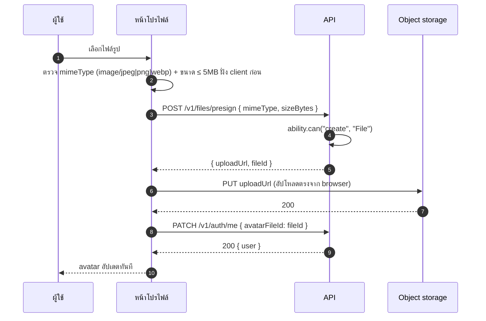

# โปรไฟล์

<Status value="in-progress" note="แก้ข้อมูลพื้นฐานและเปลี่ยนรหัสผ่านได้จริง — avatar/Google ยังไม่ implement" />

> **หน้าโปรไฟล์คือที่เดียวที่ผู้ใช้ทุกคนแก้ข้อมูลของตัวเองได้เสมอ ไม่ว่า role จะเป็นอะไร — field ที่แก้ได้ตรงกับ `${user.id}` condition ใน[ตารางสิทธิ์](/auth/rbac-model) เป๊ะ**

## ตำแหน่งใน route

`apps/web/src/app/[locale]/(app)/profile/page.tsx`

ทุก role เข้าถึงได้เสมอ — ต่างจาก [จัดการผู้ใช้](/features/settings-users) ตรงที่หน้านี้แก้ **ตัวเองเท่านั้น** ไม่มี query param สำหรับดูโปรไฟล์คนอื่น

## Layout

```text
┌──────────────────────────────────────────┐
│  โปรไฟล์ของฉัน                             │
├──────────────────────────────────────────┤
│      ┌────────┐                           │
│      │  👤    │  [เปลี่ยนรูป] [ลบรูป]        │
│      │ avatar │                           │
│      └────────┘                           │
│                                            │
│  ชื่อที่แสดง                                 │
│  [ สมชาย ใจดี                          ]   │
│  อีเมล                                     │
│  [ somchai@ex.com              ] 🔒 ยืนยันแล้ว │
│  ภาษา                                      │
│  [ ไทย                       ▾ ]           │
│                                            │
│  ─────────── บัญชีที่เชื่อมต่อ ───────────    │
│  🔵 Google        เชื่อมต่อแล้ว   [ยกเลิก]   │
│                                            │
│  ─────────── ความปลอดภัย ───────────        │
│  [ เปลี่ยนรหัสผ่าน ]                        │
│                                            │
│  [ บันทึกการเปลี่ยนแปลง ]                    │
└──────────────────────────────────────────┘
```

## Field ที่แก้ได้ และเหตุผลที่ตรงกับ RBAC

| Field | แก้ได้ไหม | เพราะอะไร |
| --- | --- | --- |
| `displayName` | ✅ | อยู่ใน field list ของ `member` ที่ [ตารางสิทธิ์](/auth/rbac-model) กำหนด: `update User where id = ${user.id}` field `displayName, avatarFileId, locale, theme` |
| `avatarFileId` | ✅ (ผ่าน upload flow) | เหมือนกัน |
| `locale` | ✅ | เหมือนกัน |
| `theme` | ✅ (ย้ายไปหน้า[ตั้งค่าธีม](/features/settings-theme)แยก) | เหมือนกัน |
| `email` | ❌ แสดงอย่างเดียว | ไม่อยู่ใน field list ของ `member` — เปลี่ยนอีเมลต้องผ่าน flow ยืนยันแยก (ยังไม่ specced ในหน้านี้) เพื่อกัน account takeover ผ่านการเปลี่ยนอีเมลเงียบ ๆ |
| `roles` | ❌ ไม่แสดงเลย | `manager` และ `member` ไม่มีสิทธิ์แก้ `roles` แม้แต่ของตัวเอง — กันการเลื่อนขั้นตัวเอง ดู [CASL § กันการเลื่อนขั้นตัวเอง](/auth/casl) |
| `status` | ❌ ไม่แสดงเลย | ไม่มีใครปิดการใช้งานบัญชีตัวเองผ่านหน้านี้ (ต้องผ่าน flow "ลบบัญชี" แยกถ้ามี) |

::: danger field ที่ไม่อยู่ใน allowlist ต้องไม่ปรากฏในฟอร์มเลย
สอดคล้องกับหลักการเดียวกับ[หน้าจัดการผู้ใช้](/features/settings-users) — field ที่ผู้ใช้แก้ตัวเองไม่ได้ต้องไม่ render ไม่ใช่ readonly เพราะ readonly input ยังทำให้คนเข้าใจผิดว่าเกือบแก้ได้ และยังเสี่ยงมี dev คนหนึ่งลืม disabled attribute แล้วเปิดช่องโหว่โดยไม่ตั้งใจ
:::

## Avatar upload



รายละเอียด presigned URL, ข้อจำกัด mime type/ขนาด, และการลบไฟล์เก่าอยู่ที่ [จัดเก็บไฟล์](/backend/file-storage) — หน้านี้อ้างอิงแค่ flow ฝั่ง UI

::: tip อัปโหลดตรงจาก browser ไปที่ object storage ไม่ผ่าน API
ไฟล์รูปไม่ควรวิ่งผ่าน `apps/api` เลย — API แค่ออก presigned URL แล้ว browser ยิง `PUT` ตรงไปที่ storage เอง วิธีนี้ตัด API server ออกจาก data path ที่หนักที่สุด (การถ่ายโอนไฟล์) ให้เหลือแค่ทำ authorization
:::

## Field / states

| ส่วนประกอบ | สถานะ | UI |
| --- | --- | --- |
| Avatar | กำลังอัปโหลด | overlay spinner บนรูปเดิม รูปเดิมยังโชว์อยู่ระหว่างรอ |
| Avatar | อัปโหลดพลาด (เกินขนาด) | toast แดง "ไฟล์ใหญ่เกิน 5MB" ก่อนแม้แต่จะยิง presign |
| Avatar | อัปโหลดพลาด (network ระหว่าง PUT) | toast แดง "อัปโหลดไม่สำเร็จ" + ปุ่มลองใหม่ รูปเดิมไม่เปลี่ยน |
| Google account | เชื่อมต่อแล้ว | badge เขียว + ปุ่ม "ยกเลิกการเชื่อมต่อ" |
| Google account | ยังไม่เชื่อมต่อ | ปุ่ม "เชื่อมต่อกับ Google" — เริ่ม OAuth flow เดียวกับ signup แต่จบด้วยการผูกบัญชีแทนสร้างใหม่ |
| ยกเลิกเชื่อมต่อ Google เมื่อไม่มี `passwordHash` | บล็อก | dialog แจ้ง "ต้องตั้งรหัสผ่านก่อนยกเลิกการเชื่อมต่อ Google มิฉะนั้นจะเข้าระบบไม่ได้อีก" |

::: danger ห้ามให้ผู้ใช้ยกเลิกการเชื่อมต่อ provider เดียวที่มีถ้าไม่มีรหัสผ่านสำรอง
ผู้ใช้ที่สมัครผ่าน Google อย่างเดียว (`passwordHash = null` ตาม[ผังข้อมูล](/architecture/data-model)) ถ้ายกเลิกเชื่อมต่อ Google โดยไม่มีวิธีเข้าระบบอื่น จะ**ล็อกตัวเองออกจากบัญชีถาวร** ต้องบังคับตั้งรหัสผ่านก่อนเสมอในกรณีนี้
:::

## เปลี่ยนรหัสผ่าน (สำหรับผู้ใช้ที่มีรหัสผ่านอยู่แล้ว)

```text
┌──────────────────────────┐
│  เปลี่ยนรหัสผ่าน        ✕ │
├──────────────────────────┤
│  รหัสผ่านปัจจุบัน           │
│  [                    ] 👁 │
│  รหัสผ่านใหม่               │
│  [                    ] 👁 │
│  ยืนยันรหัสผ่านใหม่          │
│  [                    ]    │
│  [ ยกเลิก ]    [ เปลี่ยน ] │
└──────────────────────────┘
```

ใช้ `PasswordSchema` เดียวกับ[สมัครสมาชิก](/auth/signup) และต้องยืนยันรหัสผ่านปัจจุบันก่อนเสมอ — ป้องกันกรณี session หลุดมือแล้วคนอื่นมายึดบัญชีต่อผ่านการเปลี่ยนรหัสผ่านเงียบ ๆ

## เช็กลิสต์

- [x] field ที่ไม่อยู่ใน allowlist ของ `member` ไม่ถูก render ในฟอร์ม (หน้าโปรไฟล์แสดงแค่ `displayName` ที่แก้ได้ + `email` แบบ read-only)
- [ ] avatar อัปโหลดตรงไป object storage ผ่าน presigned URL ไม่ผ่าน API server — **ยังไม่ implement** ทั้งหมด (ไม่มี `File` module, ไม่มี object storage ตั้งค่าไว้)
- [ ] ยกเลิกเชื่อมต่อ Google ถูกบล็อกถ้าไม่มี `passwordHash` — **ยังไม่ implement** เพราะยังไม่มี Google OAuth เลย
- [x] เปลี่ยนรหัสผ่านต้องยืนยันรหัสผ่านเดิมก่อนเสมอ
- [x] เปลี่ยนอีเมลไม่อยู่ในฟอร์มนี้ (แสดงเป็น read-only เท่านั้น)

::: warning สถานะโค้ดปัจจุบัน
| สเปกเป้าหมาย | โค้ดวันนี้ |
| --- | --- |
| `/profile` route | มีจริงที่ `app/[locale]/(app)/profile/page.tsx` |
| `PATCH /v1/auth/me` | มีจริง แก้ `displayName`/`locale`/`theme` ได้ ใช้ field-level ability check |
| แก้ `locale`/`theme` จากหน้าโปรไฟล์ | field ใน schema รองรับแล้ว แต่ UI ของหน้าโปรไฟล์ยังโชว์แค่ `displayName` — `theme` แก้ผ่าน [ตั้งค่า · ธีม](/features/settings-theme) แยกต่างหากตามที่สเปกกำหนด |
| `POST /v1/files/presign` | ยังไม่มี — ไม่มีตาราง `File` ใน Prisma และไม่มี module จัดการไฟล์ (ดู [จัดเก็บไฟล์](/backend/file-storage)) |
| เชื่อมต่อ Google จากหน้าโปรไฟล์ | ยังไม่มี Google OAuth เลย (ดู [สมัครสมาชิก](/auth/signup)) |
| เปลี่ยนรหัสผ่าน | มีจริง — `POST /v1/auth/change-password` ตรวจรหัสผ่านเดิมด้วย `bcrypt.compare` ก่อนเสมอ |
:::
