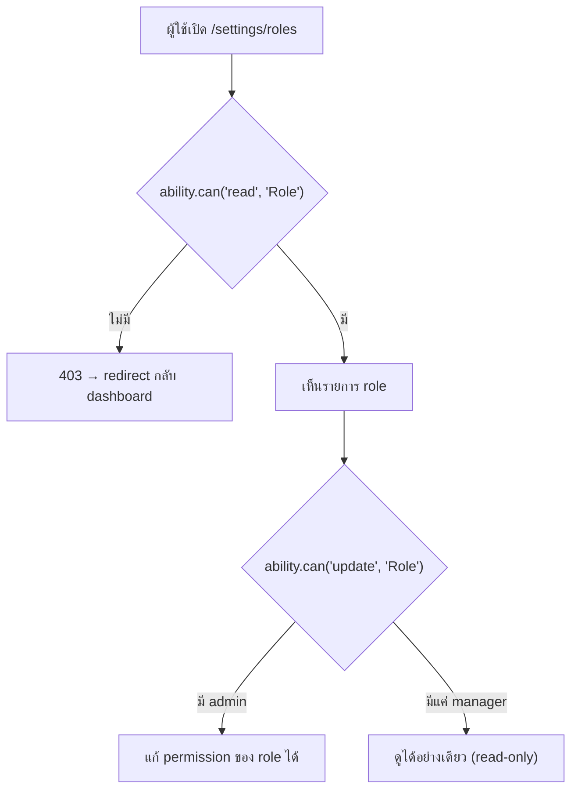
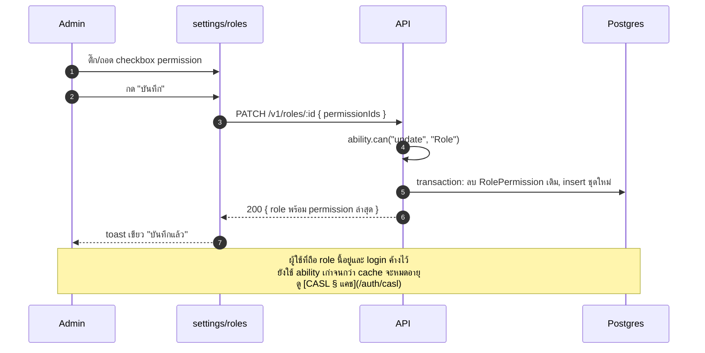

# ตั้งค่า · Role & permission

<Status value="planned" />

> **หน้านี้แก้ไข "role ไหนมี permission อะไร" ไม่ใช่หน้าที่สร้าง permission ใหม่ — สอง action นี้ต่างระดับกัน**

โมเดลข้อมูลเต็มอยู่ที่ [Role & permission model](/auth/rbac-model) กลไกบังคับใช้อยู่ที่ [CASL](/auth/casl) หน้านี้เป็นสเปกของ UI ที่ครอบสองอย่างนั้น

## เข้าถึงได้ใคร



ตาม[ตารางสิทธิ์](/auth/rbac-model) `manager` มี `read Role` แต่ไม่มี `create/update/delete Role` — เห็นหน้านี้ได้แต่ทุกปุ่มแก้ไขต้อง disabled หรือไม่ render เลย มีแค่ `admin` ที่แก้ได้จริง

## Layout

```text
┌───────────────────────────────────────────────────┐
│  Role & Permission                    [+ เพิ่ม role]│
├───────────────────────────────────────────────────┤
│  ┌─────────────┐ ┌─────────────┐ ┌─────────────┐  │
│  │ admin    🔒  │ │ manager  🔒  │ │ member   🔒  │  │
│  │ ผู้ดูแลระบบ   │ │ ผู้จัดการ    │ │ สมาชิก      │  │
│  │ ทำได้ทุกอย่าง │ │ 8 permission│ │ 3 permission│  │
│  └─────────────┘ └─────────────┘ └─────────────┘  │
│  ┌─────────────┐                                   │
│  │ editor       │  ← role ที่สร้างเอง ลบได้ แก้ได้  │
│  │ กองบรรณาธิการ │                                   │
│  │ 4 permission │                                   │
│  └─────────────┘                                   │
└───────────────────────────────────────────────────┘
```

การ์ดที่มี 🔒 คือ `isSystem = true` — ลบไม่ได้และเปลี่ยน `key` ไม่ได้ (ตาม[ตารางสิทธิ์](/auth/rbac-model)) แต่ **แก้ชื่อแสดงผล (`name`) ได้** เพราะไม่กระทบ `key` ที่โค้ดอ้างอิง

## หน้าจอแก้ไข permission ของ role

```text
┌─────────────────────────────────────────────────┐
│  แก้ไข role: editor                           ✕  │
├─────────────────────────────────────────────────┤
│  ชื่อ                                             │
│  [ กองบรรณาธิการ                              ]  │
├─────────────────────────────────────────────────┤
│  Permission                                       │
│  Subject: User                                    │
│    ☑ create   ☑ read   ☑ update   ☐ delete       │
│  Subject: Role                                     │
│    ☐ create   ☑ read   ☐ update   ☐ delete       │
│  Subject: File                                     │
│    ☑ create   ☑ read   ☐ update   ☐ delete       │
├─────────────────────────────────────────────────┤
│  [ ยกเลิก ]                          [ บันทึก ]  │
└─────────────────────────────────────────────────┘
```

::: danger checkbox ในหน้านี้เลือกได้เฉพาะคู่ action×subject ที่ seed ไว้แล้ว
UI นี้ **ไม่ใช่** ตัวสร้าง `Permission` ใหม่ — เป็นแค่ตัวเลือกว่า role ไหนถือ permission ที่มีอยู่แล้วบ้าง ทุก checkbox ต้อง render จากรายการ `Permission` ที่มีจริงใน DB (มาจาก `PERMISSIONS` ใน seeder ตาม [RBAC § Seed](/auth/rbac-model)) ไม่ใช่ input อิสระที่พิมพ์ action/subject เองได้ — ถ้าเปิดให้พิมพ์อิสระเท่ากับเปิดช่องให้เขียนกฎ CASL ตามใจชอบผ่าน UI
:::

### สัญญา

```ts
// packages/contracts/src/role.schema.ts
export const UpdateRoleSchema = z.object({
  name: z.string().trim().min(1).max(120).optional(),
  permissionIds: z.array(z.uuid()).optional(), // ต้องเป็น id ที่มีอยู่จริงใน Permission
});

export const CreateRoleSchema = z.object({
  key: z.string().trim().min(1).max(64).regex(/^[a-z][a-z0-9_]*$/, "ใช้ตัวเล็ก ตัวเลข และ _ เท่านั้น"),
  name: z.string().trim().min(1).max(120),
  permissionIds: z.array(z.uuid()),
});
```

## Role ระบบที่แก้ไม่ได้บาง field

| Field | `isSystem = true` | role ที่สร้างเอง |
| --- | --- | --- |
| `key` | ล็อก | ล็อกหลังสร้าง (เปลี่ยนแล้วโค้ดที่ hardcode `key` จะพัง) |
| `name` | แก้ได้ | แก้ได้ |
| permission ที่ถือ | แก้ได้ (ยกเว้นต้องเหลือ `admin` ที่มี `manage all` อย่างน้อยหนึ่งคน) | แก้ได้อิสระ |
| ลบ role | ทำไม่ได้ (ปุ่มไม่ render) | ทำได้ถ้าไม่มีผู้ใช้ถือ role นี้อยู่ |

::: warning ลบ role ที่ยังมีคนถืออยู่ต้องบล็อกด้วยข้อความที่ actionable
`DELETE /v1/roles/:id` ต้องตอบ `409 ROLE_IN_USE` พร้อมจำนวนผู้ใช้ที่ถือ role นั้น UI แปลงเป็น "ลบไม่ได้ — มีผู้ใช้ 4 คนใช้ role นี้อยู่" ไม่ใช่ error message ดิบจาก API
:::

## Field / states

| ส่วนประกอบ | สถานะ | UI |
| --- | --- | --- |
| การ์ด role | โหลดสำเร็จ | ตามภาพ layout |
| การ์ด role | กำลังโหลด | skeleton 3-4 การ์ด |
| Checkbox permission | กำลังบันทึก | disabled ทั้งกลุ่ม + spinner เล็กบนปุ่มบันทึก |
| ลบ role ที่ isSystem | — | ปุ่มลบไม่ render เลย ไม่ใช่ disabled |
| สร้าง role ใหม่ที่ key ซ้ำ | error | inline error ใต้ช่อง key: "key นี้ถูกใช้แล้ว" (จาก `409 RESOURCE_CONFLICT`) |

## Sequence แก้ permission



::: tip แก้ permission ของ role มีผลล่าช้ากับผู้ใช้ที่ login อยู่แล้ว
ถ้า ability ถูกแคชไว้ (ดู [CASL § แคช](/auth/casl)) คนที่ถือ role นั้นและ login ค้างอยู่จะยังเห็นสิทธิ์เดิมจนกว่าแคชจะหมดอายุหรือถูกล้าง แจ้งเรื่องนี้ใน UI ด้วยข้อความเล็ก ๆ ใต้ปุ่มบันทึก: "ผู้ใช้ที่ล็อกอินอยู่จะเห็นการเปลี่ยนแปลงภายในไม่กี่นาที"
:::

## เช็กลิสต์

- [ ] checkbox permission render จาก `Permission` ที่มีจริงเท่านั้น ไม่มี free text
- [ ] role ที่ `isSystem = true` ไม่มีปุ่มลบและไม่มีช่องแก้ `key`
- [ ] ลบ role ที่มีคนถืออยู่ตอบ error ที่บอกจำนวนผู้ใช้ที่กระทบ
- [ ] มี guard กันไม่ให้ `admin` เหลือ 0 คนที่มี `manage all`
- [ ] แจ้งผู้ใช้ว่า permission ใหม่มีผลล่าช้าถ้ามีการแคช ability

::: warning สถานะโค้ดปัจจุบัน
| สเปกเป้าหมาย | โค้ดวันนี้ |
| --- | --- |
| `/settings/roles` route | ไม่มี — ไม่มีหน้า UI ใด ๆ |
| ตาราง `Role`, `Permission`, `RolePermission` | ไม่มีเลยสักตาราง (ดู [Data model](/architecture/data-model)) |
| `PATCH /v1/roles/:id` | ไม่มี endpoint นี้ |
| `409 ROLE_IN_USE` | ไม่มีใน [error code catalog](/reference/error-codes) ตอนนี้ |
| CASL ability caching | ยังไม่ implement — ดู [CASL](/auth/casl) |
:::
