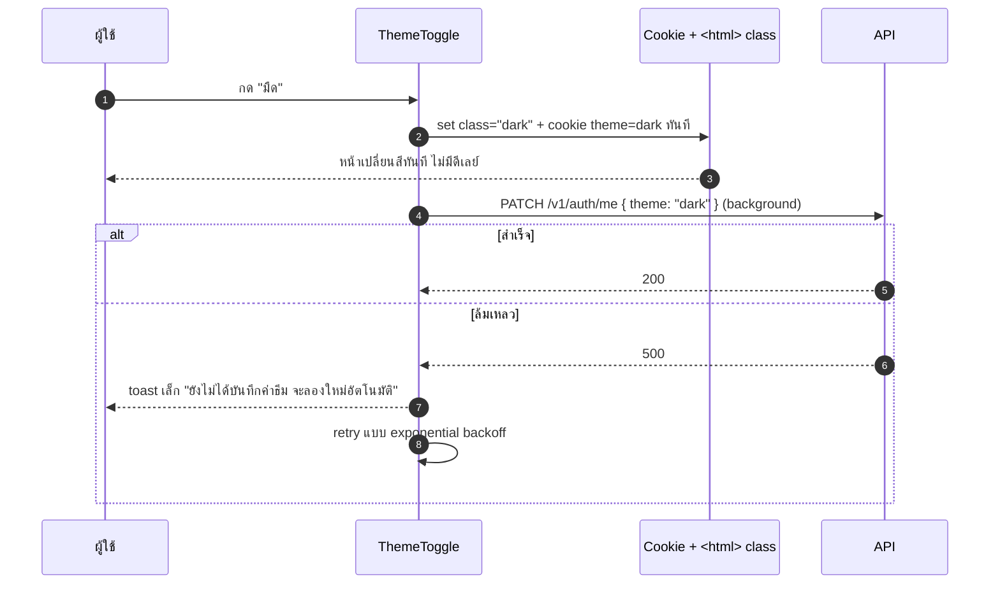
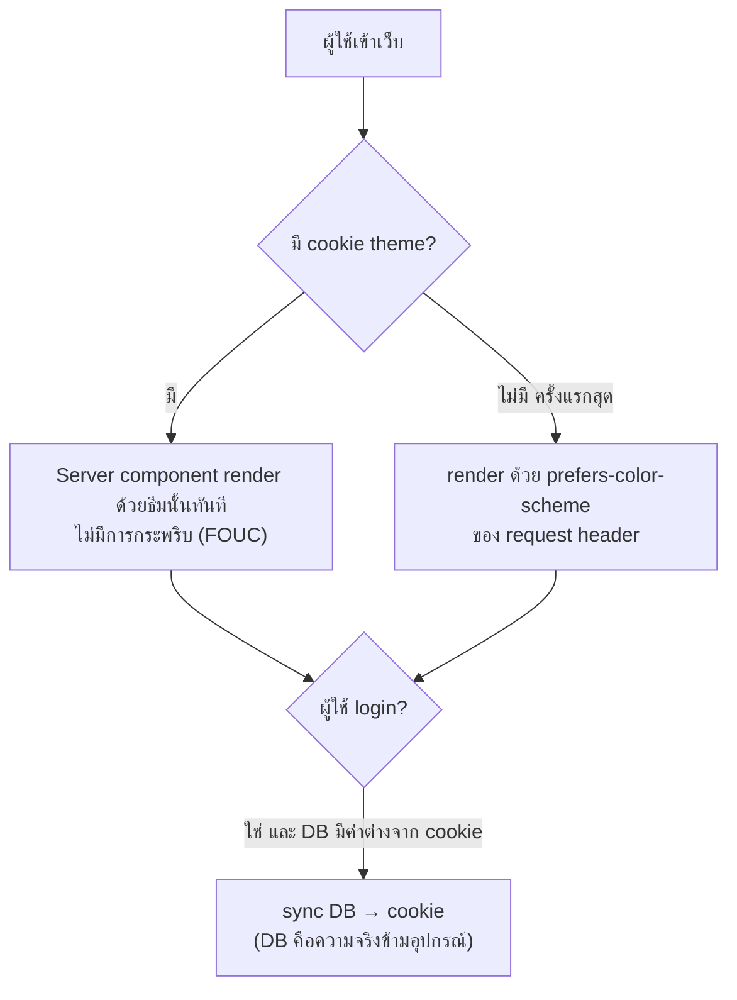

# ตั้งค่า · ธีม

<Status value="implemented" />

> **ธีมมีสองที่เก็บ: cookie สำหรับ render ตอนแรกแบบไม่กระพริบ กับ `User.theme` สำหรับจำค่าข้ามอุปกรณ์ — สองที่นี้ต้อง sync กัน ไม่ใช่แข่งกัน**

กลไกเบื้องหลัง (CSS variable, `prefers-color-scheme`, การสลับ class บน `<html>`) อยู่ที่ [ธีม & dark mode](/frontend/theming) แล้ว หน้านี้พูดเฉพาะ UI การตั้งค่าและวิธีผูกกับ field `User.theme`

## ตำแหน่งใน route

`apps/web/src/app/[locale]/(app)/settings/theme/page.tsx`

ทุก role เข้าถึงได้ — ธีมเป็นการตั้งค่าส่วนตัวล้วน ตาม[ตารางสิทธิ์](/auth/rbac-model) `member` แก้ `theme` ของตัวเองได้อยู่แล้ว

## Layout

```text
┌─────────────────────────────────────────────┐
│  ธีม                                          │
├─────────────────────────────────────────────┤
│  โหมดสี                                        │
│  ┌────────┐  ┌────────┐  ┌────────┐          │
│  │  ☀️     │  │  🌙    │  │  💻    │          │
│  │ สว่าง   │  │  มืด    │  │ ตามระบบ │          │
│  │  ●      │  │        │  │        │          │
│  └────────┘  └────────┘  └────────┘          │
│                                                │
│  ตัวอย่าง                                       │
│  ┌───────────────────────────────────────┐   │
│  │ [ปุ่มตัวอย่าง]  ข้อความตัวอย่าง         │   │
│  └───────────────────────────────────────┘   │
└─────────────────────────────────────────────┘
```

สามตัวเลือกตรงกับ `User.theme` ใน[ผังข้อมูล](/architecture/data-model): `"light" | "dark" | "system"` การเลือก "ตามระบบ" หมายถึงตาม `prefers-color-scheme` ของอุปกรณ์ ไม่ใช่ค่าคงที่

## Field / states

| ส่วนประกอบ | สถานะ | UI |
| --- | --- | --- |
| ตัวเลือกโหมดสี | โหลดครั้งแรก | ใช้ค่าจาก cookie ทันที (ไม่รอ API) ป้องกันการกระพริบ |
| กดเลือกโหมดใหม่ | กำลังบันทึก | เปลี่ยนธีมทันทีแบบ optimistic (ไม่รอ response) + จุดวงกลมย้ายทันที |
| บันทึกพลาด (network) | error | ธีมที่ UI แสดงยังคงค่าใหม่ (ผู้ใช้เห็นธีมที่เลือกอยู่แล้ว) แต่ toast แดง "บันทึกไม่สำเร็จ จะกลับไปใช้ค่าเดิมเมื่อโหลดหน้าใหม่" |
| preview panel | เสมอ | แสดง component ตัวอย่าง (ปุ่ม, การ์ด, ข้อความ) ให้เห็นผลจริงก่อนออกจากหน้า |

::: tip เปลี่ยนธีมต้องเป็น optimistic update เสมอ
การสลับ dark/light ที่รอ round-trip ของ API ก่อนถึงจะเปลี่ยนสี จะรู้สึกหน่วงทันทีที่ผู้ใช้สัมผัสได้ สลับ class บน `<html>` และตั้ง cookie ทันทีที่คลิก แล้วค่อยยิง `PATCH /v1/auth/me` ตามหลังแบบ fire-and-forget ถ้าพังค่อยแจ้งแบบไม่รบกวน (toast เล็ก ไม่ใช่ modal บล็อกหน้าจอ)
:::

## Sequence การเปลี่ยนธีม



## ทำไมต้องมีทั้ง cookie และ DB



| ที่เก็บ | มีไว้ทำไม | ใครอ่าน |
| --- | --- | --- |
| Cookie (`theme`) | ให้ server component render สีถูกตั้งแต่ HTML แรก ไม่กระพริบ | Next.js server component ตอน SSR |
| `User.theme` ใน DB | จำค่าข้ามอุปกรณ์/เบราว์เซอร์ | ตอน login สำเร็จ sync ลง cookie |

::: warning cookie กับ DB ไม่ตรงกันได้ชั่วคราว — ต้องรู้ว่า DB ชนะเสมอตอน login
ถ้าผู้ใช้ตั้งธีมบนมือถือเป็น dark แล้วเปิดเว็บบนคอมที่ไม่เคยตั้ง cookie มาก่อน ตอน login สำเร็จต้อง sync ค่าจาก `User.theme` ลง cookie ทันที ไม่ใช่ปล่อยให้ cookie ที่ไม่มีอยู่ fallback ไปที่ `prefers-color-scheme` ของเครื่องนั้นเงียบ ๆ
:::

## เช็กลิสต์

- [x] เปลี่ยนธีมเป็น optimistic update เสมอ ไม่รอ API (`setTheme` ทันที แล้ว `PATCH` ตามหลัง)
- [ ] cookie ถูกตั้งพร้อมกับ class บน `<html>` ในจังหวะเดียวกัน กัน FOUC — ยังไม่ implement คือใช้กลไก `localStorage` ของ `next-themes` ล้วน ๆ ไม่มี cookie เลย
- [ ] login สำเร็จ sync `User.theme` → cookie โดยอัตโนมัติ — ยังไม่ implement เพราะยังไม่มี cookie ให้ sync (ดู [ธีม & dark mode](/frontend/theming#บันทึกค่าที่ผู้ใช้เลือกไว้))
- [x] บันทึกพลาดมี retry แบบไม่บล็อก UI (retry แบบ delay 3 วินาทีครั้งเดียว ยังไม่ใช่ exponential backoff เต็มรูปแบบ)
- [x] preview panel แสดง component จริงจาก [ระบบ UI](/frontend/ui-system) ไม่ใช่ mockup แยก

::: warning สถานะโค้ดปัจจุบัน
| สเปกเป้าหมาย | โค้ดวันนี้ |
| --- | --- |
| `/settings/theme` route | มีจริงที่ `app/[locale]/(app)/settings/theme/page.tsx` |
| `User.theme` คอลัมน์ | มีจริงในฐานข้อมูล ค่าเริ่มต้น `"system"` |
| `PATCH /v1/auth/me { theme }` | มีจริง ใช้ field-level ability check เดียวกับ `PATCH /v1/users/:id` |
| กลไก dark mode ฝั่ง frontend | implement ครบแล้ว — ดูสถานะที่ [ธีม & dark mode](/frontend/theming) |
| cookie สำหรับ SSR ไม่กระพริบ | ยังไม่มี — ธีมตอนโหลดหน้าแรกยังพึ่ง `localStorage`/`prefers-color-scheme` ของ `next-themes` เท่านั้น ไม่ได้อ่านจาก `User.theme` ตั้งแต่ HTML แรก |
:::
