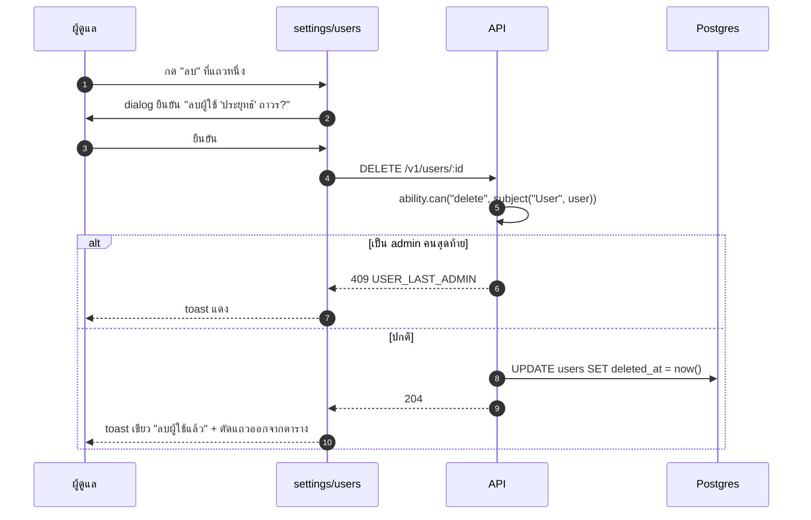

# ตั้งค่า · จัดการผู้ใช้

<Status value="implemented" />

> **หน้านี้คือ CRUD ของ `User` ที่กรองด้วย [CASL](/auth/casl) เต็มรูปแบบ — สิ่งที่ `admin` เห็นกับสิ่งที่ `manager` เห็นต้องต่างกันจากกฎเดียวกัน ไม่ใช่สอง component คนละไฟล์**

## ตำแหน่งใน route

`apps/web/src/app/[locale]/(app)/settings/users/page.tsx`

เข้าถึงได้เฉพาะผู้ใช้ที่มี `ability.can("read", "User")` แบบไม่จำกัดเฉพาะตัวเอง — สำหรับ `admin` และ `manager` ตาม[ตารางสิทธิ์](/auth/rbac-model) ส่วน `member` ที่มีแค่ `read User` (ของตัวเอง) จะไม่เห็นเมนูนี้เลย

## Layout รายการ

```text
┌────────────────────────────────────────────────────┐
│  จัดการผู้ใช้                        [+ เพิ่มผู้ใช้]  │
│  [ ค้นหาชื่อ/อีเมล...          ]  [ สถานะ ▾ ]        │
├────────────────────────────────────────────────────┤
│  ชื่อ           อีเมล              Role      สถานะ   │
│  ─────────────────────────────────────────────────  │
│  สมชาย ใจดี     somchai@ex.com    manager   ●active  │
│  วิภา รักเรียน   vipa@ex.com       member    ●active  │
│  ประยุทธ์ มั่นคง  prayut@ex.com     member    ○inactive│
│  ─────────────────────────────────────────────────  │
│  แสดง 1-20 จาก 128        [< ก่อนหน้า]  [ถัดไป >]    │
└────────────────────────────────────────────────────┘
```

## Field ในตาราง

| Column | มาจาก field | แสดงยังไง |
| --- | --- | --- |
| ชื่อ | `displayName` | คลิกเปิด drawer แก้ไข |
| อีเมล | `email` | ข้อความล้วน (ไม่คลิกได้) |
| Role | `roles[].role.name` | badge, หลาย role แสดงหลาย badge |
| สถานะ | `status` | dot indicator: เขียว = `ACTIVE`, เทา = `INACTIVE` |
| Action | — | ปุ่ม `⋮` เปิดเมนู: แก้ไข / ปิดการใช้งาน / ลบ |

::: tip ตารางต้องกรองด้วย `accessibleBy` ที่ server ไม่ใช่ซ่อนแถวที่ client
`manager` เห็นเฉพาะผู้ใช้ที่ ability อนุญาต — การกรองต้องเกิดที่ `GET /v1/users` ผ่าน `accessibleBy(ability, "read").User` (ดู [CASL § กรองข้อมูล](/auth/casl)) ไม่ใช่ดึงมาทั้งหมดแล้วซ่อนแถวด้วย JS เพราะ payload ที่ส่งมาถึง browser ก็รั่วอยู่ดี
:::

## ฟอร์มเพิ่ม/แก้ไขผู้ใช้ (drawer)

```text
┌──────────────────────────┐
│  แก้ไขผู้ใช้            ✕ │
├──────────────────────────┤
│  ชื่อที่แสดง                │
│  [ สมชาย ใจดี            ] │
│  อีเมล                     │
│  [ somchai@ex.com        ] │
│  Role                      │
│  [ manager            ▾ ] │
│  สถานะ                     │
│  ( ) Active  ( ) Inactive  │
│                            │
│  [ ยกเลิก ]   [ บันทึก ]  │
└──────────────────────────┘
```

### สัญญา

```ts
// packages/contracts/src/user.schema.ts
export const UpdateUserSchema = z.object({
  displayName: z.string().trim().min(1).max(120).optional(),
  email: z.email().max(255).optional(),
  status: z.enum(["ACTIVE", "INACTIVE"]).optional(),
  roleIds: z.array(z.uuid()).optional(),
});
export type UpdateUser = z.infer<typeof UpdateUserSchema>;
```

ฟอร์มเดียวกันนี้ใช้ทั้งตอนเพิ่มและแก้ไข field ที่แสดงต่างกันตาม ability ของผู้ใช้ที่กำลังดู ไม่ใช่ตาม role ของ user ที่กำลังถูกแก้ — `manager` เปิดฟอร์มแก้ user คนอื่นจะ **ไม่เห็น** ช่อง Role เลยเพราะ [ตารางสิทธิ์](/auth/rbac-model) ระบุว่า `manager` แก้ `roles` ไม่ได้

::: danger field ที่ผู้ใช้ปัจจุบันแก้ไม่ได้ต้องไม่ render ไม่ใช่ render แล้ว disable
`<input disabled>` ยังส่งค่าขึ้น DOM ให้เห็นได้ผ่าน dev tools และยังเป็นสัญญาณผิด ๆ ว่า "เกือบแก้ได้" ใช้ `<Can I="update" a={subject} field="roles">` ครอบ ทั้งช่อง ถ้าไม่มีสิทธิ์ก็ไม่ render field นั้นเลย — สอดคล้องกับหลักการที่ [CASL § UI gating ไม่ใช่ security](/auth/casl) วางไว้ (การซ่อน field ที่ backend ก็ปฏิเสธอยู่แล้ว เป็นแค่ UX ไม่ใช่ชั้นความปลอดภัยเพิ่ม)
:::

## Empty state และ error state

| สถานการณ์ | UI |
| --- | --- |
| ค้นหาแล้วไม่เจอ | "ไม่พบผู้ใช้ที่ตรงกับ 'xyz'" + ปุ่มล้างตัวกรอง |
| ระบบยังไม่มีผู้ใช้เลย (ทางทฤษฎี — จริง ๆ ไม่เกิดเพราะมี seed admin เสมอ) | "ยังไม่มีผู้ใช้ในระบบ" |
| โหลดพลาด | banner แดงบนตาราง + ปุ่ม "ลองใหม่" ตารางเดิมยังอยู่ (ไม่ล้างข้อมูลเก่าทิ้งจนกว่าจะโหลดสำเร็จ) |
| ลบ user ที่เป็น `admin` คนสุดท้าย | ปุ่มลบยัง render (ไม่ซ่อน เพราะ manager ไม่รู้ล่วงหน้าว่าใครเป็น admin คนสุดท้าย) แต่กดแล้วเจอ toast แดง "ต้องเหลือผู้ดูแลอย่างน้อยหนึ่งคน" (มาจาก `USER_LAST_ADMIN`) |

## Sequence การลบผู้ใช้



::: tip ลบคือ soft delete เสมอ
`DELETE /v1/users/:id` ไม่ได้ลบแถวจริงจากฐานข้อมูล ตั้ง `deletedAt` ตาม[ข้อตกลงของ schema](/architecture/data-model) — UI ไม่ต้องรู้เรื่องนี้เลย แค่ตอบสนองต่อ `204` เหมือนลบสำเร็จ
:::

## เช็กลิสต์

- [x] `GET /v1/users` กรองด้วย `accessibleBy` ที่ server ไม่ใช่ client
- [x] field ที่ผู้ใช้ปัจจุบันแก้ไม่ได้ไม่ถูก render ในฟอร์ม (เช็กด้วย `ability.can("update", target, field)` ต่อ field)
- [x] ปุ่มลบมี dialog ยืนยันเสมอ
- [x] `USER_LAST_ADMIN` แสดงเป็น toast ที่อ่านเข้าใจ ไม่ใช่ raw error code
- [ ] pagination แบบ cursor หรือ offset ให้ตรงกับที่ backend implement — ปัจจุบันมีแค่ offset (`page`/`limit`) หน้าเดียว ไม่มี infinite scroll/cursor

::: warning สถานะโค้ดปัจจุบัน
| สเปกเป้าหมาย | โค้ดวันนี้ |
| --- | --- |
| `/settings/users` route | มีจริงที่ `app/[locale]/(app)/settings/users/page.tsx` |
| `GET /v1/users` ที่กรองด้วย ability | มีจริง กรองด้วย `accessibleBy(ability, "read").User` รองรับ `search` ด้วย |
| `UpdateUserSchema` | มีครบ: `displayName`, `email`, `status`, `roleIds` (ทุก field ตรวจ field-level ability ก่อนแก้) |
| `DELETE /v1/users/:id` แบบ soft delete | มีจริง ตั้ง `deletedAt` และเช็ก `USER_LAST_ADMIN` ก่อนลบ |
| ตรวจ `USER_LAST_ADMIN` | มีจริง — บล็อกการลบ admin คนสุดท้าย |
:::
