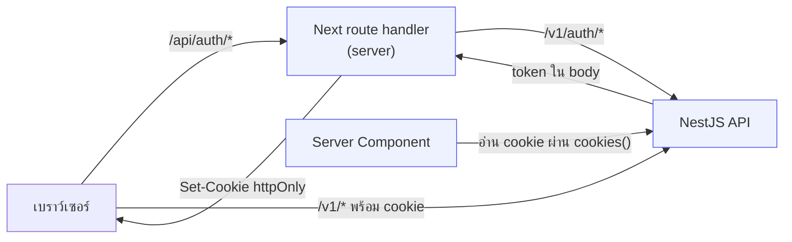
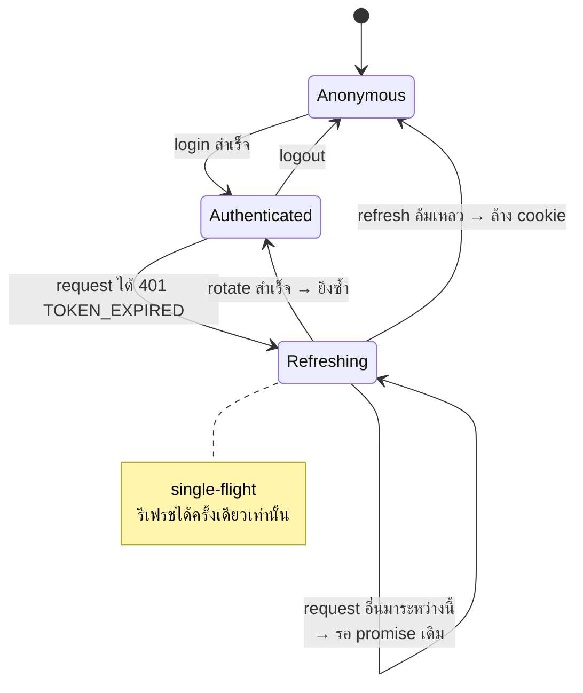

# Session ฝั่ง client

<Status value="planned" />

เบราว์เซอร์เก็บ session ยังไง ต่ออายุยังไง และป้องกัน route ยังไง

## เก็บ token ที่ไหน

| | httpOnly cookie | localStorage | ตัวแปรในหน่วยความจำ |
| --- | --- | --- | --- |
| XSS ขโมยได้ | ❌ ไม่ได้ | ✅ **ได้** | ✅ ได้ (ยากกว่า) |
| ต้องกัน CSRF | ✅ ต้อง | ❌ ไม่ต้อง | ❌ ไม่ต้อง |
| Server Component อ่านได้ | ✅ | ❌ | ❌ |
| อยู่รอดตอน refresh หน้า | ✅ | ✅ | ❌ |
| แนบให้อัตโนมัติ | ✅ | ❌ | ❌ |

**เลือก httpOnly cookie** ทั้ง access และ refresh token

เหตุผล: XSS หนึ่งครั้งบน `localStorage` = token หลุดถาวรจนหมดอายุ ส่วน CSRF มีวิธีป้องกันที่รู้กันดีและได้ผลจริง (`SameSite=Lax` + double-submit) ที่สำคัญไม่แพ้กันคือ Server Component อ่าน cookie ได้ ทำให้ prefetch ฝั่ง server ได้โดยไม่ต้องรอ JS โหลด เหตุผลเต็มอยู่ที่ [ADR-0006](/adr/0006-token-storage-httponly-cookie)

## รูปแบบโดยรวม



token ไม่เคยผ่านมือ JavaScript ในหน้าเว็บเลย — route handler รับมาแล้วแปลงเป็น cookie ทันที

## ตั้ง cookie

```ts
// apps/web/src/app/api/auth/login/route.ts
import { cookies } from "next/headers";
import { LoginSchema, AuthTokensSchema } from "@app-platform/contracts";

export async function POST(request: Request) {
  const body = LoginSchema.parse(await request.json());

  const res = await fetch(`${process.env.API_URL}/v1/auth/login`, {
    method: "POST",
    headers: { "content-type": "application/json", "x-request-id": crypto.randomUUID() },
    body: JSON.stringify(body),
  });

  if (!res.ok) {
    return Response.json(await res.json(), { status: res.status });
  }

  const tokens = AuthTokensSchema.parse(await res.json());
  const jar = await cookies();

  jar.set("access_token", tokens.accessToken, {
    httpOnly: true,
    secure: process.env.NODE_ENV === "production",
    sameSite: "lax",
    path: "/",
    maxAge: 60 * 15,
  });

  jar.set("refresh_token", tokens.refreshToken, {
    httpOnly: true,
    secure: process.env.NODE_ENV === "production",
    sameSite: "lax",
    // จำกัด path — cookie นี้ถูกส่งเฉพาะตอนขอ refresh เท่านั้น
    path: "/api/auth/refresh",
    maxAge: 60 * 60 * 24 * 7,
  });

  // ห้ามคืน token ใน body — จุดประสงค์ทั้งหมดคือไม่ให้ JS แตะ
  return Response.json({ ok: true });
}
```

::: tip `path` ของ refresh cookie แคบไว้
`path: "/api/auth/refresh"` ทำให้เบราว์เซอร์ส่ง refresh token เฉพาะตอนเรียก endpoint นั้น ทุก request อื่นไม่มีทางพามันไปด้วย ลดพื้นที่ที่มันจะรั่วลงเหลือจุดเดียว
:::

::: tip ใช้ `API_URL` ไม่ใช่ `NEXT_PUBLIC_API_URL`
route handler รันฝั่ง server จึงใช้ env ธรรมดาได้ และ **ควรใช้** เพราะมันชี้ไปที่ hostname ภายใน Docker network ซึ่งเบราว์เซอร์เข้าไม่ถึงอยู่แล้ว
:::

## กัน CSRF

`SameSite=Lax` กันการยิงข้ามเว็บได้เกือบหมด — เบราว์เซอร์จะไม่ส่ง cookie ไปพร้อม `POST` ที่มาจากโดเมนอื่น เพิ่มอีกชั้นด้วย double-submit token สำหรับ mutation ทั้งหมด

```ts
// proxy.ts — ตั้ง CSRF token ที่ JS อ่านได้ (ตั้งใจให้อ่านได้)
if (!request.cookies.get("csrf_token")) {
  response.cookies.set("csrf_token", crypto.randomUUID(), {
    httpOnly: false,     // ต้องอ่านได้ ไม่งั้นส่งกลับมาเป็น header ไม่ได้
    sameSite: "lax",
    path: "/",
  });
}
```

```ts
// route handler ของทุก mutation
const cookieToken = (await cookies()).get("csrf_token")?.value;
const headerToken = request.headers.get("x-csrf-token");
if (!cookieToken || cookieToken !== headerToken) {
  return Response.json({ code: "AUTHZ_FORBIDDEN" }, { status: 403 });
}
```

::: tip ทำไม double-submit ถึงได้ผล
เว็บของคนร้ายทำให้เบราว์เซอร์ *ส่ง* cookie ของเราไปได้ (ถ้า SameSite ยอม) แต่ **อ่าน** ค่ามันไม่ได้เพราะติด same-origin policy จึงใส่ค่าที่ถูกต้องลงใน header ไม่ได้ ค่าใน cookie กับใน header ตรงกัน = คำขอมาจากหน้าเว็บของเราจริง
:::

## Refresh อัตโนมัติ



```ts
// apps/web/src/lib/api-client.ts
let refreshPromise: Promise<boolean> | null = null;

/** ทุกคนที่เจอ 401 พร้อมกัน แชร์การ refresh ครั้งเดียว */
function refreshOnce(): Promise<boolean> {
  refreshPromise ??= fetch("/api/auth/refresh", { method: "POST" })
    .then((res) => res.ok)
    .finally(() => { refreshPromise = null; });
  return refreshPromise;
}

export async function apiFetch<T extends z.ZodTypeAny>(
  path: string,
  schema: T,
  init: RequestInit = {},
): Promise<z.infer<T>> {
  const send = () =>
    fetch(`/api/proxy${path}`, {
      ...init,
      headers: {
        "content-type": "application/json",
        "x-request-id": uuidv7(),
        ...(isMutation(init.method) ? { "x-csrf-token": readCsrfCookie() } : {}),
        ...init.headers,
      },
      credentials: "include",
    });

  let res = await send();

  if (res.status === 401) {
    const body = await res.clone().json().catch(() => null);
    // เฉพาะ EXPIRED เท่านั้นที่ควร refresh — INVALID แปลว่า session ตายแล้ว
    if (body?.code === "AUTH_TOKEN_EXPIRED" && (await refreshOnce())) {
      res = await send();
    } else {
      window.location.href = `/login?next=${encodeURIComponent(location.pathname)}`;
      throw toApiError(body, 401);
    }
  }

  const body = await res.json().catch(() => null);
  if (!res.ok) throw toApiError(body, res.status);
  return schema.parse(body);
}
```

::: danger single-flight ไม่ใช่ของแถม แต่จำเป็น
หน้า dashboard ที่มี 5 query ยิงพร้อมกัน ถ้า access token หมดอายุพอดี จะได้ `401` ห้าครั้ง แล้วยิง refresh ห้าครั้ง ตัวแรกสำเร็จและ rotate ส่วนอีกสี่ตัวส่ง token ที่ถูก rotate ไปแล้ว → [ระบบตีความว่าเป็นการใช้ซ้ำ](/auth/tokens) → **เพิกถอนทั้ง family ผู้ใช้หลุดทันที**

ถ้าไม่ทำ single-flight rotation จะทำให้ผู้ใช้หลุดทุกครั้งที่ token หมดอายุพอดีตอนโหลดหน้าที่มีหลาย query
:::

::: tip ต้องแยก `AUTH_TOKEN_EXPIRED` ออกจาก `AUTH_TOKEN_INVALID`
`EXPIRED` = refresh แล้วยิงซ้ำ · `INVALID` = ล้างทิ้งแล้วไป login ถ้ารวมกัน จะเกิดวนลูป refresh–401 ไม่รู้จบตอนที่ token เสียจริง ๆ นี่คือเหตุผลที่ [JwtAuthGuard ต้องแยก error สองแบบนี้](/auth/tokens)
:::

## ป้องกัน route

```ts
// apps/web/src/proxy.ts
import createIntlMiddleware from "next-intl/middleware";
import { routing } from "./i18n/routing";

const intl = createIntlMiddleware(routing);

const PUBLIC = ["/login", "/signup", "/forgot-password", "/reset-password", "/verify-email", "/check-email"];

export default function proxy(request: NextRequest) {
  const response = intl(request);

  // ตัด locale ออกก่อน: /th/settings → /settings
  const path = request.nextUrl.pathname.replace(/^\/(th|en)/, "") || "/";
  const hasSession = Boolean(request.cookies.get("access_token") ?? request.cookies.get("refresh_token"));

  if (!PUBLIC.some((p) => path.startsWith(p)) && !hasSession) {
    const url = request.nextUrl.clone();
    url.pathname = `/${getLocale(request)}/login`;
    url.searchParams.set("next", request.nextUrl.pathname);
    return NextResponse.redirect(url);
  }

  // ล็อกอินอยู่แล้วไม่ควรเห็นหน้า login
  if (PUBLIC.some((p) => path.startsWith(p)) && hasSession && path !== "/reset-password") {
    return NextResponse.redirect(new URL(`/${getLocale(request)}/dashboard`, request.url));
  }

  return response;
}

export const config = { matcher: ["/((?!api|_next|_vercel|.*\\..*).*)"] };
```

::: danger middleware ตรวจแค่ "มี cookie ไหม" ไม่ได้ verify
ตรวจว่ามี cookie อยู่เท่านั้น — ไม่ได้ verify ลายเซ็น (จะยิง API ทุก navigation ซึ่งช้าเกินไป) แปลว่าคนที่ยัด cookie มั่ว ๆ จะผ่าน middleware เข้าไปได้ **แล้วเจอ 401 จาก API ทันทีที่หน้านั้นดึงข้อมูล**

middleware ทำหน้าที่ UX (ไม่ให้เห็นหน้าเปล่า) ไม่ใช่ความปลอดภัย ความปลอดภัยอยู่ที่ guard ฝั่ง API เสมอ
:::

## Session ปัจจุบัน

```ts
// apps/web/src/hooks/use-session.ts
export const sessionKeys = { me: ["auth", "me"] as const };

export function useSession() {
  const { data, isPending } = useQuery({
    queryKey: sessionKeys.me,
    queryFn: () => apiFetch("/auth/me", MeResponseSchema),
    staleTime: 5 * 60_000,
    retry: false,          // 401 ไม่ควรลองซ้ำ
  });

  return {
    user: data?.user ?? null,
    ability: useMemo(() => (data ? buildAbility(data.rules) : null), [data]),
    isPending,
  };
}
```

prefetch ฝั่ง server เพื่อไม่ให้เห็นหน้าเปล่าตอนโหลดครั้งแรก

```tsx
// app/[locale]/(app)/layout.tsx — Server Component
const queryClient = new QueryClient();
await queryClient.prefetchQuery({
  queryKey: sessionKeys.me,
  queryFn: () => serverFetch("/v1/auth/me", MeResponseSchema),  // อ่าน cookie ผ่าน cookies()
});

return (
  <HydrationBoundary state={dehydrate(queryClient)}>
    <AbilityProvider>{children}</AbilityProvider>
  </HydrationBoundary>
);
```

## ออกจากระบบ

```ts
// apps/web/src/app/api/auth/logout/route.ts
export async function POST() {
  const jar = await cookies();
  const refreshToken = jar.get("refresh_token")?.value;

  // แจ้ง API ให้เพิกถอน — ถ้าลบแต่ cookie token จะยังใช้ได้อีก 7 วัน
  if (refreshToken) {
    await fetch(`${process.env.API_URL}/v1/auth/logout`, {
      method: "POST",
      headers: { cookie: `refresh_token=${refreshToken}` },
    }).catch(() => {});   // ล้าง cookie ต่อแม้ API ล่ม
  }

  jar.delete("access_token");
  jar.delete("refresh_token");
  return Response.json({ ok: true });
}
```

ฝั่ง client ต้อง `queryClient.clear()` ด้วย ไม่ใช่แค่ `invalidateQueries` — ไม่งั้นข้อมูลของคนก่อนหน้าจะค้างใน cache แล้วโผล่ให้คนถัดไปที่ล็อกอินบนเครื่องเดียวกันเห็น

::: warning สถานะโค้ดปัจจุบัน
| สเปกเป้าหมาย | โค้ดวันนี้ |
| --- | --- |
| route handler `/api/auth/*` | ไม่มีโฟลเดอร์ `app/api/` เลย |
| `api-client` + single-flight refresh | ไม่มีไฟล์ |
| ป้องกัน route ใน `proxy.ts` | มีแต่ middleware ของ next-intl |
| `useSession` + ability | ไม่มี |
| CSRF token | ไม่มี |
| `QueryClient` ตั้ง default | `providers.tsx` สร้าง `new QueryClient()` เปล่า ๆ ไม่ตั้ง `staleTime` หรือ `retry` |
| prefetch ฝั่ง server + hydrate | ไม่มี |
| API คืน token เป็น cookie | API คืน token ใน body ยังไม่มีใครแปลงเป็น cookie |
:::
