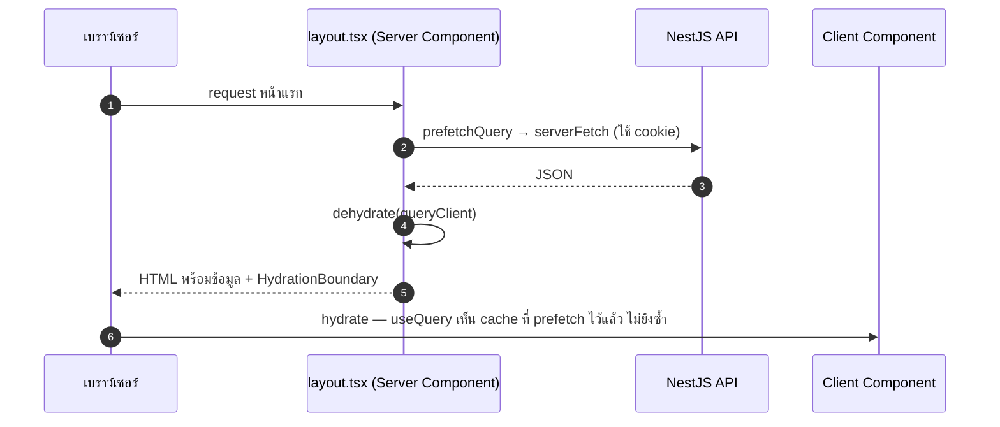

# Data fetching (TanStack Query)

<Status value="in-progress" note="hook ใช้งานจริงครบแล้ว เหลือ server prefetch/hydration" />

ทุก request ที่ต้อง cache, revalidate หรือ dedupe ผ่าน TanStack Query ทั้งหมด ไม่ใช้ `useEffect` + `fetch` ตรง ๆ ในหน้าเว็บ

## ทำไมไม่ใช้ `useEffect` + `fetch`

```tsx
// ❌ อย่าทำแบบนี้ — ไม่มี cache, ยิงซ้ำทุกครั้งที่ mount, race condition ตอน id เปลี่ยนเร็ว
useEffect(() => {
  fetch(`/api/users/${id}`).then((r) => r.json()).then(setUser);
}, [id]);
```

ปัญหาไม่ใช่แค่โค้ดยาว แต่คือพฤติกรรมที่หายไป — ไม่มี dedupe ระหว่างสอง component ที่ขอข้อมูลเดียวกันพร้อมกัน ไม่มี retry, ไม่มี stale-while-revalidate, และไม่มีกลไกยกเลิก request เก่าเมื่อ `id` เปลี่ยนก่อน response แรกจะกลับมา TanStack Query แก้ทั้งหมดนี้ด้วยแนวคิดเดียว: **query key คือ cache key**

## `QueryClientProvider` ปัจจุบัน <Status value="implemented" inline />

```tsx
// apps/web/src/app/providers.tsx
"use client";

import { useState } from "react";
import { QueryClient, QueryClientProvider } from "@tanstack/react-query";
import { ReactQueryDevtools } from "@tanstack/react-query-devtools";
import { ApiError } from "@/lib/api-client";

export function Providers({ children }: { children: React.ReactNode }) {
  const [queryClient] = useState(
    () =>
      new QueryClient({
        defaultOptions: {
          queries: {
            retry: (failureCount, error) => {
              // api-client already retries once after a token refresh —
              // an ApiError past that point means the request is genuinely bad
              if (error instanceof ApiError) return false;
              return failureCount < 2;
            },
          },
        },
      }),
  );

  return (
    <QueryClientProvider client={queryClient}>
      {children}
      <ReactQueryDevtools initialIsOpen={false} />
    </QueryClientProvider>
  );
}
```

`retry` ตั้งไว้กลางที่เดียวแล้ว: `ApiError` (แปลว่ายิงซ้ำหลัง refresh แล้วยังพัง) ไม่ retry ต่อ ส่วน error อื่น (network) retry ได้สูงสุด 2 ครั้ง — ยังไม่มี `staleTime` กลาง แต่ละ hook ตั้งเองตามความเหมาะสมของข้อมูล (ดูตัวอย่างใน [dashboard](/features/dashboard))

::: tip `retry` ต้องรู้จัก error shape ของเราเอง
retry ค่า default ของ TanStack Query (3 ครั้ง, exponential backoff) ไม่แยก `4xx` กับ `5xx` — retry `404` หรือ `422` สามรอบมีแต่ทำให้ผู้ใช้รอนานขึ้นโดยผลลัพธ์เหมือนเดิม ต้องเช็คเงื่อนไขเองเสมอ
:::

## Query key convention <Status value="implemented" inline />

```ts
// apps/web/src/hooks/query-keys.ts
export const userKeys = {
  all: ["users"] as const,
  list: (filters: { page: number; search?: string }) => [...userKeys.all, "list", filters] as const,
  detail: (id: string) => [...userKeys.all, "detail", id] as const,
};
```

โปรเจกต์จริงมี `sessionKeys`, `userKeys`, `roleKeys`, `dashboardKeys` ในไฟล์เดียวกัน ตามรูปแบบนี้

| กฎ | เหตุผล |
| --- | --- |
| key เป็น array เสมอ ไม่ใช่ string เดี่ยว | `invalidateQueries({ queryKey: userKeys.all })` ลบ list และ detail ทั้งหมดในทีเดียวจาก prefix เดียว |
| ใส่ filter/param ลงใน key | filter ต่างกัน = cache entry คนละอัน ไม่งั้นหน้าค้นหาจะเห็นผลลัพธ์ของ filter ก่อนหน้า |
| export เป็น object รวม ไม่กระจายทั่วโปรเจกต์ | หา "ใครใช้ key นี้บ้าง" ได้จากที่เดียว ตอน refactor ปลอดภัยกว่า |

## เขียน query hook <Status value="implemented" inline />

```ts
// apps/web/src/hooks/use-users.ts
import { useQuery } from "@tanstack/react-query";
import { paginatedSchema, UserSchema } from "@app-platform/contracts";
import { request } from "@/lib/api-client";
import { userKeys } from "@/hooks/query-keys";

export function useUsers(page: number, search: string) {
  return useQuery({
    queryKey: userKeys.list({ page, search: search || undefined }),
    queryFn: () =>
      request(`/v1/users?page=${page}&limit=20${search ? `&search=${encodeURIComponent(search)}` : ""}`, paginatedSchema(UserSchema)),
    placeholderData: (prev) => prev, // กันหน้ากะพริบตอนเปลี่ยนหน้า pagination
  });
}
```

`request` มาจาก `lib/api-client.ts` (ดู [Session ฝั่ง client](/frontend/auth-client#refresh-อัตโนมัติ)) — มัน parse response ผ่าน schema เดียวกับที่ API ใช้สร้าง Swagger ดังนั้น type ของ `data` ไม่มีทาง drift จากสิ่งที่ server ส่งจริง โปรเจกต์จริงมี hook แบบนี้ครบทุกทรัพยากร: `use-users.ts`, `use-roles.ts`, `use-dashboard.ts`, `use-me.ts`, `use-change-password.ts`

## Server prefetch + Hydration



```tsx
// app/[locale]/(app)/users/page.tsx — Server Component, เป้าหมาย
export default async function UsersPage() {
  const queryClient = new QueryClient();
  await queryClient.prefetchQuery({
    queryKey: userKeys.list(DEFAULT_FILTERS),
    queryFn: () => serverFetch("/v1/users", UsersListResponseSchema),
  });

  return (
    <HydrationBoundary state={dehydrate(queryClient)}>
      <UsersTable />
    </HydrationBoundary>
  );
}
```

`useUsers` ใน `<UsersTable />` (client component) ต้องใช้ **query key เดียวกันเป๊ะ** กับที่ prefetch ไว้ ไม่งั้น hydration จะไม่จับคู่กันและ query ยิงซ้ำจาก client ทันที

::: danger key ไม่ตรงกัน = prefetch เสียเปล่า
`dehydrate`/`HydrationBoundary` จับคู่ query ด้วยการเทียบ `queryKey` แบบ serialize ทั้ง object ถ้า server prefetch ด้วย `userKeys.list({ page: 1 })` แต่ client เรียก `useUsers({ page: 1, sort: undefined })` สอง key อาจไม่ตรงกันตามลำดับ property ใช้ helper function ตัวเดียวสร้าง key ทั้งสองฝั่งเสมอ อย่าประกอบ array เองซ้ำที่
:::

## Mutation + invalidate <Status value="implemented" inline />

```ts
// apps/web/src/hooks/use-users.ts
export function useUpdateUser(id: string) {
  const queryClient = useQueryClient();

  return useMutation({
    mutationFn: (dto: UpdateUser) =>
      apiFetch(`/users/${id}`, UserSchema, { method: "PATCH", body: JSON.stringify(dto) }),
    onSuccess: (updated) => {
      queryClient.setQueryData(userKeys.detail(id), updated);          // อัปเดตทันทีแบบไม่ต้อง refetch
      queryClient.invalidateQueries({ queryKey: userKeys.all });        // แต่ list ต้อง refetch เพราะ filter/sort อาจเปลี่ยนตำแหน่งแถวนี้
    },
  });
}
```

::: tip `setQueryData` กับ `invalidateQueries` ทำคนละหน้าที่
`setQueryData` แก้ cache ทันทีโดยไม่ยิง network — ใช้กับ query ที่รู้ผลลัพธ์แน่ชัดแล้ว (เช่น detail ของ record ที่เพิ่ง update) `invalidateQueries` แค่ทำเครื่องหมายว่า stale แล้วรอ refetch รอบถัดไป — ใช้กับ query ที่ผลลัพธ์ไม่แน่นอน (list ที่มี filter/sort/pagination)
:::

## จัดการ error

`apiFetch` โยน error object เดียวกับที่ [error envelope](/conventions/errors) นิยามไว้เสมอ ดังนั้น component เขียน handler ได้ครั้งเดียว

```tsx
const { data, error, isPending } = useUsers(filters);

if (error) {
  return <ErrorBanner code={error.code} message={t(`errors.${error.code}`)} />;
}
```

ผูก `error.code` กับข้อความแปลในไฟล์ locale แทนการโชว์ `error.message` ดิบ — `message` ของ error envelope เป็นภาษาอังกฤษไว้ debug เท่านั้น ดู [catalog รหัส error ทั้งหมด](/reference/error-codes)

::: warning สถานะโค้ดปัจจุบัน
| สเปกเป้าหมาย | โค้ดวันนี้ |
| --- | --- |
| `QueryClient` ตั้ง `staleTime`/`retry` กลาง | `retry` ตั้งกลางแล้ว (ข้าม `ApiError` หลัง refresh) — ยังไม่มี `staleTime` กลาง แต่ละ hook ตั้งเอง |
| query/mutation hook ในโฟลเดอร์ `hooks/` | มีครบทุกทรัพยากร: users, roles, dashboard, audit log, me, change-password |
| `request` client พร้อม single-flight refresh | มีจริงที่ `lib/api-client.ts` — ดู [Session ฝั่ง client](/frontend/auth-client) |
| Server prefetch + `HydrationBoundary` | ยังไม่มี — ทุก route ยังดึงข้อมูลจาก client หลัง mount |
| query key convention (`query-keys.ts`) | มีจริง — `sessionKeys`, `userKeys`, `roleKeys`, `dashboardKeys` |
:::
