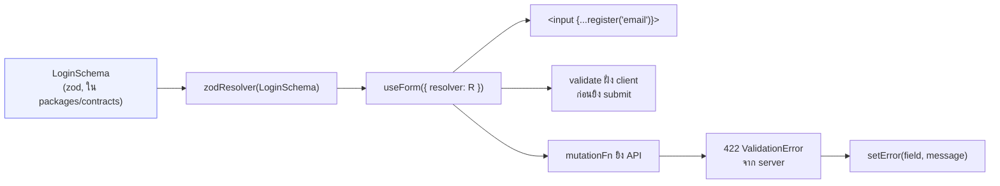

# ฟอร์ม (react-hook-form + zod)

<Status value="planned" />

ทุกฟอร์มใช้ schema เดียวกับที่ API ใช้ validate — ไม่มีการเขียนกฎ validate ซ้ำสองที่ระหว่าง client กับ server

## รูปแบบมาตรฐาน



schema ตัวเดียวทำสามอย่าง: กำหนด type ของ form values, สร้างกฎ validate ฝั่ง client ผ่าน `zodResolver`, และเป็นสิ่งเดียวกับที่ API validate ฝั่ง server ดังนั้นข้อความ error จาก 422 จับคู่กับชื่อ field ในฟอร์มได้ตรงเป๊ะ ดู [Contract-first workflow](/conventions/contract-first)

## ตัวอย่างฟอร์มเต็ม

```tsx
// apps/web/src/components/forms/login-form.tsx — เป้าหมาย
"use client";

import { useForm } from "react-hook-form";
import { zodResolver } from "@hookform/resolvers/zod";
import { LoginSchema, type Login } from "@app-platform/contracts";
import { useLogin } from "@/hooks/use-login";
import { Button } from "@/components/ui/button";
import { Input } from "@/components/ui/input";
import { Field, FieldError } from "@/components/ui/field";

export function LoginForm() {
  const form = useForm<Login>({
    resolver: zodResolver(LoginSchema),
    defaultValues: { email: "", password: "" },
  });
  const login = useLogin();

  const onSubmit = form.handleSubmit(async (values) => {
    try {
      await login.mutateAsync(values);
    } catch (err) {
      applyServerErrors(form, err); // ดูหัวข้อ "map error จาก server" ด้านล่าง
    }
  });

  return (
    <form onSubmit={onSubmit} noValidate>
      <Field label="อีเมล" error={form.formState.errors.email?.message}>
        <Input type="email" {...form.register("email")} />
      </Field>
      <Field label="รหัสผ่าน" error={form.formState.errors.password?.message}>
        <Input type="password" {...form.register("password")} />
      </Field>
      <Button type="submit" disabled={form.formState.isSubmitting}>
        เข้าสู่ระบบ
      </Button>
    </form>
  );
}
```

::: tip `noValidate` เสมอ
ปิด validate ของเบราว์เซอร์เอง (`required`, `type="email"` popup) เพราะข้อความมันแปลไม่ได้และหน้าตาไม่ตรงกับ design system — ให้ `zodResolver` เป็นคนตัดสินอย่างเดียว
:::

## เชื่อมกับ component ของ [ระบบ UI](/frontend/ui-system)

`Field` เป็น wrapper บาง ๆ ที่จัดวาง label + input + ข้อความ error ให้ตรงกับ design token — ไม่ใช่ของ react-hook-form เอง เขียนแยกไว้ในระบบ UI เพื่อให้ทุกฟอร์มหน้าตาเหมือนกัน

```tsx
// apps/web/src/components/ui/field.tsx — เป้าหมาย
export function Field({ label, error, children }: FieldProps) {
  return (
    <div className="space-y-1.5">
      <label className="text-sm font-medium">{label}</label>
      {children}
      {error && <FieldError>{error}</FieldError>}
    </div>
  );
}
```

## Map error จาก server กลับเข้าฟอร์ม

server อาจปฏิเสธด้วยเหตุผลที่ zod ฝั่ง client ตรวจไม่ได้ล่วงหน้า (เช่น "อีเมลนี้มีคนใช้แล้ว") — error พวกนี้มาเป็น [error envelope](/conventions/errors) แล้วต้องแปลงกลับเป็น field error ของ react-hook-form

```ts
// apps/web/src/lib/apply-server-errors.ts — เป้าหมาย
import type { UseFormReturn, FieldValues } from "react-hook-form";
import type { ApiError } from "@/lib/api-client";

export function applyServerErrors<T extends FieldValues>(form: UseFormReturn<T>, err: unknown) {
  if (!isApiError(err) || err.status !== 422) throw err; // ไม่ใช่ validation error ให้ throw ต่อให้ error boundary จับ

  for (const detail of err.details ?? []) {
    if (detail.field) {
      form.setError(detail.field as never, { message: detail.code, type: "server" });
    } else {
      form.setError("root", { message: detail.code, type: "server" });
    }
  }
}
```

::: warning ต้องใช้ `detail.code` ไม่ใช่ `detail.message` เป็น translation key
`message` ใน error envelope เป็นภาษาอังกฤษไว้ debug เท่านั้น ตาม[สัญญาของ error envelope](/conventions/errors) `code` ต่างหากที่เป็น key คงที่สำหรับ i18n — ผูก `code` เข้ากับไฟล์ข้อความของ next-intl ไม่ใช่โชว์ `message` ตรง ๆ ให้ผู้ใช้เห็น
:::

## Submit แบบ mutation

`onSubmit` ไม่เรียก `fetch` เอง แต่เรียก mutation hook จาก [Data fetching](/frontend/data-fetching#mutation-invalidate) เสมอ — เหตุผลคือ `isSubmitting` ต้องผูกกับสถานะ network จริง (`isPending` ของ mutation) ไม่ใช่ flag ที่เขียนเอง และผลสำเร็จต้อง invalidate query ที่เกี่ยวข้องทันที

```ts
// apps/web/src/hooks/use-login.ts — เป้าหมาย
export function useLogin() {
  const queryClient = useQueryClient();
  return useMutation({
    mutationFn: (values: Login) =>
      apiFetch("/api/auth/login", AuthOkResponseSchema, {
        method: "POST",
        body: JSON.stringify(values),
      }),
    onSuccess: () => {
      queryClient.invalidateQueries({ queryKey: sessionKeys.me });
    },
  });
}
```

## เทสฟอร์ม

ฟอร์มเทสง่ายที่สุดเมื่อแยก validate logic (ใน schema) ออกจาก interaction logic (ใน component) — เทส schema ตรง ๆ ด้วย unit test ธรรมดา แล้วเทส component แค่ flow หลัก (กรอกครบ → submit → เห็นผล, กรอกผิด → เห็น error)

```ts
describe("LoginSchema", () => {
  it("ปฏิเสธ password สั้นกว่า 8 ตัว", () => {
    expect(LoginSchema.safeParse({ email: "a@b.com", password: "short" }).success).toBe(false);
  });
});
```

::: warning สถานะโค้ดปัจจุบัน
| สเปกเป้าหมาย | โค้ดวันนี้ |
| --- | --- |
| `LoginForm` ผ่าน `zodResolver` | ไม่มี form component ใด ๆ ในโปรเจกต์ |
| `Field` / `FieldError` ใน UI system | `components/ui/` มีแค่ `button.tsx` |
| `applyServerErrors` map 422 กลับเข้าฟอร์ม | ไม่มีไฟล์ |
| `useLogin` และ mutation hook อื่น ๆ | ไม่มี hook ใด ๆ เกี่ยวกับ auth หรือ mutation |
| dependency `react-hook-form` + `@hookform/resolvers` | **ติดตั้งแล้ว** ใน `apps/web/package.json` แต่ยังไม่มีจุดไหน import ใช้ |
:::
