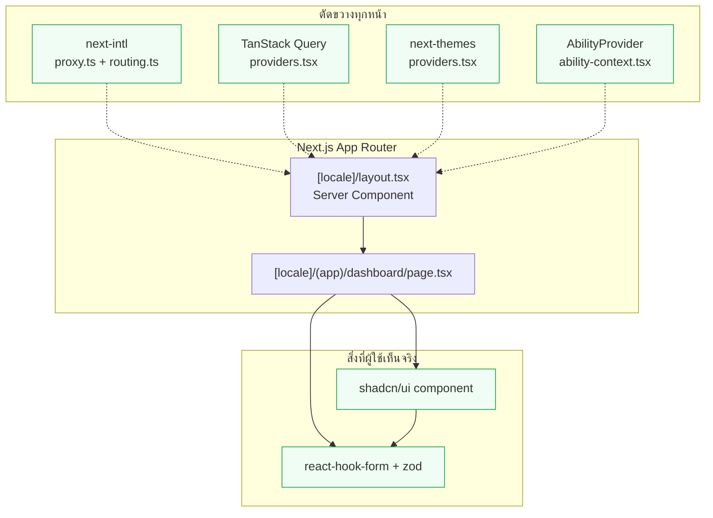

# ภาพรวมฟรอนต์เอนด์

<Status value="implemented" note="ทุกเสาหลักมีโค้ดจริงรันอยู่ — เหลือ server prefetch/hydration เป็นช่องว่างหลัก" />

หมวดนี้อธิบายว่า `apps/web` ประกอบกันยังไง — ตั้งแต่ดึงข้อมูล ไปจนถึงฟอร์ม ระบบ UI ภาษา และธีม หน้านี้คือแผนที่ ส่วนรายละเอียดแต่ละเรื่องอยู่ในหน้าย่อย

## สแต็กที่เลือกใช้

| งาน | เครื่องมือ | สถานะ |
| --- | --- | --- |
| Routing & rendering | Next.js 16 App Router | <Status value="implemented" inline /> |
| Data fetching / cache | TanStack Query | <Status value="in-progress" inline note="มี hook ครบทุกทรัพยากรแล้ว เหลือ server prefetch" /> |
| ฟอร์ม + validate | react-hook-form + `zodResolver` | <Status value="implemented" inline /> |
| ระบบ component | shadcn/ui (บน Radix + Tailwind) | <Status value="implemented" inline /> |
| ภาษา | next-intl | <Status value="implemented" inline /> |
| ธีม / dark mode | next-themes | <Status value="implemented" inline /> |
| สัญญาข้อมูล | zod schema จาก `packages/contracts` | <Status value="implemented" inline note="hook ทุกตัวใน web import จาก contracts" /> |

ทุกแถวเลือกเพราะเหตุผลเดียวกัน: ให้ TypeScript จับความผิดพลาดตอน build แทนที่จะไปพังตอน runtime ในมือผู้ใช้

## โครงสร้างระดับสูง

เส้นประ = provider ที่ห่อทั้งต้นไม้จาก layout เส้นทึบ = การ render ปกติ ทุก node สีเขียวมีโค้ดจริงรันอยู่แล้ว

## แผนที่หน้าเอกสาร

| หน้า | เรื่อง | สถานะ |
| --- | --- | --- |
| [Data fetching](/frontend/data-fetching) | TanStack Query, query key, prefetch/hydrate | <Status value="in-progress" inline /> |
| [ฟอร์ม](/frontend/forms) | react-hook-form + `zodResolver` บน schema เดียวกับ API | <Status value="implemented" inline /> |
| [ระบบ UI](/frontend/ui-system) | shadcn/ui, `components.json`, การตั้ง token | <Status value="implemented" inline /> |
| [i18n](/frontend/i18n) | next-intl, routing, ไฟล์ข้อความ | <Status value="implemented" inline /> |
| [ธีม & dark mode](/frontend/theming) | next-themes, CSS variable, toggle | <Status value="implemented" inline /> |
| [Session ฝั่ง client](/frontend/auth-client) | เก็บ token, refresh อัตโนมัติ, ป้องกัน route | <Status value="in-progress" inline /> |
| [สิทธิ์บน UI](/frontend/permissions-client) | `<Can>`, `AbilityProvider` | <Status value="implemented" inline /> |

หน้าผลิตภัณฑ์จริง (ที่ประกอบทุกอย่างข้างบนเข้าด้วยกัน) อยู่ในหมวด [หน้าผลิตภัณฑ์](/features/dashboard) — เช่น [แดชบอร์ด](/features/dashboard), [ตั้งค่า · จัดการผู้ใช้](/features/settings-users) และ [ตั้งค่า · ธีม](/features/settings-theme)

## หลักการออกแบบร่วม

สามข้อนี้ซ้ำอยู่ในแทบทุกหน้าย่อย เพราะเป็นแกนของทั้งฝั่ง frontend

1. **Server Component ก่อนเสมอ** — ดึงข้อมูลที่ต้องล็อกอินให้ prefetch จาก server แล้วส่งต่อผ่าน `HydrationBoundary` ไม่ใช่ยิงใหม่จาก client หลัง mount ดูตัวอย่างเต็มใน [Data fetching](/frontend/data-fetching#server-prefetch-hydration)
2. **สัญญาเดียว ใช้ซ้ำทุกที่** — schema ใน `packages/contracts` เป็นทั้ง type, `zodResolver` และตัวตรวจ response จริง ไม่มี type ที่พิมพ์ซ้ำมือ ดู [Contract-first workflow](/conventions/contract-first)
3. **UI ซ่อนปุ่ม ไม่ได้ป้องกัน** — `<Can>` และการเช็คสิทธิ์บนหน้าเว็บทำเพื่อ UX เท่านั้น server ต้องปฏิเสธเองเสมอ ดู [CASL authorization](/auth/casl)

::: tip อ่านหน้าไหนก่อน
ถ้าจะ implement หน้าใหม่สักหน้า ลำดับที่สมเหตุสมผลคือ i18n (มีอยู่แล้ว) → data fetching → UI system → forms → theming ทำตามลำดับนี้แล้ว dependency จะไม่ย้อนกลับมากัดกัน
:::

## สิ่งที่ยังไม่มี

- ยังไม่มี server prefetch + `HydrationBoundary` — ทุก query ยังยิงจาก client หลัง mount ทั้งหมด
- token ฝั่ง client ยังเก็บใน `sessionStorage` ไม่ใช่ httpOnly cookie ตาม ADR-0006 (ดู [Session ฝั่ง client](/frontend/auth-client))
- หน้าโปรไฟล์ยังไม่มี avatar upload และ Google account linking (ต้องมี object storage/Google credentials)

::: warning สถานะโค้ดปัจจุบัน
| สเปกเป้าหมาย | โค้ดวันนี้ |
| --- | --- |
| หน้า dashboard / settings / profile | มีครบแล้ว — `dashboard`, `settings/users`, `settings/roles`, `settings/theme`, `profile` |
| query/mutation hook ในทุกหน้า | มี hook ต่อทรัพยากรครบ (`use-users`, `use-roles`, `use-dashboard`, `use-me`, ฯลฯ) แต่ยังไม่มี server prefetch |
| ฟอร์มผ่าน react-hook-form + zod | `Field`/`FieldError`/`applyServerErrors` ใช้งานจริงในทุกฟอร์ม |
| shadcn/ui เต็มระบบ | `components.json` + component จาก Radix ครบ (`Button`, `Dialog`, `Select`, `Checkbox`, `Table`, ฯลฯ) |
| `apps/web` ใช้ schema จาก `packages/contracts` | hook ทุกตัวใน `entities/*` และ `features/*` import schema จาก contracts จริง |
| dark mode | `next-themes` + CSS variable ต่อโหมด + `ThemeToggle` ทำงานจริง |
:::
