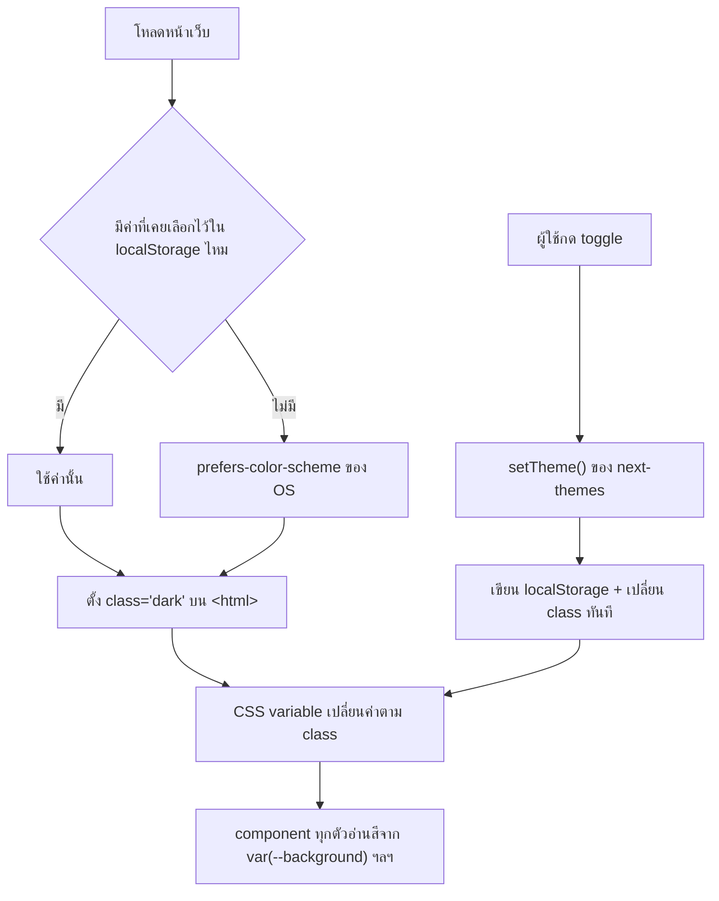

# ธีม & dark mode

<Status value="implemented" />

สลับ light/dark ด้วย class บน `<html>` + CSS variable ไม่ใช่ prop ที่ส่งผ่าน component tree — วิธีนี้ทำให้ทุก component (รวมถึงของ shadcn/ui) รับสีที่ถูกต้องโดยไม่ต้อง re-render ทั้งต้นไม้ตอนสลับธีม

## แนวทาง



ไม่มี state ของธีมอยู่ใน React context ที่ component ต้อง subscribe — `next-themes` จัดการผ่าน DOM class ล้วน ๆ ทำให้สลับธีมไม่ trigger re-render ของ component ที่ไม่เกี่ยวข้อง

## ตั้งค่า `ThemeProvider`

```bash
pnpm --filter @app-platform/web add next-themes
```

```tsx
// apps/web/src/app/providers.tsx — เป้าหมาย
"use client";

import { useState } from "react";
import { ThemeProvider } from "next-themes";
import { QueryClient, QueryClientProvider } from "@tanstack/react-query";
import { ReactQueryDevtools } from "@tanstack/react-query-devtools";

export function Providers({ children }: { children: React.ReactNode }) {
  const [queryClient] = useState(() => new QueryClient());

  return (
    <ThemeProvider attribute="class" defaultTheme="system" enableSystem disableTransitionOnChange>
      <QueryClientProvider client={queryClient}>
        {children}
        <ReactQueryDevtools initialIsOpen={false} />
      </QueryClientProvider>
    </ThemeProvider>
  );
}
```

`attribute="class"` คือสิ่งที่ผูก `next-themes` เข้ากับ Tailwind — Tailwind อ่าน dark mode จาก class `dark` บน ancestor โดย default `disableTransitionOnChange` กัน transition CSS เล่นแปลก ๆ ตอนสลับธีม (สีวิ่งไล่กันทั้งหน้าแบบไม่ตั้งใจ)

::: tip `attribute="class"` ต้องตรงกับ `darkMode` ใน Tailwind config
Tailwind v4 ใช้ `@custom-variant dark (&:where(.dark, .dark *))` (หรือ `darkMode: "class"` ใน v3) — ถ้า `next-themes` ตั้ง attribute เป็นอย่างอื่น (เช่น `data-theme`) แต่ Tailwind ยังรอ class `.dark` อยู่ dark mode จะไม่ทำงานเลยแบบเงียบ ๆ ไม่มี error ให้เห็น
:::

## CSS variable ต่อโหมด

```css
/* apps/web/src/app/globals.css — เป้าหมาย */
:root {
  --background: 0 0% 100%;
  --foreground: 222 47% 11%;
  --primary: 221 83% 53%;
  --primary-foreground: 0 0% 100%;
  --border: 220 13% 91%;
}

.dark {
  --background: 222 47% 11%;
  --foreground: 210 40% 98%;
  --primary: 217 91% 60%;
  --primary-foreground: 222 47% 11%;
  --border: 217 33% 24%;
}
```

```css
@theme inline {
  --color-background: hsl(var(--background));
  --color-foreground: hsl(var(--foreground));
  --color-primary: hsl(var(--primary));
  --color-border: hsl(var(--border));
}
```

component ทุกตัวใช้ `bg-background`, `text-foreground`, `bg-primary` — ไม่มีที่ไหนเขียน `dark:bg-slate-900` ตรง ๆ ในไฟล์ component เพราะความต่างระหว่างโหมดอยู่ในนิยาม CSS variable ชั้นเดียวเท่านั้น `components/ui/button.tsx` ก็ย้ายมาใช้ `bg-primary` แล้ว จึงสลับ dark mode ได้เองโดยไม่ต้องแก้ component

## Toggle component

```tsx
// apps/web/src/components/theme-toggle.tsx
"use client";

import { useTheme } from "next-themes";
import { Sun, Moon } from "lucide-react";
import { Button } from "@/components/ui/button";

export function ThemeToggle() {
  const { resolvedTheme, setTheme } = useTheme();

  return (
    <Button
      variant="ghost"
      size="sm"
      aria-label="สลับธีม"
      onClick={() => setTheme(resolvedTheme === "dark" ? "light" : "dark")}
    >
      {resolvedTheme === "dark" ? <Sun className="size-4" /> : <Moon className="size-4" />}
    </Button>
  );
}
```

ใช้ `resolvedTheme` ไม่ใช่ `theme` — `theme` อาจเป็น `"system"` ซึ่งไม่บอกว่าไอคอนควรเป็นอะไร `resolvedTheme` คือค่าจริงหลัง resolve ค่า `"system"` แล้วเสมอ

## บันทึกค่าที่ผู้ใช้เลือกไว้

`next-themes` เก็บค่าลง `localStorage` ให้อัตโนมัติ ซึ่งพอสำหรับ MVP แต่ไม่ sync ข้ามอุปกรณ์ — หน้า [ตั้งค่า · ธีม](/features/settings-theme) sync ค่าเข้า `User.theme` ผ่าน API ด้วยแล้ว เพื่อให้ผู้ใช้เห็นธีมเดิมตอนล็อกอินจากเครื่องอื่น

```ts
// apps/web/src/hooks/use-me.ts — ใช้จริงจากหน้าตั้งค่าธีม
export function useUpdateMe() {
  const queryClient = useQueryClient();
  return useMutation({
    mutationFn: (input: UpdateMe) => request("/v1/auth/me", UserSchema, { method: "PATCH", body: input }),
    onSuccess: () => queryClient.invalidateQueries({ queryKey: sessionKeys.me }),
  });
}
```

::: tip ยังไม่ได้ sync ผ่าน cookie ตอน login
ตัวกลไก dark mode (`next-themes` + `localStorage`) implement ครบแล้ว และค่าที่เลือกก็ถูกบันทึกลง `User.theme` จริง แต่ flow "sync `User.theme` → cookie ทันทีตอน login สำเร็จ" ตามที่ [ตั้งค่า · ธีม](/features/settings-theme#ทำไมต้องมีทั้ง-cookie-และ-db) อธิบายไว้ยังไม่ implement เพราะ session ฝั่ง client ยังไม่ได้ย้ายไป httpOnly cookie (ดู [Session ฝั่ง client](/frontend/auth-client)) — วันนี้ค่าตั้งต้นของธีมยังมาจาก `localStorage`/`prefers-color-scheme` เท่านั้น
:::

## หลีกเลี่ยง flash of wrong theme

`next-themes` ฉีด inline script เข้า `<head>` เพื่ออ่าน `localStorage` และตั้ง class **ก่อน** React hydrate — แต่ `<html>` ต้องมี `suppressHydrationWarning` ไม่งั้น React จะ warn ว่า attribute ไม่ตรงกันระหว่าง server กับ client render แรก

```tsx
// apps/web/src/app/[locale]/layout.tsx
<html lang={locale} suppressHydrationWarning>
```

::: danger ห้ามอ่าน `theme` ใน Server Component
`useTheme()` ทำงานเฉพาะ client เท่านั้น เพราะค่าจริงมาจาก `localStorage` ที่ server ไม่รู้จัก การพยายามอ่านธีมใน Server Component เพื่อ render สีให้ตรงตั้งแต่ HTML แรกจะทำให้ hydration mismatch เสมอ — ปล่อยให้ HTML แรกเป็นสี default แล้วให้ script ของ `next-themes` แก้ class ก่อน paint แทน ผู้ใช้จะไม่เห็น flash เพราะ script รันก่อน browser paint จริง ๆ
:::

::: warning สถานะโค้ดปัจจุบัน
| สเปกเป้าหมาย | โค้ดวันนี้ |
| --- | --- |
| dependency `next-themes` | ติดตั้งและใช้งานจริง |
| `ThemeProvider` ใน `providers.tsx` | มีจริง ห่อ `QueryClientProvider` |
| CSS variable ต่อโหมด (`:root` / `.dark`) ใน `globals.css` | มีครบ: `background`, `foreground`, `card`, `primary`, `secondary`, `muted`, `accent`, `destructive`, `success`, `border`, `input`, `ring` |
| `ThemeToggle` component | มีจริงที่ `components/theme-toggle.tsx` ใช้ในทุกหน้าผ่าน `(app)/layout.tsx` |
| `suppressHydrationWarning` บน `<html>` | มีจริง |
| sync ธีมเข้า profile ผ่าน API | มีจริงผ่าน `PATCH /v1/auth/me` — sync กลับเป็น cookie ตอน login ยังไม่ implement |
:::
