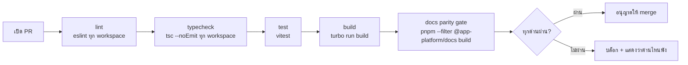

# CI/CD

<Status value="planned" />

::: warning ไม่มี CI ตอนนี้
`.github/workflows/` ไม่มีอยู่จริงในโค้ด — ไม่มีอะไรกันการ merge โค้ดที่ build พัง, lint ไม่ผ่าน หรือ type error ดู [Roadmap ข้อ 9](/start/roadmap) ทุกอย่างในหน้านี้คือสเปกเป้าหมาย
:::

## ทำไมต้องมี

repo นี้เป็น pnpm workspace ที่ `apps/web`, `apps/api`, `apps/docs` แชร์ `packages/contracts` กันอยู่ การแก้ schema ใน contracts อาจพังทั้ง web และ api พร้อมกันโดยไม่มีใครรู้จนกว่าจะ deploy — CI คือด่านเดียวที่จับได้ก่อน merge

นอกจากนี้เอกสารชุดนี้เป็น bilingual SSOT ตาม [ADR-0015](/adr/0015-docs-as-bilingual-ssot) — กติกาที่ว่า "ทุกหน้าไทยต้องมี `/en/` มิเรอร์" ไม่มีทางบังคับได้ถ้าไม่มี pipeline ที่รัน `pnpm --filter @app-platform/docs build` แล้วเช็ก dead link จริง ๆ

## Pipeline เป้าหมาย



แต่ละ stage รันผ่าน `turbo` เพื่อใช้ cache ข้าม job และข้าม workspace ที่ไม่ถูกแตะ

| Stage | คำสั่ง | บล็อกอะไร |
| --- | --- | --- |
| lint | `pnpm lint` | code style, unused import, กฎของ eslint |
| typecheck | `pnpm turbo run typecheck` | type error ข้าม workspace (contracts → web/api) |
| test | `pnpm test` | ตอนนี้ยังไม่มีไฟล์เทสเลย — ดู [Roadmap ข้อ 8](/start/roadmap), stage นี้ผ่านอัตโนมัติจนกว่าจะมี |
| build | `pnpm build` | ทุกแอป build ผ่านจริง ไม่ใช่แค่ dev server รันได้ |
| docs parity gate | `pnpm --filter @app-platform/docs build` | หน้าไทยที่ไม่มีมิเรอร์ `/en/`, dead link, mermaid/Vue compile error |

::: tip docs parity gate ไม่ใช่แค่ "build เอกสารผ่าน"
VitePress ตั้ง `ignoreDeadLinks` แบบจำกัด (ยกเว้นแค่ `http(s)://localhost`) และ `.vitepress/structure.ts` ลงทะเบียนทุกหน้าไว้ล่วงหน้า ทำให้หน้าที่มีแค่ไทยแต่ไม่มีอังกฤษ (หรือกลับกัน) ทำให้ build ทั้ง repo แดง นี่คือกลไกเดียวที่บังคับ ADR-0015 แบบอัตโนมัติ ไม่ใช่แค่ convention ที่หวังว่าคนจะทำตาม
:::

## ตัวอย่าง workflow (เป้าหมาย)

```yaml
# .github/workflows/ci.yml — ยังไม่มีไฟล์นี้ในโค้ด
name: ci

on:
  pull_request:
  push:
    branches: [main]

jobs:
  ci:
    runs-on: ubuntu-latest
    steps:
      - uses: actions/checkout@v4

      - uses: pnpm/action-setup@v4
        with:
          version: 11.18.0

      - uses: actions/setup-node@v4
        with:
          node-version: 22
          cache: pnpm

      - run: pnpm install --frozen-lockfile

      - run: pnpm lint
      - run: pnpm turbo run typecheck
      - run: pnpm test
      - run: pnpm build
      - run: pnpm --filter @app-platform/docs build
```

`--frozen-lockfile` กัน CI แก้ `pnpm-lock.yaml` เงียบ ๆ — ถ้า lockfile ไม่ตรงกับ `package.json` ต้อง fail ไม่ใช่ auto-update

## Required checks และ branch protection

เป้าหมาย: ตั้ง `main` ให้บังคับ

| กติกา | เหตุผล |
| --- | --- |
| ห้าม push ตรงเข้า `main` | ทุกอย่างผ่าน PR |
| ต้องผ่าน job `ci` ก่อน merge ได้ | บล็อกโค้ดที่ build ไม่ผ่านไม่ให้เข้า `main` |
| ต้องมี branch เป็นปัจจุบันก่อน merge (up to date) | กัน "ผ่านตอนเปิด PR แต่พังหลังคนอื่น merge ก่อน" |

## จะไปถึง production pipeline ยังไง

Stage ข้างบนคือ **CI** (ตรวจก่อน merge) เท่านั้น ส่วน **CD** (build image → push → deploy) เป็นอีกชั้นที่ต้องรอการตัดสินใจเรื่อง target platform ก่อน — ดู [Deployment](/ops/deployment) และ [Docker & Traefik § เป้าหมายสำหรับ production](/ops/docker-traefik)

::: warning สถานะโค้ดปัจจุบัน
| สเปกเป้าหมาย | โค้ดวันนี้ |
| --- | --- |
| `.github/workflows/ci.yml` รัน lint/typecheck/test/build/docs | ไม่มี `.github/` เลย |
| branch protection บน `main` | ไม่มี — ยังไม่มี remote repo ที่ตั้งค่านี้ได้ |
| docs parity gate บังคับอัตโนมัติ | มีแค่ script `pnpm --filter @app-platform/docs build` ที่ต้องรันเอง |
| CD (build → push → deploy) | ไม่มี — ไม่มี target platform ให้ deploy ไปหา |
:::
