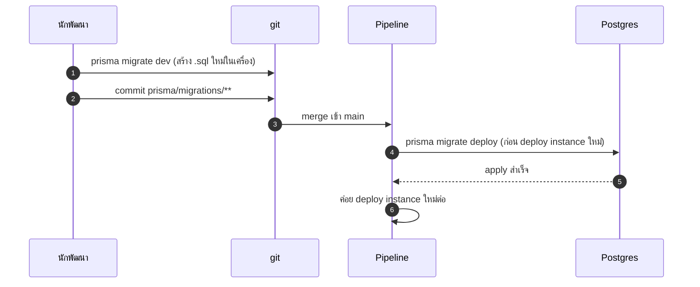
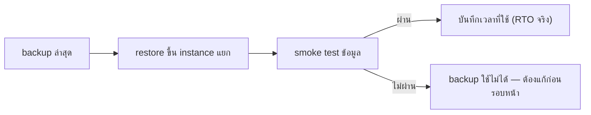

# งานปฏิบัติการฐานข้อมูล

<Status value="planned" />

หน้านี้ว่าด้วยการดูแล Postgres หลังพ้นขั้นตอนพัฒนาบนเครื่อง — migration ตอน deploy, backup, และการซ้อม restore งาน `prisma migrate dev` และ `prisma:seed` แบบวันต่อวันอยู่ที่ [Local development § ฐานข้อมูล](/ops/local-development) แล้ว ไม่ทวนซ้ำที่นี่

## Migration ตอน deploy

โค้ดวันนี้มีแค่ `prisma migrate dev` ซึ่ง**ไม่ใช่**คำสั่งที่ใช้ตอน deploy — มันจะถามคำถามแบบ interactive และแก้ schema แบบ dev-only (`shadow database` ฯลฯ) เป้าหมายคือแยกให้ชัด

| คำสั่ง | ใช้ที่ไหน | ทำอะไร |
| --- | --- | --- |
| `prisma migrate dev` | เครื่อง dev เท่านั้น | สร้าง migration ใหม่จาก diff ของ `schema.prisma`, apply ทันที, ถามชื่อ migration |
| `prisma migrate deploy` | CI/CD, ก่อน traffic เปลี่ยนมาที่ instance ใหม่ | apply migration ที่มีอยู่แล้วเท่านั้น ไม่ถามอะไร ไม่สร้างของใหม่ |



::: danger `migrate deploy` ต้องรันก่อน traffic เปลี่ยน ไม่ใช่หลัง
ถ้า instance ใหม่ (โค้ดใหม่) เริ่มรับ traffic ก่อน migration apply แล้วโค้ดนั้น query column ที่ยังไม่มี จะพังทันที ลำดับต้องเป็น migrate ก่อนเสมอ — ดู [Deployment § Migration ตอน deploy](/ops/deployment)
:::

seed ก็มีปัญหาเดียวกันในอีกมุม — ดู [Roadmap ข้อ 4](/start/roadmap) ที่ `prisma db seed` ใช้ไม่ได้เพราะ `tsx` ไม่อยู่ใน dependency ต้องแก้ก่อนที่จะเอา seed เข้า pipeline อัตโนมัติได้

## Backup

ยังไม่มี backup script หรือ cron ใด ๆ ในโค้ด เป้าหมาย

| อย่าง | เป้าหมาย |
| --- | --- |
| ความถี่ | อย่างน้อยวันละครั้ง (full `pg_dump`) + WAL archiving ต่อเนื่องถ้าต้องการ PITR |
| ที่เก็บ | object storage แยก region จาก DB หลัก |
| retention | อย่างน้อย 30 วันย้อนหลัง หมุนแบบ grandfather-father-son ถ้าต้องเก็บนาน |
| การเข้ารหัส | backup ที่เก็บนอกเครื่องต้อง encrypt at rest |
| ทดสอบ | backup ที่ไม่เคยถูก restore ทดสอบ ถือว่าใช้ไม่ได้จนกว่าจะพิสูจน์ |

```bash
# ตัวอย่างคำสั่ง (เป้าหมาย ไม่ใช่ script ที่มีอยู่จริง)
pg_dump --format=custom \
  --dbname="$DATABASE_URL" \
  --file="backup-$(date +%Y%m%d-%H%M%S).dump"
```

## Restore drill

backup ที่ไม่เคยลองกู้คืนคือ backup ที่ยังพิสูจน์ไม่ได้ว่าใช้งานได้ เป้าหมาย

1. ตั้งตารางซ้อม restore เป็นระยะ (เช่น รายไตรมาส) ไม่ใช่แค่ตอนเกิดเหตุจริง
2. restore ขึ้น instance แยกต่างหาก ไม่ใช่ทับของจริง
3. รัน smoke test พื้นฐาน (เช่น `SELECT count(*) FROM "User"`) เทียบกับตัวเลขที่คาดไว้
4. บันทึกเวลาที่ใช้ทั้งกระบวนการ — ตัวเลขนี้คือ RTO (recovery time objective) จริง ไม่ใช่ตัวเลขในเอกสาร



## Point-in-time recovery (PITR)

ถ้าต้องการกู้คืนไปยัง timestamp ใดก็ได้ (ไม่ใช่แค่จุด backup ล่าสุด) ต้องมี WAL archiving ต่อเนื่องคู่กับ full backup เป็นระยะ — ตัวเลือกทั่วไปคือใช้ความสามารถของ managed Postgres provider หรือรัน `pgbackrest`/`wal-g` เอง ยังไม่มีการตัดสินใจเรื่องนี้ ขึ้นกับว่าจะเลือก managed หรือ self-host DB ก่อน — ดู [Deployment § สิ่งที่ต้องตัดสินใจก่อน](/ops/deployment)

::: warning สถานะโค้ดปัจจุบัน
| สเปกเป้าหมาย | โค้ดวันนี้ |
| --- | --- |
| `prisma migrate deploy` เป็นขั้นตอนใน CI/CD ก่อน deploy | ไม่มี CI/CD เลย — ดู [CI/CD](/ops/ci-cd) |
| backup รายวัน + retention policy | ไม่มี script หรือ cron ใด ๆ |
| restore drill ตามตาราง | ไม่เคยทำ |
| PITR ผ่าน WAL archiving | ไม่มี |
| seed ที่ใช้ได้ในอัตโนมัติ | `prisma db seed` พังเพราะ `tsx` ไม่อยู่ใน dependency — ดู [Roadmap ข้อ 4](/start/roadmap) |
:::
