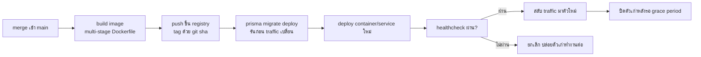
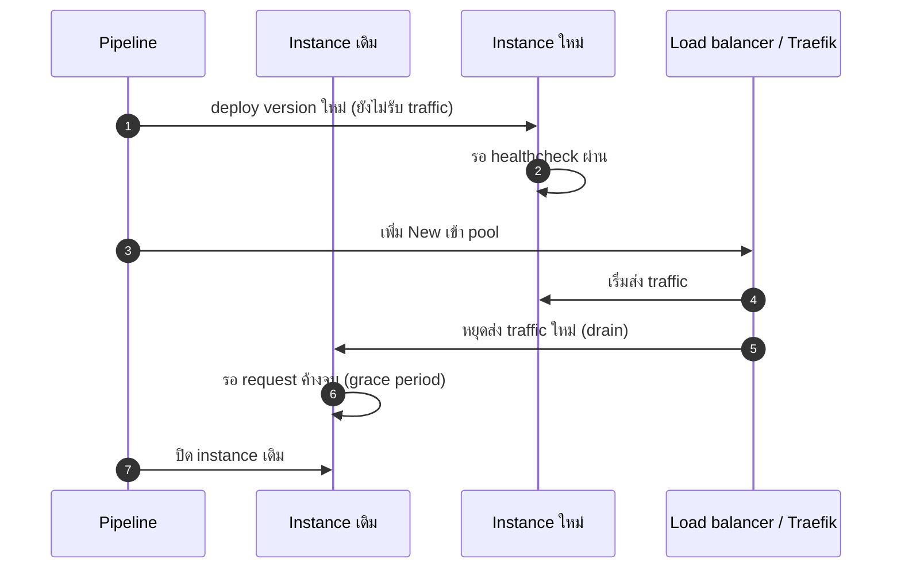

# Deployment

<Status value="planned" />

::: warning ยังไม่มี target platform
หน้านี้จงใจไม่ผูกกับ cloud provider เจ้าไหน — ทีมยังไม่ได้ตัดสินใจ สิ่งที่เขียนไว้คือ "รูปร่าง" ที่ deployment ต้องมี ไม่ว่าจะ deploy ไปที่ไหนก็ตาม
:::

## สิ่งที่ต้องตัดสินใจก่อนเขียนโค้ดจริง

| คำถาม | ทำไมสำคัญ |
| --- | --- |
| self-host (VM + Docker) หรือ managed platform (PaaS/container service)? | กำหนดว่าต้องเขียน orchestrator manifest เองแค่ไหน |
| Postgres แบบ managed หรือรัน container เอง? | กระทบเรื่อง backup/PITR ทั้งหมด — ดู [Database operations](/ops/database-ops) |
| deploy กี่ environment (staging + production หรือมากกว่า)? | กำหนดจำนวน secret set และ pipeline ที่ต้องแยก |
| domain/DNS เป็นของใคร ใครถือ TLS cert | Traefik ต้องตั้ง ACME provider ให้ตรง |

จนกว่าจะตอบคำถามพวกนี้ หน้านี้จะไม่ระบุชื่อ cloud provider ใด ๆ

## รูปร่างของ deployment เป้าหมาย

### Build artifact

| แอป | สิ่งที่ต้องมีใน image | อ้างอิง |
| --- | --- | --- |
| web | `.next/standalone` + `.next/static` (ตั้ง `output: "standalone"` ไว้แล้ว) | [Docker & Traefik](/ops/docker-traefik) |
| api | `dist/` (compiled) + Prisma engine ที่ตรงกับ target platform | — |
| docs | build เป็น static asset ล้วน (`pnpm --filter @app-platform/docs build` ออก `dist/`) — deploy แบบ static host ได้ ไม่ต้องรัน container | — |

::: tip เอกสารไม่จำเป็นต้อง deploy แบบเดียวกับ web/api
VitePress build ออกมาเป็นไฟล์ static ล้วน ต่างจาก web/api ที่เป็น server ที่ต้องรันตลอด เอกสารจึง deploy ผ่าน static hosting/CDN ได้โดยไม่ต้องมี container รันค้างไว้เลย
:::

### Env injection

Env ต้องไม่ถูก build เข้า image (ยกเว้น `NEXT_PUBLIC_*` ที่ตั้งใจให้ฝังตอน build — ดู [Environment variables](/reference/env-vars)) ค่าที่เหลือฉีดตอน runtime ผ่าน secret manager ของ target platform ไม่ใช่ commit เข้า repo หรือ bake เข้า image

### Migration ตอน deploy

`prisma migrate deploy` ต้องรัน **ก่อน** ที่ instance ใหม่รับ traffic ไม่ใช่หลัง — migration ที่ยังไม่ apply แล้วโค้ดใหม่ query field ที่ยังไม่มีจะพังทันที รายละเอียดอยู่ที่ [Database operations](/ops/database-ops)

### Zero-downtime rollout

กติกา: instance ใหม่ต้องรอ traffic **หลัง** healthcheck ผ่านเท่านั้น และ instance เก่าต้องมี grace period ก่อนถูกฆ่า ไม่งั้น request ที่ค้างอยู่จะหลุด

### Rollback

deploy แต่ละครั้งต้อง tag ด้วย git sha ที่ระบุตัวได้ ทำให้ rollback = สั่ง deploy image tag ก่อนหน้าซ้ำ ไม่ต้อง revert commit ก่อน ยกเว้นกรณีที่ migration ใหม่เป็น breaking (ลบ column ที่โค้ดเก่ายังอ่านอยู่) — กรณีนั้นต้องทำ migration แบบ expand/contract ล่วงหน้า ดู [Contract-first § เปลี่ยนสัญญาแบบ breaking](/conventions/contract-first)

::: danger อย่า rollback code โดยไม่เช็ก migration
ถ้า migration ใหม่ลบหรือเปลี่ยนชื่อ column แล้ว rollback แค่ image กลับไปเวอร์ชันเก่า โค้ดเก่าจะ query column ที่ไม่มีแล้วพังทันที ต้องวางแผน migration ให้ backward-compatible อย่างน้อยหนึ่งเวอร์ชันเสมอ
:::

::: warning สถานะโค้ดปัจจุบัน
| สเปกเป้าหมาย | โค้ดวันนี้ |
| --- | --- |
| production Dockerfile + registry + deploy pipeline | ไม่มีสักส่วน — ดู [Docker & Traefik](/ops/docker-traefik) และ [CI/CD](/ops/ci-cd) |
| `prisma migrate deploy` เป็นขั้นตอนอัตโนมัติก่อน deploy | มีแค่ `prisma migrate dev` สำหรับ dev — ดู [Database operations](/ops/database-ops) |
| target platform ที่เลือกแล้ว | ยังไม่ตัดสินใจ |
| zero-downtime rollout | ไม่มี — ไม่มีอะไรให้ rollout เลย |
:::
