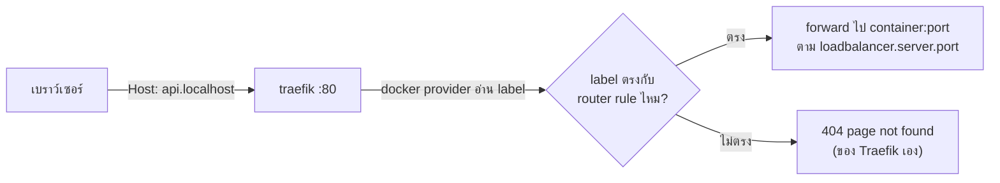
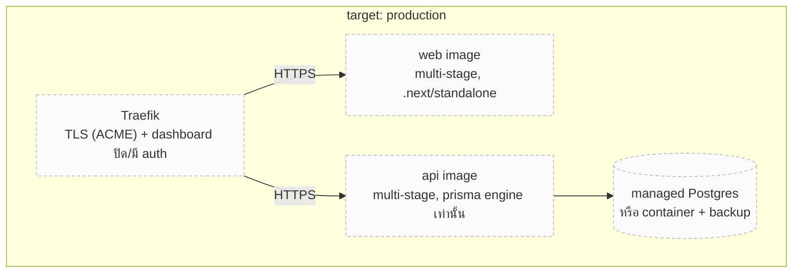

# Docker & Traefik

<Status value="in-progress" note="dev stack ใช้งานได้จริง production ยังเป็นสเปก" />

หน้านี้เป็น runbook ของงาน ops รอบ Docker/Traefik — ถ้าต้องการภาพรวมสถาปัตยกรรมและผังของ stack ให้ดู [Container & routing](/architecture/containers) ก่อน หน้านี้เจาะคำสั่งที่ใช้จริง วิธี debug routing และสิ่งที่ต้องทำเพิ่มก่อนขึ้น production

## คำสั่งที่ใช้บ่อย

```bash
pnpm dev:docker              # ยกทั้ง stack (base + local overlay)
pnpm dev:docker:build        # บังคับ build image ใหม่หลังแก้ Dockerfile.dev
pnpm dev:docker:down         # หยุดและลบ container (volume ยังอยู่)

docker compose logs -f traefik            # ดู log Traefik
docker compose restart api                # restart service เดียว
docker compose exec postgres psql -U app  # เข้า psql ตรง ๆ
docker compose ps                         # สถานะทุก service + healthcheck
```

คำสั่งพวกนี้เทียบเท่ากับ

```bash
docker compose -f docker-compose.yml -f docker-compose.local.yml <subcommand>
```

`docker-compose.yml` เป็นฐาน (service, network, env, label ของ Traefik) ส่วน `docker-compose.local.yml` เป็น overlay เฉพาะ dev (`build:` ชี้ `Dockerfile.dev`, bind mount, publish port, polling watcher) — รายละเอียดเต็มอยู่ที่ [Container & routing § แยกกันสองไฟล์เพราะอะไร](/architecture/containers)

## Debug การ route ผ่าน Traefik



ลำดับการเช็กเมื่อ `*.localhost` เข้าไม่ถึง service

1. เปิด dashboard `http://localhost:8080` — ดูว่า router/service ของแอปนั้นขึ้นในรายการไหม
2. ถ้าไม่ขึ้นเลย: container ไม่มี label `traefik.enable=true` หรือไม่ได้อยู่ใน network `app-platform`
3. ถ้าขึ้นแต่สีแดง/unhealthy: `loadbalancer.server.port` ผิด หรือ process ในนั้นยังไม่ bind กับ port ที่ประกาศ
4. ถ้า router ขึ้นแต่ browser resolve `*.localhost` ไม่ได้: บาง OS/เบราว์เซอร์เก่าต้องเพิ่มเข้า `/etc/hosts` เอง — ดู [Local development § แก้ปัญหา](/ops/local-development)

::: tip เพิ่ม service ใหม่เข้า Traefik
1. เติม label ทั้งสี่บรรทัดใน `docker-compose.yml` (`enable`, `routers.<name>.rule`, `routers.<name>.entrypoints`, `services.<name>.loadbalancer.server.port`)
2. เติม `build:` และ bind mount ของ service นั้นใน `docker-compose.local.yml`
3. ผูก `networks: [app-platform]` — ลืมข้อนี้แล้ว Traefik จะมองไม่เห็น container เลย ไม่ error ให้เห็นด้วย
:::

## Dockerfile ของแต่ละแอป

ทั้งสามไฟล์เป็น dev-only — ไม่มี multi-stage, ไม่มี production build

| แอป | ไฟล์ | base image | CMD |
| --- | --- | --- | --- |
| api | `infra/docker/api/Dockerfile.dev` | `node:22-bookworm-slim` + `openssl`, `ca-certificates` | `prisma generate && pnpm dev` |
| web | `infra/docker/web/Dockerfile.dev` | `node:22-bookworm-slim` | `pnpm dev` |
| docs | `infra/docker/docs/Dockerfile.dev` | `node:22-bookworm-slim` | `pnpm dev` |

ทุกไฟล์ก๊อป `package.json` ของทุก workspace ก่อนแล้วค่อย `pnpm install` เพื่อให้ layer cache ไม่พังทุกครั้งที่แก้โค้ด (เฉพาะตอนแก้ dependency เท่านั้นที่ layer นี้ invalidate)

::: warning image ของ `docs` ไม่มี `git`
`node:22-bookworm-slim` ไม่ติดตั้ง `git` มาให้ และ `Dockerfile.dev` ของ docs ก็ไม่ได้เพิ่มเข้าไป ถ้าปลั๊กอิน VitePress ตัวไหนพยายามอ่าน `git log` ของไฟล์ (เช่น "last updated" ที่อิง commit) จะ error เงียบ ๆ ในโหมด Docker ตอนนี้ยังไม่มีปลั๊กอินแบบนั้นเปิดใช้ ถ้าจะเปิดในอนาคตต้องเพิ่ม `apt-get install git` เข้า Dockerfile นี้ด้วย
:::

## เป้าหมายสำหรับ production

ยังไม่มีโค้ดส่วนนี้เลยสักบรรทัด — เป็นสเปกทั้งหมด



`apps/web/next.config.ts` ตั้ง `output: "standalone"` ไว้แล้ว ซึ่งเป็นชิ้นส่วนที่ Dockerfile production ต้องใช้ — คัดลอกแค่ `.next/standalone` + `.next/static` ก็พอ ไม่ต้องลาก `node_modules` ทั้งก้อนไป image สุดท้าย

การตัดสินใจเรื่อง target platform (self-host / cloud provider ใด) ยังไม่ได้ทำ — ดู [Deployment](/ops/deployment)

::: warning สถานะโค้ดปัจจุบัน
| สเปกเป้าหมาย | โค้ดวันนี้ |
| --- | --- |
| Dockerfile multi-stage สำหรับ production ทุกแอป | มีแค่ `Dockerfile.dev` — ดู [Container & routing](/architecture/containers) |
| `docker-compose.prod.yml` หรือ manifest ของ orchestrator | ไม่มี |
| Traefik ทำ TLS ผ่าน ACME + ปิด dashboard | `traefik.yml` เปิด `insecure: true`, HTTP อย่างเดียว |
| healthcheck ของ web/api ใน compose | มีแค่ postgres กับ redis |
| image registry + tagging scheme | ไม่มี — ไม่เคย build image เพื่อ push |
:::
