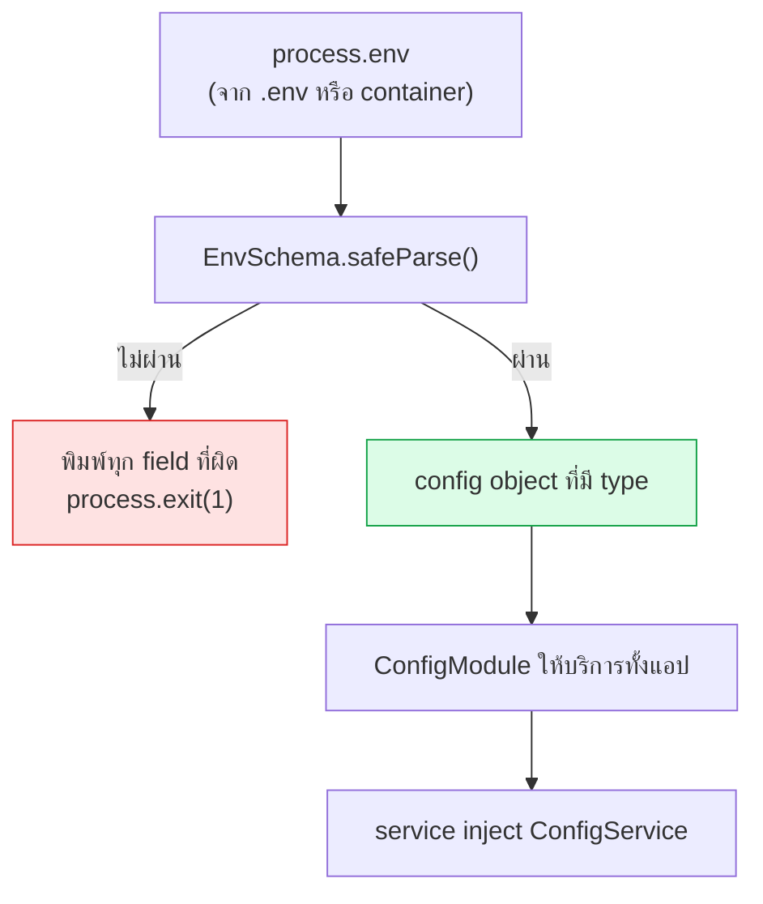

# Config & environment

<Status value="planned" />

> **ตั้ง env ผิด ต้องตายตั้งแต่ตอนบูต ไม่ใช่ไปพังตอนมีคนใช้งาน**

## หลักการ

| หลัก | ความหมาย |
| --- | --- |
| ตายเร็ว | validate env ทั้งชุดตอนบูต ขาดตัวเดียวก็ไม่ต้องขึ้น |
| พิมพ์ครั้งเดียว | ทุก env มีอยู่ใน zod schema ที่เดียว ที่เหลืออ่านจากตรงนั้น |
| ไม่มี default ให้ secret | port มี default ได้ secret ไม่มี |
| แยก build-time กับ runtime | `NEXT_PUBLIC_*` ถูกฝังตอน build ห้ามใส่ความลับ |
| config ไม่ใช่ feature flag | ค่าที่เปลี่ยนบ่อยควรอยู่ใน DB ไม่ใช่ env |

## ลำดับตอนบูต



::: danger อย่ารายงานทีละตัว
`safeParse` แล้ววนพิมพ์ **ทุก** field ที่ผิดในครั้งเดียว การใช้ `getOrThrow` ทีละตัวทำให้ต้อง restart หลายรอบกว่าจะรู้ครบว่าขาดอะไรบ้าง
:::

## Schema ของ env

```ts
// apps/api/src/config/env.schema.ts
import { z } from "zod";

export const EnvSchema = z.object({
  NODE_ENV: z.enum(["development", "test", "production"]).default("development"),
  API_PORT: z.coerce.number().int().min(1).max(65535).default(4000),
  LOG_LEVEL: z.enum(["fatal", "error", "warn", "info", "debug", "trace"]).default("info"),

  DATABASE_URL: z.url().startsWith("postgresql://"),
  REDIS_URL: z.url().startsWith("redis://").optional(),

  // 32 ตัวอักษรขึ้นไป และห้ามเป็นค่าตัวอย่าง — กันการเผลอ deploy ทั้ง .env.example
  JWT_ACCESS_SECRET: z.string().min(32).refine((s) => !s.startsWith("change-me"), {
    message: "JWT_ACCESS_SECRET ยังเป็นค่าตัวอย่าง สร้างใหม่ด้วย: openssl rand -base64 48",
  }),
  JWT_REFRESH_SECRET: z.string().min(32).refine((s) => !s.startsWith("change-me"), {
    message: "JWT_REFRESH_SECRET ยังเป็นค่าตัวอย่าง สร้างใหม่ด้วย: openssl rand -base64 48",
  }),
  JWT_ACCESS_EXPIRES_IN: z.string().regex(/^\d+[smhd]$/).default("15m"),
  JWT_REFRESH_EXPIRES_IN: z.string().regex(/^\d+[smhd]$/).default("7d"),

  CORS_ORIGINS: z.string().transform((s) => s.split(",").map((o) => o.trim()).filter(Boolean)),

  GOOGLE_CLIENT_ID: z.string().optional(),
  GOOGLE_CLIENT_SECRET: z.string().optional(),
  GOOGLE_CALLBACK_URL: z.url().optional(),

  MAIL_TRANSPORT: z.enum(["smtp", "console"]).default("console"),
  MAIL_FROM: z.string().default("no-reply@app-platform.local"),
  SMTP_URL: z.url().optional(),

  APP_WEB_URL: z.url().default("http://app.localhost"),
})
  // secret สองตัวต้องต่างกัน ไม่งั้น access token ใช้แทน refresh ได้
  .refine((env) => env.JWT_ACCESS_SECRET !== env.JWT_REFRESH_SECRET, {
    message: "JWT_ACCESS_SECRET กับ JWT_REFRESH_SECRET ต้องไม่ซ้ำกัน",
    path: ["JWT_REFRESH_SECRET"],
  })
  // ถ้าจะใช้ Google ต้องครบทั้งชุด มีครึ่ง ๆ กลาง ๆ ไม่ได้
  .refine(
    (env) => !env.GOOGLE_CLIENT_ID || (env.GOOGLE_CLIENT_SECRET && env.GOOGLE_CALLBACK_URL),
    { message: "ตั้ง GOOGLE_CLIENT_ID แล้วต้องตั้ง GOOGLE_CLIENT_SECRET และ GOOGLE_CALLBACK_URL ด้วย" },
  )
  .refine((env) => env.MAIL_TRANSPORT !== "smtp" || !!env.SMTP_URL, {
    message: "MAIL_TRANSPORT=smtp ต้องมี SMTP_URL",
    path: ["SMTP_URL"],
  });

export type Env = z.infer<typeof EnvSchema>;
```

::: tip refine คือที่ที่กฎข้ามตัวแปรควรอยู่
กฎอย่าง "secret สองตัวต้องไม่ซ้ำ" หรือ "ตั้ง A แล้วต้องตั้ง B" ถ้าไปตรวจใน service จะกระจายและมักถูกลืม รวมไว้ใน schema ที่เดียวแล้วมันจะถูกบังคับตอนบูตทุกครั้ง
:::

## ต่อเข้ากับ Nest

```ts
// apps/api/src/config/env.validate.ts
import { EnvSchema } from "./env.schema";

export function validateEnv(raw: Record<string, unknown>) {
  const result = EnvSchema.safeParse(raw);
  if (result.success) return result.data;

  // พิมพ์ทุกอันที่ผิดในครั้งเดียว
  console.error("❌ ตั้งค่า environment ไม่ถูกต้อง:\n");
  for (const issue of result.error.issues) {
    console.error(`  • ${issue.path.join(".") || "(root)"}: ${issue.message}`);
  }
  console.error("\nดูรายการทั้งหมดที่ docs.localhost/reference/env-vars\n");
  process.exit(1);
}
```

```ts
// app.module.ts
ConfigModule.forRoot({
  isGlobal: true,
  validate: validateEnv,
  cache: true,
}),
```

อ่านค่าแบบมี type

```ts
constructor(private readonly config: ConfigService<Env, true>) {}

// infer เป็น string อัตโนมัติ ไม่ต้องใส่ generic เอง
const secret = this.config.get("JWT_ACCESS_SECRET", { infer: true });
```

::: tip `ConfigService<Env, true>`
argument ตัวที่สองคือ `WasValidated` การใส่ `true` ทำให้ `get()` คืน type ที่ไม่ใช่ optional เพราะ validate ผ่านแล้วรับประกันว่ามีค่าแน่นอน — จะได้ไม่ต้องเขียน `!` หรือ `?? default` ซ้ำ ๆ
:::

## ฝั่ง Web ต่างจากฝั่ง API

Next.js แบ่ง env เป็นสองโลก และการปนกันคือช่องโหว่ที่พบบ่อยที่สุด

| ชนิด | เห็นจากไหน | ตอนไหนถูกอ่าน | ใส่ความลับได้ไหม |
| --- | --- | --- | --- |
| `NEXT_PUBLIC_*` | server + **เบราว์เซอร์** | ถูกฝังตอน **build** | **ไม่ได้เด็ดขาด** |
| ธรรมดา | server เท่านั้น | runtime | ได้ |

::: danger `NEXT_PUBLIC_*` ถูกฝังลงใน JS ที่ทุกคนโหลดได้
ค่าเหล่านี้ถูกแทนที่เป็น literal ตอน build ใครก็ตามที่เปิดเว็บดาวน์โหลดไปครบ **ห้ามใส่ API key, secret, connection string** ไว้ใน `NEXT_PUBLIC_*` เด็ดขาด และการ "แก้ทีหลังใน production" ไม่มีผล เพราะค่าถูกฝังไปตั้งแต่ตอน build image แล้ว
:::

ตอนนี้มีตัวเดียวคือ `NEXT_PUBLIC_API_URL` ตรวจตอนบูตของ web ได้เหมือนกัน

```ts
// apps/web/src/lib/env.ts
import { z } from "zod";

const PublicEnvSchema = z.object({
  NEXT_PUBLIC_API_URL: z.url(),
});

// ต้องอ้างเต็ม ๆ ทีละตัว — Next แทนที่ตอน build ด้วยการ match ข้อความตรง ๆ
// เขียน process.env[name] แบบ dynamic จะได้ undefined
export const env = PublicEnvSchema.parse({
  NEXT_PUBLIC_API_URL: process.env.NEXT_PUBLIC_API_URL,
});
```

## ชั้นของไฟล์ env

| ไฟล์ | commit ไหม | ใช้ทำอะไร |
| --- | --- | --- |
| `.env.example` | **ใช่** | ต้นแบบ ทุก key ต้องมี ค่าที่เป็นความลับใส่ placeholder |
| `.env` | ไม่ | ค่าจริงบนเครื่องตัวเอง อยู่ใน `.gitignore` |
| `.env.test` | ใช่ | ค่าที่ให้ผลแน่นอนสำหรับเทส ไม่มีความลับจริง |
| environment ของ container | ไม่ | production ฉีดผ่าน secret manager |

`docker-compose.yml` อ่าน `.env` อัตโนมัติแล้วส่งต่อเป็น environment ของ service พร้อม default แบบ `${VAR:-fallback}`

::: warning `.env.example` วันนี้เหมือน `.env` ทุกไบต์
แปลว่ามีคนก๊อปทั้งไฟล์แล้วใช้ต่อ ซึ่งหมายความว่า secret ที่ใช้จริงคือ `change-me-access-secret` — schema ด้านบนถึงมี `refine` ที่บล็อกค่าขึ้นต้นด้วย `change-me` ไว้
:::

## เพิ่ม env ตัวใหม่

1. เติมใน `EnvSchema` พร้อมชนิดและกฎ — ถ้าเป็น secret **ห้ามใส่ default**
2. เติมใน `.env.example` พร้อมคอมเมนต์สั้น ๆ
3. เติมใน `environment:` ของ service ที่ต้องใช้ใน `docker-compose.yml`
4. เติมแถวใน [ตาราง env](/reference/env-vars)
5. ถ้าเป็นความลับ → ไปเพิ่มใน secret manager ของ production ก่อน deploy
6. อ่านผ่าน `ConfigService` เท่านั้น **ห้ามแตะ `process.env` ในโค้ดแอป**

::: danger ห้ามอ่าน `process.env` ตรง ๆ ในโค้ดแอป
`process.env.FOO` ข้ามการ validate ทั้งหมดและได้ type เป็น `string | undefined` เสมอ อ่านผ่าน `ConfigService` เท่านั้น ยกเว้นสองที่ที่เลี่ยงไม่ได้คือ `main.ts` ช่วงก่อนบูต และ `prisma.config.ts` ที่รันนอก Nest
:::

## ระเบียบเรื่องความลับ

| กฎ | ทำไม |
| --- | --- |
| ไม่ commit ค่าจริงลง git ไม่ว่ากรณีใด | git ไม่ลืม แม้จะลบ commit ทีหลัง |
| ทุก environment ใช้ secret คนละชุด | dev หลุดไม่ควรกระทบ production |
| หมุน JWT secret ได้โดยไม่ต้อง logout ทุกคน | รองรับหลาย secret ตอน verify ชั่วคราว |
| `LOG_LEVEL=debug` เฉพาะ non-production | debug log มีข้อมูล query |
| redact header ที่มีความลับใน log | ดู [Trace ID](/platform/trace-id) |

::: warning สถานะโค้ดปัจจุบัน
| สเปกเป้าหมาย | โค้ดวันนี้ |
| --- | --- |
| `ConfigModule.forRoot({ validate })` | `ConfigModule.forRoot({ isGlobal: true })` เฉย ๆ ไม่ validate อะไรเลย |
| ไม่มีที่ไหนอ่าน `process.env` ตรง ๆ | `main.ts` อ่าน `API_PORT` และ `app.module.ts` อ่าน `LOG_LEVEL`/`NODE_ENV` ตรง ๆ |
| `EnvSchema` ใน `src/config/` | ไม่มีโฟลเดอร์ `src/config/` |
| `CORS_ORIGINS` เป็น allowlist | `main.ts` เรียก `enableCors()` เปล่า = อนุญาตทุก origin |
| ฝั่ง web validate env | ไม่มี — `NEXT_PUBLIC_API_URL` ไม่ถูกอ้างถึงเลยในโค้ด |
| บล็อก secret ที่เป็น `change-me` | ไม่มีการตรวจ |
:::
