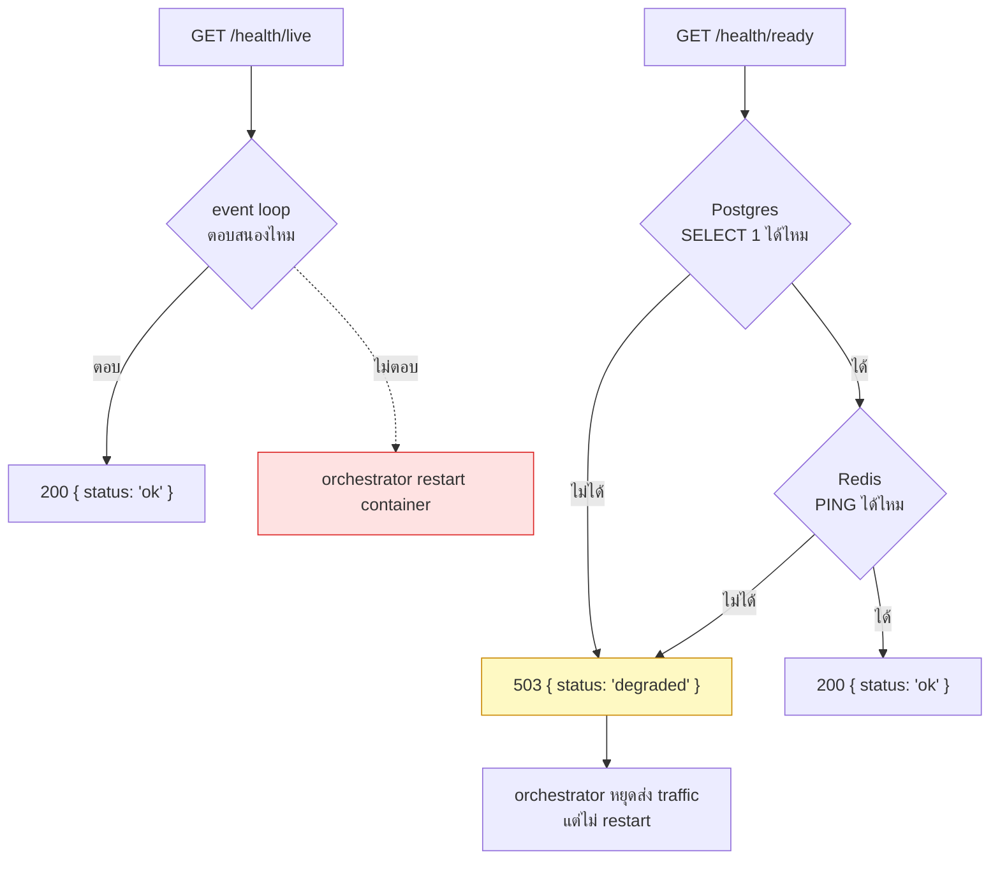

# Health checks

<Status value="implemented" />

> **liveness ตอบว่า "process ยังไม่ตาย" readiness ตอบว่า "รับ traffic ได้จริง" สองคำถามนี้ไม่ใช่คำถามเดียวกัน**

## ทำไมต้องแยกสองแบบ

`GET /health` ที่มีอยู่วันนี้ตอบแค่ว่า Node process ยังรันอยู่และ event loop ยังตอบสนอง มันไม่ได้บอกว่า Postgres ต่อได้ หรือ Redis ยังไม่ล่ม ถ้า orchestrator (Docker Compose healthcheck, หรือวันหน้าเป็น Kubernetes) ใช้ endpoint เดียวตัดสินทั้งสองเรื่อง จะเกิดปัญหาสองแบบสลับกัน

- **container ที่ DB ต่อไม่ได้ยังถูกส่ง traffic เข้า** เพราะ health check "ผ่าน" (แค่ process ยังไม่ตาย) แต่ทุก request ที่แตะ DB จะ 500
- **container ที่กำลัง restart / migrate ถูกฆ่าทิ้งกลางคัน** เพราะ liveness ที่เข้มเกินไปเอา readiness-level check มาปนด้วย

Kubernetes (และ Docker Compose healthcheck แบบเดียวกัน) จึงแยกสองสัญญาณนี้ออกจากกันโดยตั้งใจ — spec หน้านี้ตามรูปแบบนั้น

## สองปลายทาง



| Endpoint | ตอบคำถาม | ถ้าตอบ "ไม่" orchestrator ควรทำอะไร | เช็คอะไรบ้าง |
| --- | --- | --- | --- |
| `GET /health/live` | process ยังรันอยู่ไหม | restart container | ไม่มี — แค่ handler ตอบได้ก็พอ |
| `GET /health/ready` | รับ traffic ได้จริงไหม | เอาออกจาก load balancer ชั่วคราว ห้าม restart | Postgres, Redis (ถ้าใช้), dependency ภายนอกที่ critical |

::: danger readiness check ห้าม restart container
ถ้า readiness ล้มเหลวเพราะ DB ล่มชั่วคราว การ restart container ไม่ได้ช่วยอะไรและอาจทำให้แย่ลง (thundering herd ตอน DB ฟื้น) endpoint ที่ orchestrator ผูกกับ "restart" ต้องเป็น `/health/live` เท่านั้น — `/health/ready` ผูกกับ "readinessProbe" หรือ Traefik healthcheck ที่แค่ถอดออกจาก routing
:::

## สัญญา response

```ts
// packages/contracts/src/health.schema.ts
import { z } from "zod";

export const HealthCheckSchema = z.object({
  status: z.enum(["ok"]),
  checkedAt: z.iso.datetime(),
});

export const ReadinessCheckSchema = z.object({
  status: z.enum(["ok", "degraded"]),
  checkedAt: z.iso.datetime(),
  checks: z.object({
    postgres: z.object({ ok: z.boolean(), latencyMs: z.number().optional() }),
    redis: z.object({ ok: z.boolean(), latencyMs: z.number().optional() }).optional(),
  }),
});
export type ReadinessCheck = z.infer<typeof ReadinessCheckSchema>;
```

## Implementation เป้าหมาย

```ts
// apps/api/src/health/health.controller.ts
import { Controller, Get, HttpCode, HttpStatus } from "@nestjs/common";
import { ApiExcludeController } from "@nestjs/swagger";
import { Public } from "../auth/decorators/public.decorator";
import { PrismaService } from "../prisma/prisma.service";
import { RedisService } from "../redis/redis.service";

@ApiExcludeController()
@Controller("health")
export class HealthController {
  constructor(
    private readonly prisma: PrismaService,
    private readonly redis: RedisService,
  ) {}

  @Public()
  @Get("live")
  live() {
    return { status: "ok", checkedAt: new Date().toISOString() };
  }

  @Public()
  @Get("ready")
  async ready() {
    const [postgres, redis] = await Promise.all([this.checkPostgres(), this.checkRedis()]);
    const ok = postgres.ok && redis.ok;

    return {
      status: ok ? "ok" : "degraded",
      checkedAt: new Date().toISOString(),
      checks: { postgres, redis },
    };
  }

  private async checkPostgres() {
    const start = Date.now();
    try {
      await this.prisma.$queryRaw`SELECT 1`;
      return { ok: true, latencyMs: Date.now() - start };
    } catch {
      return { ok: false };
    }
  }

  private async checkRedis() {
    const start = Date.now();
    try {
      await this.redis.ping();
      return { ok: true, latencyMs: Date.now() - start };
    } catch {
      return { ok: false };
    }
  }
}
```

::: tip status code ของ readiness ต้อง 503 เมื่อ degraded ไม่ใช่ 200
Docker Compose / Kubernetes healthcheck ตัดสินจาก HTTP status ไม่ใช่จากอ่านค่าใน body การคืน `200 { status: "degraded" }` แปลว่า orchestrator ยังคิดว่าปกติแล้วยังส่ง traffic เข้าเหมือนเดิม ต้องคืน `503` ให้ `@HttpCode(HttpStatus.SERVICE_UNAVAILABLE)` เมื่อ `ok === false`
:::

`@Public()` ต้องอยู่ทั้งสอง endpoint — health check เรียกก่อนที่จะมี session ใด ๆ ถ้าถูก guard บล็อกไว้ orchestrator จะเห็น 401 ตลอดแล้วคิดว่า container ตายทุกตัว

## ผูกเข้ากับ Docker Compose

```yaml
# docker-compose.yml
services:
  api:
    healthcheck:
      test: ["CMD", "wget", "--spider", "-q", "http://localhost:4000/health/ready"]
      interval: 10s
      timeout: 3s
      retries: 3
      start_period: 20s
```

`start_period` ให้เวลา container บูตก่อนที่ readiness ล้มเหลวจะถูกนับเป็นความผิดพลาดจริง — สำคัญเพราะตอนบูต Prisma ยัง connect ไม่เสร็จ

## Endpoint ปัจจุบัน (ของจริง)

`apps/api/src/health.controller.ts` มีครบทั้งสามทางเข้าแล้ว — `GET /health/live` (ไม่แตะ dependency), `GET /health/ready` (เช็ค Postgres ผ่าน `PrismaService.$queryRaw` และ Redis ผ่าน `RedisService.ping()`, คืน `503` เมื่อ degraded), และ `GET /health` เดิมที่ยังอยู่เป็น alias ของ `/health/live` เพื่อไม่ทำลาย config เดิม ทั้งหมด `@Public()` และ `@ApiExcludeController()`

`docker-compose.yml` service `api` มี `healthcheck:` block ชี้ไปที่ `/health/ready` แล้ว พร้อม `start_period: 20s`

## เช็กลิสต์

- [x] `GET /health/live` — ไม่แตะ dependency ใด ๆ
- [x] `GET /health/ready` — เช็ค Postgres และ Redis
- [x] readiness คืน `503` เมื่อ degraded ไม่ใช่ `200`
- [x] ทั้งสอง endpoint เป็น `@Public()` และไม่โผล่ใน Swagger
- [x] `docker-compose.yml` healthcheck ชี้ไปที่ `/health/ready`
- [x] `start_period` ให้เวลาพอสำหรับตอน container เพิ่งบูต
