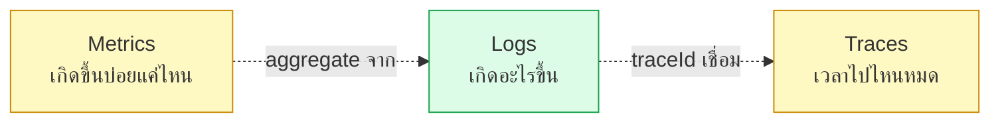
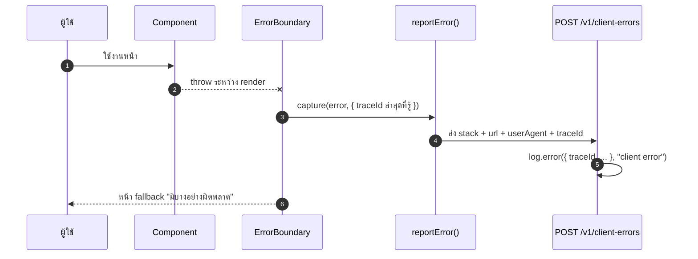

# Observability & logging

<Status value="implemented" />

> **log ที่อ่านไม่ได้ตอนตี 3 คือ log ที่ไม่มีประโยชน์ — structured logging ไม่ใช่ของหรูหรา เป็นข้อกำหนดขั้นต่ำ**

หน้านี้พูดถึง "จะเห็นอะไรตอนระบบมีปัญหา" ส่วนกลไกผูก id เข้ากับทุกบรรทัด log อยู่ที่ [Trace ID](/platform/trace-id) แล้ว — หน้านี้ไม่พูดซ้ำ

## สามเสาของ observability



| เสา | ตอนนี้ | เป้าหมาย |
| --- | --- | --- |
| Logs | `nestjs-pino` ต่อแล้ว, format JSON | ผูกกับ `traceId`/`userId` ทุกบรรทัด (ดู [Trace ID](/platform/trace-id)) |
| Metrics | ไม่มี | Prometheus endpoint `/metrics` — request count, latency histogram, error rate |
| Traces | ไม่มี | OpenTelemetry เมื่อระบบโตพอที่ log เพียงอย่างเดียวไม่พอ (ดู [ทางไปต่อของ Trace ID](/platform/trace-id)) |

หน้านี้โฟกัสที่ logs เพราะเป็นเสาเดียวที่มีรากฐานอยู่แล้วในโค้ด

## Logging ฝั่ง API

### สิ่งที่มีอยู่จริงวันนี้

```ts
// apps/api/src/app.module.ts
LoggerModule.forRoot({
  pinoHttp: {
    level: process.env.LOG_LEVEL ?? "info",
    transport:
      process.env.NODE_ENV === "production"
        ? undefined
        : { target: "pino-pretty", options: { singleLine: true } },
  },
}),
```

`nestjs-pino` แทนที่ Nest logger เริ่มต้นด้วย `pino-http` ทุก request/response ถูก log อัตโนมัติเป็น JSON ใน production (pino-pretty แค่ dev เพื่ออ่านง่ายในเทอร์มินัล) นี่คือรากฐานที่ถูกแล้ว — ปัญหาไม่ใช่ตัวไลบรารี แต่คือสิ่งที่ยังไม่ได้ต่อเข้ากับมัน

### ช่องว่างสามเรื่อง

ทั้งสามเรื่องนี้แก้แล้ว — `genReqId` ผูกกับ `x-request-id` เดียวกับ [Trace ID](/platform/trace-id), `redact` ครอบ `authorization`/`cookie`/`set-cookie`, และมี log ระดับ service จริงแล้ว (`AuthService.login`, `UsersService.create`, `PoliciesGuard` ตอน forbidden) ดูวิธี implement ที่ [Trace ID § ต่อเข้ากับ pino](/platform/trace-id)

### Log level — ใช้ตอนไหน

| Level | ใช้เมื่อ | ตัวอย่าง |
| --- | --- | --- |
| `trace` | debug ระดับบรรทัดต่อบรรทัด (ปิดใน production เสมอ) | ค่าตัวแปรระหว่างคำนวณ |
| `debug` | รายละเอียดที่มีประโยชน์ตอน dev | SQL query, cache hit/miss |
| `info` | เหตุการณ์ทางธุรกิจปกติ | `user registered`, `role assigned` |
| `warn` | ผิดปกติแต่ระบบจัดการได้เอง | validation ล้มเหลว, `403 Forbidden` |
| `error` | ต้องมีคนไปดู | exception ที่ไม่คาดคิด, DB connection หลุด |
| `fatal` | ระบบใช้งานไม่ได้อีกต่อไป | boot ล้มเหลว, env validate ไม่ผ่าน |

```ts
// ตัวอย่าง log ระดับ service ที่ควรมี
this.logger.info({ userId: user.id, roleKey: "manager" }, "role assigned");
this.logger.warn({ userId: user.id, field: "roles" }, "permission denied: field-level update");
```

::: danger ห้าม log ข้อมูลอ่อนไหว
ห้าม log: รหัสผ่านหรือ hash ของมัน, JWT/refresh token เต็มค่า, เลขบัตร, ค่าจาก `Authorization`/`Cookie` header ดิบ ๆ ถ้าจำเป็นต้องอ้างถึง user ให้ log `userId` ไม่ใช่ email หรือชื่อเต็ม — `userId` ตามรอยได้เหมือนกันแต่ไม่ใช่ PII ที่อ่านได้ตรง ๆ
:::

## Logging ฝั่งเว็บ

ตอนนี้ **ไม่มีเลย** — ไม่มี error boundary ที่ log, ไม่มีการส่ง client-side error ไปที่ไหน ถ้าผู้ใช้เจอหน้าขาว ทีมจะไม่รู้จนกว่าจะมีคนแจ้ง

### เป้าหมาย



```tsx
// apps/web/src/app/error.tsx
"use client";

export default function GlobalError({ error, reset }: { error: Error & { digest?: string }; reset: () => void }) {
  useEffect(() => {
    reportClientError(error);
  }, [error]);

  return (
    <div role="alert">
      <p>มีบางอย่างผิดพลาด</p>
      <button onClick={reset}>ลองใหม่</button>
    </div>
  );
}
```

`reportClientError` ควรส่ง `traceId` ล่าสุดที่ `api-client` ใช้ (ถ้ามี) เพื่อให้ error ฝั่ง client เชื่อมกับ log ฝั่ง server ของ request เดียวกันได้ ดูรูปแบบการส่ง `x-request-id` ที่ [Trace ID](/platform/trace-id)

::: tip อย่าเพิ่ง log ทุก warning ของ React
บนเว็บ third-party error (extension ของเบราว์เซอร์, ad blocker) จะโผล่มาปนกับ error จริง กรองด้วย `ignoreErrors` list ก่อนส่งเข้าระบบ ไม่งั้น noise จะกลบสัญญาณจริงจนไม่มีใครเปิดดู log อีก
:::

## Metrics (ยังไม่ทำ)

เมื่อถึงจุดที่ log ไม่พอ (เช่นต้องการ alert บน error rate หรือ p99 latency) ให้เพิ่ม `@willsoto/nestjs-prometheus` และ endpoint `GET /metrics` (ไม่ผ่าน public internet — เปิดเฉพาะ internal network หรือหลัง auth) วัดอย่างน้อยสามตัว: request count แยกตาม route + status, latency histogram, active DB connection count

## เช็กลิสต์

- [ ] `genReqId` ใช้ `x-request-id` เดียวกับ [Trace ID](/platform/trace-id) ไม่สร้างของตัวเอง
- [ ] `redact` ครอบ `authorization`, `cookie`, `set-cookie`
- [ ] เหตุการณ์ทางธุรกิจสำคัญมี log ระดับ `info` เป็นอย่างน้อย
- [ ] ไม่มีการ log ข้อมูลอ่อนไหวที่จุดใดเลย
- [ ] ฝั่งเว็บมี `error.tsx` ที่ report error พร้อม traceId
- [ ] (เมื่อจำเป็น) `GET /metrics` ไม่เปิด public

| สเปกเป้าหมาย | สถานะ |
| --- | --- |
| `nestjs-pino` ต่อแล้ว | ✅ ใช้จริงใน `app.module.ts` |
| `genReqId` ผูกกับ `x-request-id` | ✅ |
| `redact` header ที่มีความลับ | ✅ |
| log ระดับ business event | ✅ login/register/permission denied |
| ฝั่งเว็บมี error reporting | ✅ `app/[locale]/error.tsx` → `POST /v1/client-errors` |
| Metrics endpoint | ยังไม่ทำ — ดูหัวข้อ [Metrics](#metrics-ยังไม่ทำ) ด้านบน ตั้งใจเลื่อนจนกว่า log อย่างเดียวจะไม่พอ |
