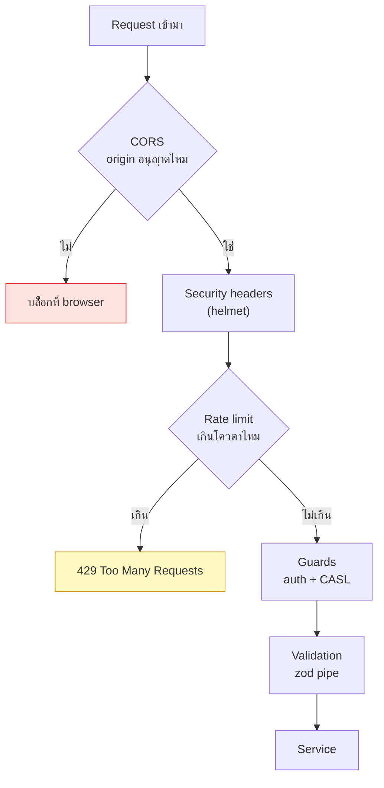

# Security checklist

<Status value="implemented" />

> **หน้านี้ไม่ใช่ทฤษฎีความปลอดภัย เป็นรายการสิ่งที่ต้องปิดก่อนที่ boilerplate นี้จะพร้อมรับ traffic จริง**

## ภาพรวมชั้นป้องกัน



หน้านี้ครอบสามชั้นแรก (CORS, headers, rate limit) — auth และ CASL อยู่ที่ [ภาพรวม auth](/auth/overview) และ [CASL](/auth/casl), validation อยู่ที่ backend validation

## 1. CORS

### ของจริงวันนี้

```ts
// apps/api/src/main.ts
app.enableCors({
  origin: env.CORS_ORIGINS, // มาจาก EnvSchema — array ของ origin ที่อนุญาตเป๊ะ ๆ
  credentials: true,
  methods: ["GET", "POST", "PATCH", "DELETE"],
  allowedHeaders: ["content-type", "authorization", "x-request-id"],
});
```

`CORS_ORIGINS` ผูกกับ [Config & environment](/platform/config) — ตายตั้งแต่ boot ถ้าไม่ตั้งใน production ห้าม default เป็น `*` หรือ `localhost` เด็ดขาด

## 2. Security headers (helmet)

### ของจริงวันนี้

```ts
// apps/api/src/main.ts
import helmet from "helmet";

app.use(
  helmet({
    contentSecurityPolicy: {
      directives: {
        defaultSrc: ["'self'"],
        imgSrc: ["'self'", "data:", env.APP_WEB_URL],
        connectSrc: ["'self'"],
        frameAncestors: ["'none'"],
      },
    },
    crossOriginResourcePolicy: { policy: "same-site" },
  }),
);
```

| Header | ป้องกันอะไร |
| --- | --- |
| `Content-Security-Policy` | XSS จาก script/style ที่ไม่ได้รับอนุญาต |
| `X-Content-Type-Options: nosniff` | browser เดา MIME type ผิดแล้วรัน content แปลกปลอมเป็น script |
| `Strict-Transport-Security` | บังคับ HTTPS หลัง visit ครั้งแรก |
| `X-Frame-Options` / `frame-ancestors` | clickjacking ผ่านการฝัง iframe |

::: tip API ที่ไม่ render HTML ยังต้องมี helmet
เข้าใจผิดที่พบบ่อยคือ "API ไม่มี XSS เพราะไม่ render HTML" แต่ Swagger UI, error page ของ Express เอง, หรือ endpoint ที่คืนค่าที่ผู้ใช้ป้อนกลับมาแบบ reflect ก็ยังเสี่ยงอยู่ helmet ตั้งค่า default ที่ปลอดภัยโดยแทบไม่มี cost
:::

## 3. Rate limiting

### ของจริงวันนี้

```ts
// apps/api/src/app.module.ts
ThrottlerModule.forRoot([
  { name: "default", ttl: 60_000, limit: 100 }, // ทั่วไป: 100 req/นาที/IP
  { name: "auth", ttl: 60_000, limit: 5 },       // เข้มกว่าเฉพาะ auth endpoint
]),
```

```ts
// apps/api/src/auth/auth.controller.ts
@Throttle({ auth: { limit: 5, ttl: 60_000 } })
@Public()
@Post("token")
token(@Body() body: TokenRequestDto) { … }
```

`POST /v1/users` ไม่ใช่ endpoint สมัครสมาชิกสาธารณะ (ต้อง login + สิทธิ์ `create User` ก่อน ดู [ข้อตกลงของ API](/conventions/api-conventions)) จึงใช้โควตา `default` เฉย ๆ พอ — `forgot-password` ในตารางด้านล่างยังเป็นเป้าหมายเพราะ endpoint นั้นเองยัง planned ([ลืมรหัสผ่าน](/auth/forgot-password))

| Endpoint | โควตาที่แนะนำ | เหตุผล |
| --- | --- | --- |
| `POST /v1/auth/login` | 5/นาที/IP | กัน brute-force รหัสผ่าน |
| `POST /v1/auth/register` | 5/นาที/IP | กัน spam สร้างบัญชี |
| `POST /v1/auth/forgot-password` | 3/นาที/IP + 3/ชั่วโมง/อีเมล | กันการยิง reset ถล่มกล่องเมล์คนอื่น |
| endpoint ทั่วไปที่ล็อกอินแล้ว | 100/นาที/IP | กัน scraping/DoS พื้นฐาน |

::: warning rate limit ต้องแยกตาม key ที่เหมาะกับ endpoint
`forgot-password` ต้องจำกัดทั้งตาม IP (กัน bot) **และ** ตามอีเมลเป้าหมาย (กันคนยิง reset ซ้ำ ๆ ใส่อีเมลคนอื่นจนกลายเป็นการรังควาน) ใช้ key เดียวไม่พอ
:::

## 4. Checklist เรื่องอื่นที่เกี่ยวข้องแต่มีหน้าของตัวเอง

รายการนี้ไม่ทำซ้ำเนื้อหา แค่ชี้ไปที่หน้าที่รับผิดชอบ

| หัวข้อ | อยู่ที่หน้า |
| --- | --- |
| bcrypt cost, password policy | [สมัครสมาชิก](/auth/signup) |
| httpOnly cookie, token rotation | [JWT & refresh rotation](/auth/tokens) |
| field-level authorization, self-escalation | [CASL](/auth/casl) |
| ไม่ส่ง stack trace ออก client | [Error envelope](/conventions/errors) |
| secret ไม่มี default, แยก build/runtime env | [Config & environment](/platform/config) |
| ไม่ log ข้อมูลอ่อนไหว | [Observability & logging](/platform/observability) |

## CI ที่ยังไม่มี

ไม่มี dependency scanning (`npm audit` / Snyk / Dependabot) ต่อกับ CI เพราะยังไม่มี CI เลย — ดู [CI/CD](/ops/ci-cd) เมื่อ pipeline ถูกสร้างขึ้น ควรมี job แยกที่ scan dependency ทุก PR ไม่ใช่รันแบบ manual เป็นครั้งคราว

## เช็กลิสต์

- [ ] `enableCors()` จำกัด `origin` จาก `CORS_ORIGINS`
- [ ] `helmet()` เปิดพร้อม CSP ที่กำหนด `defaultSrc`, `frameAncestors`
- [ ] `ThrottlerModule` ครอบทั้งแอป + throttle เข้มกว่าที่ endpoint auth
- [ ] `forgot-password` จำกัดทั้งตาม IP และตามอีเมลเป้าหมาย
- [ ] dependency scanning อยู่ใน CI (เมื่อ CI มีอยู่)
- [ ] ไม่มี secret ใดมี default ใน [`EnvSchema`](/platform/config)

CORS จำกัด origin ผ่าน `CORS_ORIGINS`, `helmet()` ตั้ง security headers, `ThrottlerModule` ครอบทั้งแอปพร้อม throttle เข้มกว่าที่ `POST /v1/auth/token` — ครบทั้งสามชั้นแล้ว dependency scanning ใน CI ยังไม่มีเพราะยังไม่มี CI เลย ดู [CI/CD](/ops/ci-cd)
