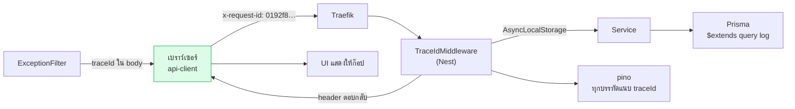
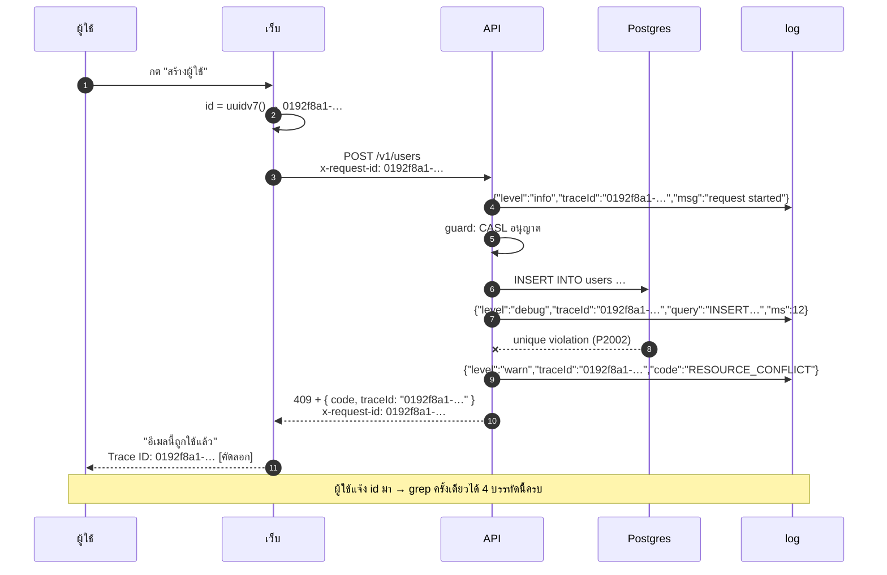

# Trace ID

<Status value="implemented" />

> **หนึ่ง request หนึ่ง id และ id นั้นปรากฏบนทุกบรรทัด log ที่เกี่ยวข้อง — ตั้งแต่เบราว์เซอร์จนถึง SQL**

เมื่อผู้ใช้บอกว่า "มันขึ้น error" คำถามเดียวที่ต้องถามคือ *"trace id คืออะไรครับ"* แล้วค้นครั้งเดียวได้เรื่องราวทั้งหมด

## รูปแบบ

| เรื่อง | ตัดสิน |
| --- | --- |
| รูปแบบ | **UUIDv7** — เรียงตามเวลาได้ ทำให้ index บน DB ไม่แตกและเรียง log ตาม id ได้เลย |
| Header | `x-request-id` ทั้งขาเข้าและขาออก |
| ใครสร้าง | ตัวแรกสุดที่แตะ request และไม่เจอ header นี้ |
| ส่งต่อ | ถ้า request ที่เข้ามามี `x-request-id` อยู่แล้ว **ใช้ตัวนั้น** ห้ามสร้างใหม่ |
| ตอบกลับ | ต้องมี `x-request-id` ใน response header เสมอ ทั้งตอนสำเร็จและตอนพัง |
| ในตัว body | ปรากฏใน `traceId` ของ [error envelope](/conventions/errors) |

::: tip ทำไม UUIDv7 ไม่ใช่ UUIDv4
UUIDv7 เอา timestamp ระดับมิลลิวินาทีไว้ข้างหน้า จึงเรียงตามเวลาโดยธรรมชาติ — เก็บลงตาราง audit ได้โดย index ไม่กระจาย และเรียง log ที่คละกันมาได้ด้วยการ sort ตาม id เฉย ๆ Node 22 มี `crypto.randomUUID()` ที่เป็น v4 ให้ใช้ `uuid` เวอร์ชันที่รองรับ v7 แทน
:::

## ไหลผ่านอะไรบ้าง



| ต่อที่ | รับ id มายังไง | ใช้ทำอะไร |
| --- | --- | --- |
| เบราว์เซอร์ (`api-client`) | สร้างเองต่อ request | ส่งเป็น `x-request-id` |
| Traefik | ส่ง header ผ่านตามปกติ | — (ไม่ตั้งค่าอะไรเพิ่ม) |
| `TraceIdMiddleware` | อ่านจาก header ถ้าไม่มีค่อยสร้าง | เก็บลง `AsyncLocalStorage` + ใส่ response header |
| `pino-http` (`genReqId`) | อ่านค่าเดียวกัน | ทุก log ของ request มี field `traceId` |
| service / repository | อ่านจาก `AsyncLocalStorage` | log เองก็ยังมี id ติดไปด้วย |
| Prisma extension | เหมือนกัน | log SQL ผูกกับ request ที่ทำให้เกิด |
| `AllExceptionsFilter` | เหมือนกัน | ใส่ลง `traceId` ของ envelope |
| UI | อ่านจาก envelope | โชว์พร้อมปุ่มคัดลอก |

## ตามรอยของจริง



## จะ implement ยังไง

### 1. ที่เก็บ context

`AsyncLocalStorage` ทำให้อ่าน trace id ได้จากทุกที่โดยไม่ต้องส่งต่อเป็น argument ผ่านทุกฟังก์ชัน

```ts
// apps/api/src/common/trace/trace-context.ts
import { AsyncLocalStorage } from "node:async_hooks";

interface TraceStore {
  traceId: string;
  userId?: string;
}

export const traceStorage = new AsyncLocalStorage<TraceStore>();

export const getTraceId = () => traceStorage.getStore()?.traceId ?? "no-trace";
export const getUserId = () => traceStorage.getStore()?.userId;

/** guard เรียกหลังยืนยันตัวตนสำเร็จ เพื่อให้ log ท่อนหลังรู้ว่าใครทำ */
export const setUserId = (userId: string) => {
  const store = traceStorage.getStore();
  if (store) store.userId = userId;
};
```

### 2. Middleware

```ts
// apps/api/src/common/trace/trace-id.middleware.ts
import { Injectable, NestMiddleware } from "@nestjs/common";
import type { NextFunction, Request, Response } from "express";
import { v7 as uuidv7 } from "uuid";
import { traceStorage } from "./trace-context";

export const TRACE_HEADER = "x-request-id";

@Injectable()
export class TraceIdMiddleware implements NestMiddleware {
  use(req: Request, res: Response, next: NextFunction) {
    const incoming = req.header(TRACE_HEADER);
    // รับของเดิมถ้าหน้าตาน่าเชื่อถือ ไม่งั้นสร้างใหม่ — ป้องกันคนยัดค่าขยะมาปน log
    const traceId = incoming && /^[0-9a-f-]{36}$/i.test(incoming) ? incoming : uuidv7();

    res.setHeader(TRACE_HEADER, traceId);
    traceStorage.run({ traceId }, () => next());
  }
}
```

ผูกให้ครอบทุก route

```ts
// app.module.ts
export class AppModule implements NestModule {
  configure(consumer: MiddlewareConsumer) {
    consumer.apply(TraceIdMiddleware).forRoutes("*");
  }
}
```

::: warning ลำดับสำคัญมาก
`TraceIdMiddleware` ต้องรันก่อน `LoggerModule` ของ pino ถ้าลำดับสลับ `genReqId` จะทำงานก่อนที่ store จะถูกสร้าง แล้วได้ `no-trace` ทั้งหมด
:::

### 3. ต่อเข้ากับ pino

```ts
// app.module.ts
LoggerModule.forRoot({
  pinoHttp: {
    level: process.env.LOG_LEVEL ?? "info",
    // ใช้ id เดียวกับ middleware — ห้ามให้ pino สร้างเลขของตัวเอง
    genReqId: (req, res) => {
      const id = (req.headers["x-request-id"] as string) ?? uuidv7();
      res.setHeader("x-request-id", id);
      return id;
    },
    customProps: () => ({ traceId: getTraceId(), userId: getUserId() }),
    // อย่าให้ header ที่มีความลับหลุดเข้า log
    redact: {
      paths: ["req.headers.authorization", "req.headers.cookie", "res.headers['set-cookie']"],
      remove: true,
    },
    transport:
      process.env.NODE_ENV === "production"
        ? undefined
        : { target: "pino-pretty", options: { singleLine: true } },
  },
}),
```

### 4. Log ของ Prisma

```ts
// apps/api/src/prisma/prisma.service.ts
this.$on("query", (e) => {
  this.logger.debug({ traceId: getTraceId(), query: e.query, durationMs: e.duration }, "prisma query");
});
```

::: danger `e.params` มีข้อมูลจริงของผู้ใช้
Prisma ใส่ค่าที่ผูกกับ query มาใน `e.params` ซึ่งอาจมีอีเมลหรือ hash ของรหัสผ่าน **อย่า log ทั้งก้อน** log แค่ `query` กับ `duration` หรือถ้าจำเป็นต้องดู params ให้เปิดเฉพาะบนเครื่องตัวเอง
:::

### 5. ฝั่ง client สร้างและส่ง

```ts
// apps/web/src/lib/api-client.ts
import { v7 as uuidv7 } from "uuid";

export async function apiFetch<T extends z.ZodTypeAny>(path: string, schema: T, init?: RequestInit) {
  const traceId = uuidv7();
  const res = await fetch(`${process.env.NEXT_PUBLIC_API_URL}${path}`, {
    ...init,
    headers: { "content-type": "application/json", "x-request-id": traceId, ...init?.headers },
    credentials: "include",
  });
  // …
}
```

ให้ client เป็นคนสร้างก่อน แปลว่าฝั่งเบราว์เซอร์ก็ log id เดียวกันได้ ตอนเก็บ error report จึงเชื่อมกับ log ฝั่ง server ได้ทันที

## ใช้จริงยังไง

```bash
# ทุกบรรทัดของ request นั้น
docker compose logs api | grep '0192f8a1-4c2e-7b3d-9f01-2a4c6e8b0d13'

# request ที่พังทั้งหมด พร้อม trace id
docker compose logs api | jq -r 'select(.level >= 50) | "\(.traceId) \(.msg)"'

# ทุก request ของผู้ใช้คนหนึ่ง
docker compose logs api | jq -r 'select(.userId == "…") | "\(.traceId) \(.req.url)"'
```

เมื่อขึ้น log aggregator แล้ว `traceId` ควรเป็น indexed field ตัวแรกที่ตั้งค่า

## ฟิลด์ที่ log ทุกบรรทัดต้องมี

| Field | ที่มา | ทำไมต้องมี |
| --- | --- | --- |
| `traceId` | `customProps` | ผูกทุกอย่างเข้าด้วยกัน |
| `userId` | `customProps` หลังผ่าน guard | ตอบว่า "ใครทำ" |
| `level` | pino | กรองความรุนแรง |
| `time` | pino | เรียงเวลา |
| `req.method`, `req.url` | pino-http | บอกว่าเรียกอะไร |
| `res.statusCode`, `responseTime` | pino-http | ผลลัพธ์และความเร็ว |

## ทางไปต่อ: OpenTelemetry

`x-request-id` เป็นสัญญาของเราเอง ถ้าวันหนึ่งต้องต่อกับระบบ tracing มาตรฐาน ให้ยอมรับ `traceparent` ตาม W3C เพิ่มโดยไม่ทิ้งของเดิม

```ts
// รับ traceparent: 00-<trace-id 32 hex>-<span-id>-<flags>
const traceparent = req.header("traceparent");
const traceId = traceparent?.split("-")[1] ?? req.header(TRACE_HEADER) ?? uuidv7();
```

ค่าที่ `getTraceId()` คืนยังเป็นตัวเดียวกันทั้งระบบ จึงเปลี่ยนได้โดยไม่ต้องแก้โค้ดที่เรียกใช้

| สเปกเป้าหมาย | สถานะ |
| --- | --- |
| `TraceIdMiddleware` + `AsyncLocalStorage` | ✅ ครอบทุก route |
| `genReqId` ผูกกับ header | ✅ |
| `redact` header ที่มีความลับ | ✅ (`authorization`, `cookie`, `set-cookie`) |
| Prisma log ผูก trace id | ✅ `PrismaService` subscribe event `query` |
| client ส่ง `x-request-id` | ✅ `apps/web/src/lib/api-client.ts` แนบทุก request |
| UI แสดง trace id | ✅ `app/[locale]/error.tsx` ส่ง traceId ไปที่ `POST /v1/client-errors` — log ฝั่ง server ต่อกับ error ฝั่ง client ด้วย id เดียวกันได้ |
