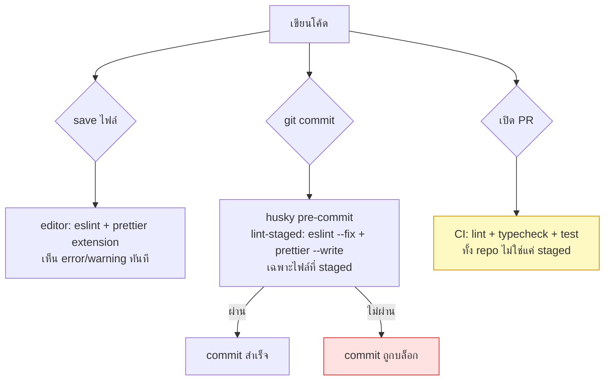

# Lint, format & type-check

<Status value="in-progress" note="lint/format บังคับที่ pre-commit แล้ว typecheck ยังไม่ถูกบังคับที่ไหนเลย" />

> **สามเครื่องมือ สามหน้าที่ต่างกัน: lint จับบั๊กที่ pattern บอกได้, format ตัดข้อถกเถียงเรื่องสไตล์ทิ้ง, type-check จับความไม่ตรงกันของ type ก่อนที่จะกลายเป็น runtime error**

## สามเครื่องมือ ตำแหน่งที่ต่างกัน



| เครื่องมือ | จับอะไร | ตัวอย่าง |
| --- | --- | --- |
| ESLint | pattern ที่รู้ว่าเสี่ยงบั๊ก, กฎเฉพาะ framework | `useEffect` ที่ dependency array ไม่ครบ, import ที่ไม่ได้ใช้, `any` ที่ไม่ได้ตั้งใจ |
| Prettier | รูปแบบล้วน ๆ ไม่เกี่ยวตรรกะ | เว้นบรรทัด, quote style, trailing comma |
| `tsc --noEmit` (typecheck) | ความไม่ตรงกันของ type ระหว่างไฟล์/โมดูล | ส่ง `string` ไปที่ parameter ที่รับ `number`, property ที่ไม่มีจริงบน object |

สามอย่างนี้ทับซ้อนกันน้อยมาก — ESLint ไม่จับ type error ข้ามไฟล์, Prettier ไม่มีความเห็นเรื่องตรรกะเลย, `tsc` ไม่สนใจว่าเว้นบรรทัดกี่บรรทัด แต่ละตัวมีจุดที่อีกสองตัวมองไม่เห็น — ต้องมีครบทั้งสาม

## สิ่งที่มีอยู่จริงวันนี้

### ESLint ต่อ workspace

```js
// apps/web/eslint.config.js
import { reactConfig } from "@app-platform/config/eslint/react";
export default reactConfig;
```

```js
// apps/api/eslint.config.js
import { nodeConfig } from "@app-platform/config/eslint/node";
export default nodeConfig;
```

แต่ละ workspace มี config ของตัวเองที่ extend มาจาก shared config กลาง (`@app-platform/config`) — `apps/web` ใช้กฎของ React (hooks, JSX a11y) ส่วน `apps/api` ใช้กฎของ Node/Nest (ไม่มีกฎ JSX ที่ไม่เกี่ยวข้อง)

```bash
pnpm --filter @app-platform/web lint
pnpm --filter @app-platform/api lint
pnpm lint   # ทุก workspace ผ่าน Turborepo
```

### Prettier + husky + lint-staged ที่ root

```json
// package.json (root)
"lint-staged": {
  "*.{ts,tsx}": ["eslint --fix"],
  "*.{ts,tsx,md,json}": ["prettier --write"]
}
```

`husky` ผูก `lint-staged` เข้ากับ git hook `pre-commit` — ทุกครั้งที่ commit ไฟล์ `.ts`/`.tsx` ที่ staged จะถูก `eslint --fix` ก่อน แล้วทั้งหมด (รวม `.md`, `.json`) ผ่าน `prettier --write` การแก้เกิดขึ้น **ก่อน** commit จริง ไม่ใช่แค่เตือน

::: tip lint-staged รันเฉพาะไฟล์ที่ staged ไม่ใช่ทั้ง repo
นี่คือเหตุผลที่ pre-commit เร็ว — ไม่ต้อง lint ทั้ง monorepo ทุกครั้งที่ commit หนึ่งไฟล์ ข้อแลกเปลี่ยนคือไฟล์เก่าที่ไม่เคยถูก touch อาจยังมี lint error ค้างอยู่จนกว่าจะมีคน commit มันอีกครั้ง หรือจนกว่า CI จะรัน lint แบบเต็ม repo
:::

## ช่องว่าง: ไม่มี typecheck script ที่ไหนเลย

```json
// apps/api/package.json — ไม่มี "typecheck"
"scripts": {
  "build": "nest build",
  "lint": "eslint \"src/**/*.ts\"",
  "test": "vitest run"
}
```

ไม่มี `package.json` ไหนเลย (root, `apps/web`, `apps/api`, `apps/docs`, `packages/contracts`) ที่มี script ชื่อ `typecheck` ที่รัน `tsc --noEmit` ตรง ๆ `nest build` และ `next build` แตะ TypeScript compiler ก็จริง แต่เป็นผลข้างเคียงของการ build ไม่ใช่ gate ที่ตั้งใจไว้ — ถ้า build สำเร็จบางเส้นทาง (เช่น dev server ที่ transpile แบบ skip type-check ของ Next/ts-node-dev) type error สามารถหลุดผ่านไปได้โดยไม่มีใครรู้

::: danger dev server ส่วนใหญ่ไม่ได้ type-check เต็มรูปแบบ
`ts-node-dev` (ที่ `apps/api` ใช้รัน dev) และ Next.js dev server เน้นความเร็วโดย transpile แบบ skip type-check เต็มรูปแบบ โค้ดที่มี type error สามารถรันได้ปกติใน `pnpm dev` แล้วพังตอน `build` หรือแย่กว่านั้นคือไม่พังเลยเพราะไม่มีใครสั่ง `tsc --noEmit` แยกต่างหาก — ถ้าไม่มี typecheck script บังคับ ก็ไม่มีจุดไหนเลยที่รับประกันว่าโค้ดที่ merge ผ่าน type check จริง
:::

### เป้าหมาย

```json
// apps/api/package.json
"scripts": {
  "typecheck": "tsc --noEmit"
}
```

```json
// apps/web/package.json
"scripts": {
  "typecheck": "tsc --noEmit"
}
```

```json
// root package.json
"scripts": {
  "typecheck": "turbo run typecheck"
}
```

```json
// turbo.json
"tasks": {
  "typecheck": {
    "dependsOn": ["^build"]
  }
}
```

`dependsOn: ["^build"]` สำคัญเพราะ `apps/web` และ `apps/api` ต้องเห็น type ของ `packages/contracts` ที่ build แล้ว (ไฟล์ `.d.ts`) ไม่ใช่ source ดิบ — ถ้า `packages/contracts` เปลี่ยน type แล้วยังไม่ build ใหม่ typecheck ของ workspace อื่นจะเห็น type เก่า

## เป้าหมาย CI

เมื่อ [CI/CD](/ops/ci-cd) ถูกสร้างขึ้น ทั้งสี่คำสั่งนี้ต้องรันเป็น required check ก่อน merge ทุก PR

```yaml
# ตัวอย่างแนวคิด ไม่ใช่ syntax ที่ยืนยันแล้ว — ดูรูปแบบจริงที่ /ops/ci-cd
- run: pnpm lint
- run: pnpm typecheck
- run: pnpm test
- run: pnpm build
```

ลำดับมีเหตุผล: lint เร็วสุดควรรันก่อนเพื่อ fail fast, typecheck รองลงมา, test ช้ากว่านั้น, build เป็นด่านสุดท้ายเพราะแพงที่สุด

## เช็กลิสต์

- [ ] `typecheck` script อยู่ใน `apps/web`, `apps/api`, และ `packages/contracts`
- [ ] `turbo.json` มี task `typecheck` พร้อม `dependsOn: ["^build"]`
- [ ] `pnpm typecheck` รันผ่านทั้ง monorepo โดยไม่มี error
- [ ] CI รัน `lint`, `typecheck`, `test`, `build` เป็น required check (ดู [CI/CD](/ops/ci-cd))
- [ ] pre-commit hook ยังคงเบา (เฉพาะไฟล์ staged) — ไม่ยัด `tsc` แบบเต็ม repo เข้าไปใน hook

::: warning สถานะโค้ดปัจจุบัน
| สเปกเป้าหมาย | โค้ดวันนี้ |
| --- | --- |
| ESLint ต่อ workspace | ✅ `apps/web/eslint.config.js`, `apps/api/eslint.config.js` ใช้งานจริง |
| Prettier ที่ root | ✅ config อยู่ใน root `package.json`, ผ่าน `pnpm format` |
| husky + lint-staged ที่ pre-commit | ✅ ผูกจริงใน root `package.json` |
| `typecheck` script | ❌ ไม่มีใน `package.json` ไหนเลย — ไม่มี `apps/web`, `apps/api`, `apps/docs`, `packages/contracts`, หรือ root |
| CI รัน typecheck | ไม่มี CI เลย — ดู [CI/CD](/ops/ci-cd) |
:::
