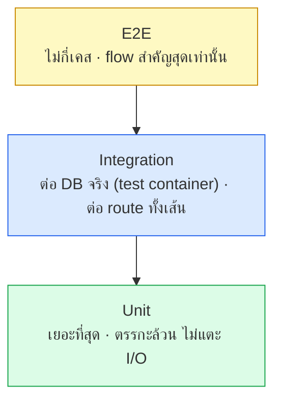

# กลยุทธ์การเทส

<Status value="planned" note="มี test runner แล้ว มีเทส 3 ไฟล์ ยังไม่มี controller/e2e" />

> **เทสที่ดีที่สุดคือเทสที่จับได้ว่าอะไร *ทำไม่ได้* ไม่ใช่แค่ยืนยันว่าอะไร *ทำได้* — โดยเฉพาะเทสด้านสิทธิ์**

## พีระมิดเป้าหมาย



| ชั้น | ทดสอบอะไร | ตัวอย่างในระบบนี้ | เร็ว/ช้า |
| --- | --- | --- | --- |
| Unit | ฟังก์ชันบริสุทธิ์ ไม่มี I/O | CASL `AppAbility`, `PasswordSchema`, การคำนวณ RBAC | เร็วมาก (ms) — รันได้เป็นพัน ๆ ครั้งต่อนาที |
| Integration | route เต็มเส้นผ่าน HTTP จริง ต่อ Postgres จริง | `POST /v1/users` แล้วเช็คแถวใน DB, `accessibleBy` กรองถูกจริงไหม | กลาง (วินาที) — ต้องมี DB |
| E2E | flow ของผู้ใช้จริงผ่าน browser | สมัคร → ยืนยันอีเมล → login → เห็น dashboard | ช้า (นาที) — เปราะบางที่สุด เก็บไว้แค่ flow ที่พังแล้วเสียหายหนักสุด |

::: tip อัตราส่วนที่แนะนำ ไม่ใช่กฎตายตัว
ยึดหลัก "ยิ่งลงถึงพื้น (unit) ยิ่งเทสเยอะได้" — unit เทสควรมีมากกว่า integration หลายเท่า และ integration ควรมากกว่า E2E หลายเท่า ถ้าสัดส่วนกลับด้าน (E2E เยอะกว่า unit) เทสจะช้าและ flaky จนทีมเริ่มข้าม CI
:::

## Unit test — เริ่มจากตรงนี้

โค้ดที่ **คุ้มค่าที่สุด** ที่จะเทสก่อนคือตรรกะสิทธิ์ เพราะเป็นจุดที่ regression สร้างความเสียหายสูงสุดและเงียบที่สุด (โค้ดยังรันได้ปกติ แค่คืนสิทธิ์เกิน)

```ts
// apps/api/src/auth/ability/ability.factory.spec.ts
describe("ability ของ manager", () => {
  const manager = { id: "u1", roles: ["manager"] };
  const ability = buildAbilityFrom(MANAGER_RULES, manager);

  it("แก้ผู้ใช้คนอื่นได้", () => {
    expect(ability.can("update", subject("User", { id: "u2" }))).toBe(true);
  });

  it("แก้ตัวเองไม่ได้", () => {
    expect(ability.can("update", subject("User", { id: "u1" }))).toBe(false);
  });

  it("แก้ field roles ไม่ได้แม้จะแก้ user คนอื่นได้", () => {
    expect(ability.can("update", subject("User", { id: "u2" }), "roles")).toBe(false);
  });
});
```

รายละเอียดชุดเทสนี้อยู่ที่ [CASL § เทส](/auth/casl) แล้ว หน้านี้ไม่พูดซ้ำ — สิ่งที่ต้องเน้นคือ **ทุกแถวใน[ตารางสิทธิ์](/auth/rbac-model) ควรมีเทสคู่กันหนึ่งอัน โดยเฉพาะแถวที่เป็นการปฏิเสธ**

### ตรรกะบริสุทธิ์อื่นที่ควรมี unit test

| โมดูล | เทสอะไร |
| --- | --- |
| `PasswordSchema` | ผ่าน/ไม่ผ่านตามความยาว, ช่องว่างหัวท้าย |
| `EnvSchema` | ค่า production ที่ยังเป็น `change-me` ต้องถูกปฏิเสธ |
| Interpolation ของ `conditions` (`${user.id}`) | แทนค่าให้ถูก ไม่รั่ว placeholder ที่ไม่รู้จัก |
| การจัดหมวด error ใน `AllExceptionsFilter` | Prisma P2002 → 409, P2025 → 404 |

## Integration test — ต่อ DB จริง

Unit test ที่ mock Prisma ทั้งกระบวนการมีความเสี่ยงจะเทสสิ่งที่ไม่ตรงกับพฤติกรรมจริงของ Postgres (เช่น unique constraint, cascade delete) integration test แก้ปัญหานี้โดยรันจริงกับฐานข้อมูล

```ts
// apps/api/test/users.e2e-spec.ts
describe("POST /v1/users (integration)", () => {
  let app: INestApplication;

  beforeAll(async () => {
    app = await createTestApp(); // ต่อ Postgres test container จริง
  });

  afterEach(async () => {
    await resetDatabase(); // truncate ทุกตาราง เรียงตาม FK — ไม่ใช้ DB เดียวกับ dev
  });

  it("สร้างผู้ใช้และให้ role member อัตโนมัติ", async () => {
    const res = await request(app.getHttpServer())
      .post("/v1/users")
      .send({ email: "new@example.com", displayName: "New", password: "correct-horse-battery" });

    expect(res.status).toBe(201);
    const user = await prisma.user.findUniqueOrThrow({
      where: { email: "new@example.com" },
      include: { roles: { include: { role: true } } },
    });
    expect(user.roles.map((r) => r.role.key)).toContain("member");
  });

  it("อีเมลซ้ำตอบ 409 แบบข้อความกลาง ๆ", async () => {
    await createUser({ email: "dup@example.com" });
    const res = await request(app.getHttpServer())
      .post("/v1/users")
      .send({ email: "dup@example.com", displayName: "Dup", password: "correct-horse-battery" });

    expect(res.status).toBe(200); // ตอบสำเร็จเสมอ — ดู [สมัครสมาชิก](/auth/signup)
  });
});
```

::: warning DB ของเทสต้องไม่ใช่ DB ของ dev
`resetDatabase()` ทำงานแบบทำลายล้าง (truncate ทุกตาราง) รันชนกับ dev database คือข้อมูลหายทั้งหมด ใช้ `DATABASE_URL` แยกสำหรับเทสเสมอ — `docker-compose.yml` ควรมี service `postgres-test` แยกต่างหาก หรืออย่างน้อยตั้ง `NODE_ENV=test` แล้ว config service เลือก connection string ที่ต่างออกไปโดยอัตโนมัติ
:::

### accessibleBy ต้องมี integration test ของตัวเอง

`accessibleBy` แปลง ability เป็น SQL `WHERE` — เทสที่ mock Prisma ไม่จับได้ว่า `WHERE` ที่แปลงออกมานั้นถูกจริงหรือเปล่า ต้องมี integration test ที่สร้างข้อมูลจริงหลายแถว แล้วยืนยันว่า `member` เห็นแค่แถวของตัวเอง

```ts
it("member เห็นแค่ user ของตัวเองใน list", async () => {
  const me = await createUser({ roles: ["member"] });
  await createUser(); // คนอื่น ไม่ควรเห็น

  const res = await request(app.getHttpServer())
    .get("/v1/users")
    .set("Cookie", await sessionCookieFor(me));

  expect(res.body.items).toHaveLength(1);
  expect(res.body.items[0].id).toBe(me.id);
});
```

## E2E test — flow สำคัญที่สุดเท่านั้น

ใช้ Playwright ผ่าน browser จริง เลือกเฉพาะ flow ที่ถ้าพังแล้วธุรกิจเสียหายตรง ๆ

| Flow | ทำไมต้อง E2E ไม่ใช่ integration |
| --- | --- |
| สมัคร → ยืนยันอีเมล → login | ครอบทั้ง redirect, cookie, และหน้าจริงหลายหน้า |
| Google OAuth (mock provider) | ต้องเช็คว่า redirect chain ทำงานถูกจริง |
| Admin ถอด role ผู้ดูแลคนสุดท้ายไม่ได้ | ต้องเห็นข้อความ error จริงบน UI ไม่ใช่แค่ API response |

::: danger E2E ที่เยอะเกินจำเป็นคือหนี้ ไม่ใช่ความปลอดภัย
E2E ช้าและ flaky ตามธรรมชาติ (timing, network) ถ้าเทสทุก edge case ด้วย E2E ทีมจะเริ่ม skip มันเวลา CI แดง สิ่งที่ unit/integration เทสได้แล้วไม่ต้องเทสซ้ำด้วย E2E
:::

## รันเทสยังไง

```bash
# ทั้ง monorepo ผ่าน Turborepo — cache ตาม input hash
pnpm test

# เฉพาะ apps/api
pnpm --filter @app-platform/api test

# watch mode ระหว่างพัฒนา
pnpm --filter @app-platform/api test -- --watch
```

`turbo.json` มี task `test` ที่ `dependsOn: ["^build"]` แล้ว — แปลว่า package ที่ dependency เปลี่ยนจะ build ใหม่ก่อนเทสเสมอ ไม่ต้องสั่งเองแยก

## เช็กลิสต์

- [ ] ทุกแถวใน[ตารางสิทธิ์](/auth/rbac-model)มีเทสคู่กัน โดยเฉพาะแถวปฏิเสธ
- [ ] `PasswordSchema` และ `EnvSchema` มี unit test
- [ ] `accessibleBy` มี integration test ที่ยืนยัน SQL filter จริง
- [ ] DB ของเทสแยกจาก DB ของ dev เด็ดขาด
- [ ] E2E ครอบเฉพาะ flow ที่พังแล้วเสียหายหนักสุด
- [ ] `pnpm test` รันผ่านใน CI ทุก PR (ดู [CI/CD](/ops/ci-cd))

::: warning สถานะโค้ดปัจจุบัน
| สเปกเป้าหมาย | โค้ดวันนี้ |
| --- | --- |
| `vitest` ติดตั้งพร้อม script `test` | ✅ มีจริงใน `apps/api/package.json` และ root ผ่าน Turborepo |
| Unit test สำหรับ ability/CASL | ไม่มี — [CASL](/auth/casl) ยังไม่ได้ implement เลย |
| Integration test ต่อ DB จริง | ไม่มี — ไม่มีไฟล์ `*.spec.ts` หรือ `*.e2e-spec.ts` ในทั้ง repo |
| E2E สำหรับ flow สมัคร/login | ไม่มี — ไม่มี Playwright หรือเครื่องมือ E2E ใดติดตั้ง |
| `pnpm test` รันใน CI | ไม่มี CI เลย — ดู [CI/CD](/ops/ci-cd) |
:::
