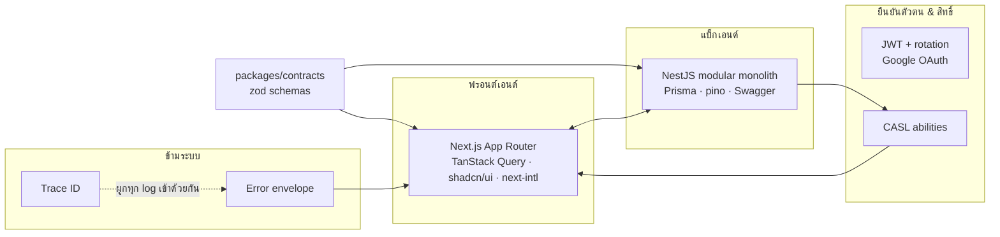

# boilerplate นี้คืออะไร

<Status value="implemented" />

`app-platform` คือ boilerplate สำหรับสร้างเว็บแอปที่มีผู้ใช้ มีสิทธิ์ และมีหลังบ้าน — บน monorepo เดียวที่ web, API และเอกสารอยู่ด้วยกัน และแชร์ "สัญญาข้อมูล" ชุดเดียวกัน

## เอกสารชุดนี้ทำหน้าที่อะไร

เอกสารนี้เป็น **spec-first** — อธิบาย boilerplate ที่เป็น *เป้าหมาย* ไม่ใช่รายงานสิ่งที่โค้ดทำอยู่ตอนนี้ ลำดับการทำงานคือ

> ตกลงสเปกในเอกสาร → implement ตามเอกสาร → อัปเดตสถานะของหน้านั้น

เพราะโค้ดยังตามไม่ครบ ทุกหน้าจึงติดป้ายสถานะไว้ให้ชัดว่าเชื่อได้แค่ไหน

| ป้าย | หมายความว่า |
| --- | --- |
| <Status value="implemented" inline /> | โค้ดใน repo นี้มีอยู่จริงและตรงกับหน้านี้ |
| <Status value="in-progress" inline /> | มีบางส่วน หน้านั้นจะบอกชัดว่าขาดอะไร |
| <Status value="planned" inline /> | สเปกล้วน ยังไม่มีโค้ด |

หน้าไหนที่สเปกกับโค้ดไม่ตรงกัน จะมีกล่องเทียบข้างกันแบบนี้เสมอ

::: warning สถานะโค้ดปัจจุบัน
| สเปกเป้าหมาย | โค้ดวันนี้ |
| --- | --- |
| ตัวอย่าง: refresh token rotation | `auth.service.ts` แค่ verify แล้ว re-sign — token เดิมใช้ซ้ำได้ |
:::

ดูรายละเอียดที่ [ความหมายของสถานะ](/reference/status-legend) และดูภาพรวมทั้งหมดที่ [Roadmap](/start/roadmap)

## หกเสาหลัก

1. **[Contract-first](/conventions/contract-first)** — zod schema ชุดเดียวใน `packages/contracts` เป็นแหล่งความจริงของ request/response ทั้งสองแอป แก้ที่เดียว TypeScript พังทั้งสองฝั่งทันทีถ้าไม่ตาม
2. **[Modular monolith](/adr/0004-modular-monolith)** — NestJS แยกเป็นโมดูลชัดเจน แต่ deploy เป็นชิ้นเดียว แตกเป็น service ทีหลังได้เมื่อจำเป็นจริง
3. **[Trace ID](/platform/trace-id)** — ทุก request มี id เดียวที่ไหลจากเบราว์เซอร์ → API → Prisma → log และโผล่ในหน้า error ให้ผู้ใช้ก๊อปมาแจ้งได้
4. **[Error envelope](/conventions/errors)** — error ทุกตัวหน้าตาเหมือนกันหมด ฝั่ง client เขียน handler ครั้งเดียวใช้ได้ทั้งระบบ
5. **[Auth + CASL](/auth/overview)** — JWT access/refresh พร้อม rotation, Google OAuth, และ ability ชุดเดียวที่ใช้ทั้ง guard ฝั่ง server และซ่อนปุ่มฝั่ง UI
6. **[i18n สองภาษา](/adr/0011-thai-default-locale)** — ไทยเป็นภาษาหลัก ทั้งตัวผลิตภัณฑ์และเอกสาร

## ได้อะไรมาให้แล้ว

| ด้าน | ของที่ให้ |
| --- | --- |
| Monorepo | pnpm workspaces + Turborepo, eslint/prettier/tsconfig ที่แชร์กันใน `packages/config` |
| Dev environment | Docker Compose + Traefik ครบ stack (`app.localhost`, `api.localhost`, `docs.localhost`) hot reload ทั้งสามแอป |
| Frontend | Next.js 16 App Router, next-intl (th/en), TanStack Query, Tailwind v4, shadcn/ui, react-hook-form + zod |
| Backend | NestJS 11, Prisma 7 + Postgres, JWT, Swagger UI, pino structured logging |
| Contracts | zod schema ที่ทั้ง Nest DTO และ react-hook-form resolver ใช้ตัวเดียวกัน |
| เอกสาร | เว็บนี้ |

## สิ่งที่ boilerplate นี้ตั้งใจ *ไม่* ทำ

การรู้ขอบเขตช่วยไม่ให้เผลอยัดของเข้ามา

- **ไม่ใช่ multi-tenant** — ไม่มี tenant/organization ในโมเดลข้อมูล ถ้าต้องการ ให้เพิ่ม `tenantId` แล้วผูกเป็น condition ของ CASL ตั้งแต่วันแรก อย่ามาเติมทีหลัง
- **ไม่มี microservices / message broker** — เป็น modular monolith โดยตั้งใจ ดู [ADR-0004](/adr/0004-modular-monolith)
- **ไม่ผูกกับ cloud provider เจ้าใดเจ้าหนึ่ง** — ทุกอย่างรันด้วย Docker Compose ได้
- **ไม่มี billing, analytics, feature flags** — เป็น domain ของแอปคุณ ไม่ใช่ของ boilerplate
- **ไม่ทำ i18n เกินสองภาษา** — โครงสร้างรองรับ แต่ที่ให้มาคือ th/en

## แนะนำลำดับการอ่าน

1. [เริ่มใช้งานใน 10 นาที](/start/quickstart) — ให้ stack รันก่อน
2. [ทัวร์โครงสร้าง repo](/start/repo-tour) — รู้ว่าอะไรอยู่ตรงไหน
3. [ภาพรวมระบบ](/architecture/overview) → [วงจรชีวิตของ request](/architecture/request-lifecycle) — mental model
4. [Contract-first](/conventions/contract-first) → [Error envelope](/conventions/errors) → [Trace ID](/platform/trace-id) — สามเรื่องนี้ถูกอ้างถึงในทุกหน้าถัดไป อ่านก่อนแล้วชีวิตง่ายขึ้นเยอะ
5. [ภาพรวม auth](/auth/overview) เมื่อจะแตะเรื่องผู้ใช้และสิทธิ์
