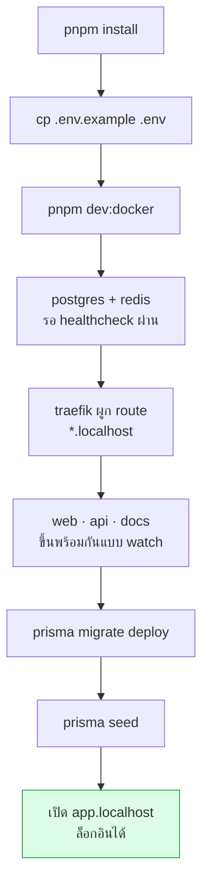

# เริ่มใช้งานใน 10 นาที

<Status value="in-progress" note="seed script ยังมีปัญหา ดูหัวข้อ migrate & seed" />

เป้าหมาย: จาก repo เปล่า → เปิด `app.localhost` ได้ พร้อมข้อมูลตัวอย่าง

## สิ่งที่ต้องมีก่อน

| เครื่องมือ | เวอร์ชัน | ตรวจด้วย |
| --- | --- | --- |
| Node.js | ≥ 22 | `node -v` |
| pnpm | 11.18.0 (ระบุใน `packageManager`) | `pnpm -v` |
| Docker + Compose | v2 ขึ้นไป | `docker compose version` |

pnpm ติดตั้งง่ายสุดผ่าน corepack: `corepack enable && corepack prepare pnpm@11.18.0 --activate`

## ลำดับการเปิดระบบ



## ขั้นตอน

### 1. ติดตั้ง dependency

```bash
pnpm install
```

### 2. เตรียม environment

```bash
cp .env.example .env
```

ค่าเริ่มต้นรันบนเครื่องได้เลย แต่มีสองอย่างที่ต้องรู้

::: danger secret ตัวอย่างห้ามใช้จริง
`JWT_ACCESS_SECRET` และ `JWT_REFRESH_SECRET` ใน `.env.example` เป็นค่า `change-me-*` ต้องเปลี่ยนก่อนขึ้น environment ใดก็ตามที่ไม่ใช่เครื่องตัวเอง สร้างด้วย `openssl rand -base64 48`
:::

::: tip DATABASE_URL ชี้ไปที่ host ของ Docker
`DATABASE_URL` ใช้ hostname `postgres` ซึ่งแปลได้เฉพาะภายใน Docker network ถ้าจะรัน `pnpm dev` บนเครื่องตรง ๆ (ไม่ผ่าน Docker) ต้องเปลี่ยนเป็น `localhost:5432` ดู[พัฒนาบนเครื่อง](/ops/local-development)
:::

รายการ env ทั้งหมดอยู่ที่ [Environment variables](/reference/env-vars)

### 3. เปิดทั้ง stack

```bash
pnpm dev:docker
```

คำสั่งนี้ประกอบ `docker-compose.yml` + `docker-compose.local.yml` เข้าด้วยกัน ยก Postgres, Redis, Traefik และทั้งสามแอปขึ้นในโหมด watch โดย bind-mount โค้ดจากเครื่องเข้า container — แก้ไฟล์แล้ว hot reload ทันที ไม่ต้อง rebuild image

ครั้งแรกจะช้าหน่อยเพราะต้อง build image

### 4. migrate & seed

รอจน Postgres ผ่าน healthcheck แล้วสั่ง

```bash
pnpm --filter @app-platform/api prisma:migrate
pnpm --filter @app-platform/api prisma:seed
```

::: warning สถานะโค้ดปัจจุบัน
| สเปกเป้าหมาย | โค้ดวันนี้ |
| --- | --- |
| `pnpm prisma:seed` รันได้ทันที | `apps/api/prisma.config.ts` ตั้ง `migrations.seed = "tsx prisma/seed.ts"` แต่ `tsx` **ไม่ได้อยู่ใน dependency** (`package.json` ใช้ `ts-node`) — สั่งผ่าน `prisma db seed` จะพัง |
| seed ใส่ role/permission ตั้งต้น | `seed.ts` upsert แค่ user เดียว ยังไม่มีตาราง role/permission ให้ seed ([data model](/architecture/data-model)) |

**ทางเลี่ยงตอนนี้:** สคริปต์ `prisma:seed` ใน `package.json` เรียก `ts-node prisma/seed.ts` โดยตรง จึงรันผ่าน ให้ใช้คำสั่ง `pnpm --filter @app-platform/api prisma:seed` อย่าเรียก `prisma db seed`
:::

### 5. เปิดใช้งาน

| บริการ | URL |
| --- | --- |
| Web | http://app.localhost |
| API | http://api.localhost |
| **Swagger UI** | http://api.localhost/docs |
| เอกสารชุดนี้ | http://docs.localhost |
| Traefik dashboard | http://localhost:8080 |

::: tip `docs` สองความหมาย
`api.localhost/docs` คือ **Swagger UI** ของ REST API ส่วน `docs.localhost` คือ **เว็บเอกสารชุดนี้ (VitePress)** คนละของกันคนละคำเดียวกัน
:::

### 6. บัญชีตัวอย่าง

จาก `apps/api/prisma/seed.ts`

| อีเมล | รหัสผ่าน |
| --- | --- |
| `demo@example.com` | `password123` |

ตอนนี้ยังทดสอบได้เฉพาะผ่าน Swagger (`POST /auth/login`) เพราะหน้า login บนเว็บยังไม่ถูก implement — ดู[สเปกหน้าเข้าสู่ระบบ](/auth/login)

## แก้ปัญหาที่เจอบ่อย

| อาการ | สาเหตุ | วิธีแก้ |
| --- | --- | --- |
| `app.localhost` ไม่ตอบ | เบราว์เซอร์บางตัวไม่ resolve `*.localhost` เอง | เพิ่ม `127.0.0.1 app.localhost api.localhost docs.localhost` ใน `/etc/hosts` |
| API ตายทันทีตอนบูต | `getOrThrow("JWT_ACCESS_SECRET")` ไม่เจอค่า | ยังไม่ได้ `cp .env.example .env` |
| `Can't reach database server` | รัน `pnpm dev` นอก Docker แต่ `DATABASE_URL` ชี้ hostname `postgres` | เปลี่ยนเป็น `localhost:5432` |
| port 80 ถูกใช้อยู่ | มี web server อื่นครองอยู่ | ปิดตัวนั้น หรือแก้ port ของ Traefik ใน compose |
| แก้โค้ดแล้วไม่ reload | file watcher ข้าม bind mount ไม่ทำงาน | compose ตั้ง polling ให้แล้ว ถ้ายังไม่ได้ให้ restart service นั้น |
| `pnpm install` บ่นเรื่อง build script | pnpm 11 บล็อก postinstall เป็นค่าเริ่มต้น | `pnpm-workspace.yaml` มี `allowBuilds` ระบุไว้แล้ว ถ้าเพิ่มแพ็กเกจใหม่ที่ต้อง build ให้เติมรายการนั้น |

## ขั้นถัดไป

- [ทัวร์โครงสร้าง repo](/start/repo-tour) — อะไรอยู่ตรงไหน
- [พัฒนาบนเครื่อง](/ops/local-development) — Docker vs native และงานประจำวัน
- [Roadmap](/start/roadmap) — อะไรทำแล้ว อะไรยัง
